# Risk Assessment Buddy (SMART 3.0) — Architecture, Data Movement & AWS Migration

**Prepared for:** AI Council Review
**Application:** Risk Assessment Buddy — SMART 3.0
**Output destination:** GOEHS Risk Registry (approved vendor)
**Document scope:** Current-state data movement, browser persistence, data privacy posture, and the Phase 2 migration to AWS with SSO.

---

## 1. Executive Summary

Risk Assessment Buddy is a **100% client-side web application**. There is no application server, no database, and no server-side user session. All risk assessment content lives in browser memory for the duration of a tab's life, and leaves the browser only when the user explicitly downloads a file or when text is sent to an external AI service for processing.

| Dimension | Current State (Phase 1) | Target State (Phase 2 — AWS) |
|---|---|---|
| Hosting | Static files, no managed platform | AWS (S3 + CloudFront, private origin) |
| Authentication | **None** — URL is the only control | SSO via corporate IdP |
| Authorisation | None | Role-based, group-driven from IdP |
| AI inference | Public Vercel proxy → OpenRouter → GPT-4o-mini | Private endpoint → Amazon Bedrock |
| Persistence | Browser `localStorage` + user-downloaded files | Same client model + optional server-side project store |
| Audit trail | **None** | CloudTrail + application audit log |
| Data residency | Indeterminate (OpenRouter sub-providers) | Contractually pinned AWS region |
| Output | GOEHS 40-column XLSX, manual upload | Same format, optionally automated |

**The three findings that most need Council attention** are unauthenticated access, an open AI proxy, and third-party LLM routing. These are detailed in Section 7 and addressed by Phase 2.

---

## 2. Current-State System Context

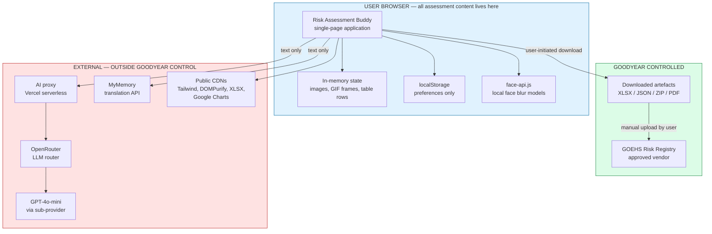

**Key architectural fact:** there is no path by which assessment data reaches a Goodyear-controlled server. It goes from the browser either to the user's local disk or to a third-party AI service.

---

## 3. Workflow Map

The application exposes five entry workflows that converge on one shared risk table and one shared GOEHS export.

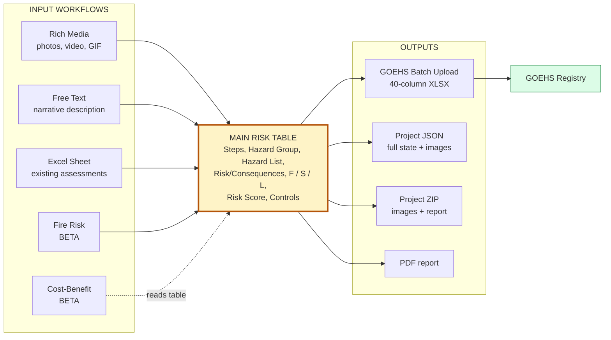

---

## 4. Workflow Data Flows

### 4.1 Rich Media — the most privacy-sensitive path

This is the only workflow that handles personal data (images of people). Face detection and blurring run **entirely in the browser** using locally hosted models; no image ever leaves the device via the network.

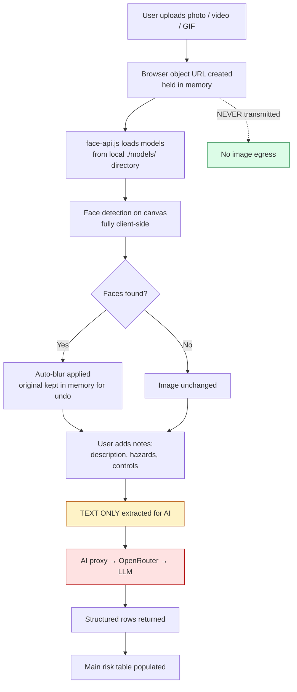

**Privacy control:** face blur is applied before the image is embedded into any downloaded artefact, but it is a **user-verifiable** control, not an enforced one — the user can erase the blur. The blur protects downstream sharing of the ZIP/PDF/JSON, not transmission (images are never transmitted).

### 4.2 Excel Sheet — Multi-Tab AI wizard

The most complex path. A multi-sheet workbook is parsed in-browser, columns are mapped to the internal schema, each sheet is sent to the AI in batches, and results are reviewed before export.

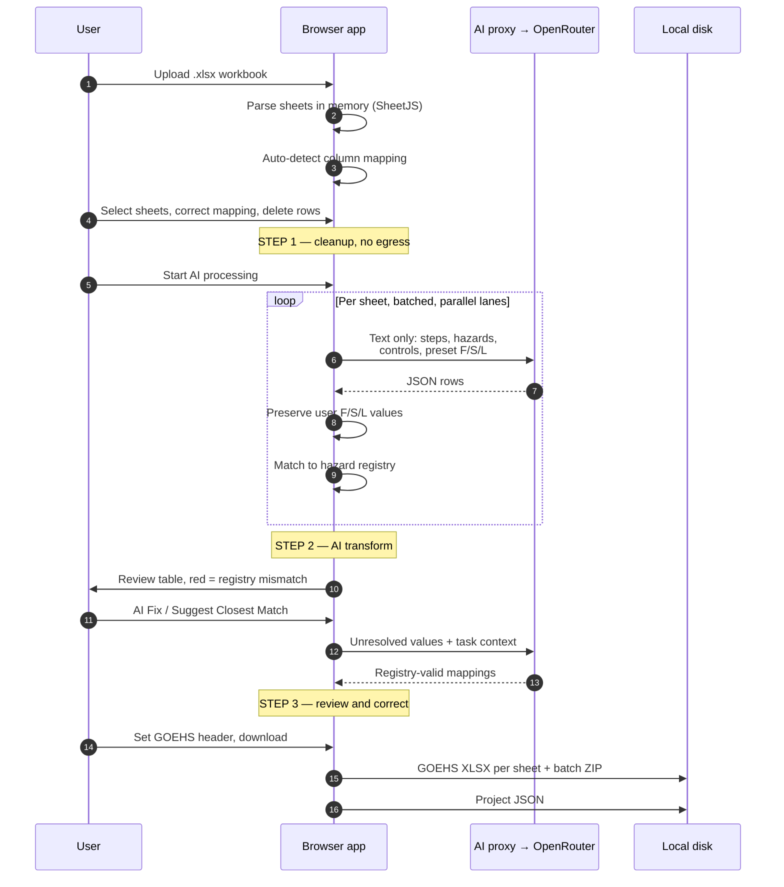

### 4.3 Free Text and Fire Risk

Both send narrative text to the AI and receive structured rows. Same egress profile as the Excel path, lower volume.

---

## 5. Data Movement and Egress — Privacy Focus

This is the diagram to anchor the privacy discussion. It classifies every outbound flow.

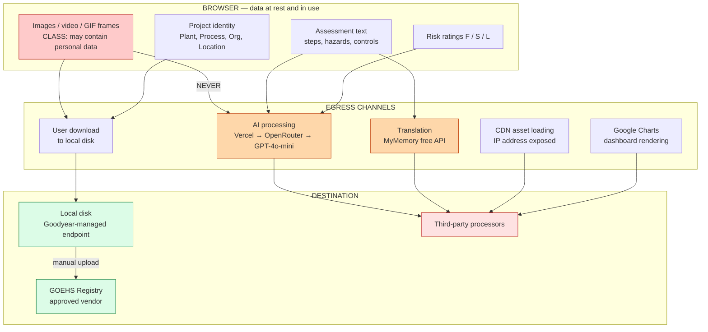

### Egress register

| # | Channel | Data sent | Processor | Contract / DPA | Phase 2 disposition |
|---|---|---|---|---|---|
| E1 | AI processing | Step text, hazard text, control text, F/S/L | OpenRouter → sub-provider | **None** | Replace with Amazon Bedrock |
| E2 | Translation | Steps, Hazard Source, Current Control | MyMemory free tier | **None** | Replace with Bedrock / Amazon Translate |
| E3 | CDN assets | IP, user agent | Cloudflare, unpkg, jsDelivr | None | Self-host in S3 |
| E4 | Google Charts | Aggregated chart values | Google | None | Replace with local charting library |
| E5 | Download | Everything, incl. base64 images | None — local | N/A | Retain, add classification labelling |

**In-app guidance today:** the Data Privacy notice instructs users not to enter personal information into text fields because they are processed externally. This is an **advisory control only** — nothing enforces it.

---

## 6. Browser Persistence — Detailed

This section matters because it determines what survives on a shared or kiosk machine.

### 6.1 What is actually persisted

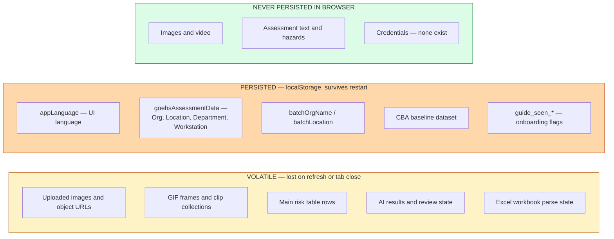

**Assessment content is not written to `localStorage`.** Only preferences and organisational metadata persist. There is no `sessionStorage`, no IndexedDB, no cookies, and no analytics or tracking.

### 6.2 Session lifecycle

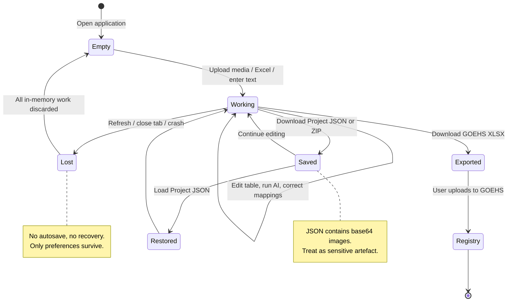

### 6.3 Persistence risk assessment

| Risk | Current exposure | Severity | Phase 2 mitigation |
|---|---|---|---|
| Org/Location metadata left on shared PC | `localStorage` persists indefinitely | Low | Bind to SSO session, clear on logout |
| Unsaved work lost on refresh | No autosave | Medium (usability) | Optional server-side draft store |
| Project JSON contains base64 images | Large file, easily shared | **High** | Classification labelling + encryption at rest |
| No remote wipe on device loss | Nothing to wipe server-side, but local files remain | Medium | MDM policy; server-side store enables revocation |
| Browser extensions can read page memory | Inherent to client-side model | Medium | Managed browser policy |

---

## 7. Cybersecurity Assessment — Current Gaps

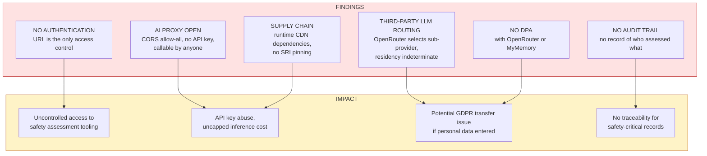

**Priority ranking for remediation:** G1 and G2 are the highest priority and are addressed first in the migration sequence.

---

## 8. Phase 2 — AWS Migration

### 8.1 Target architecture

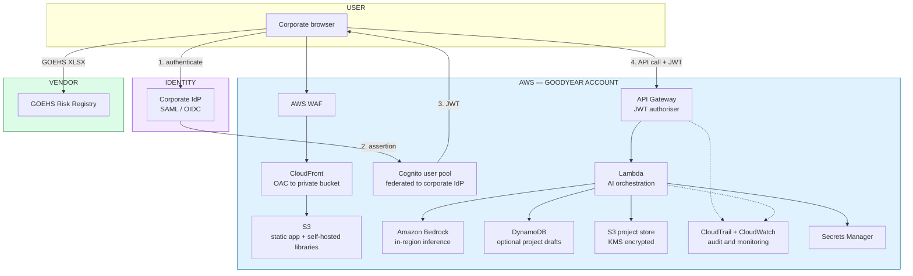

### 8.2 SSO authentication flow

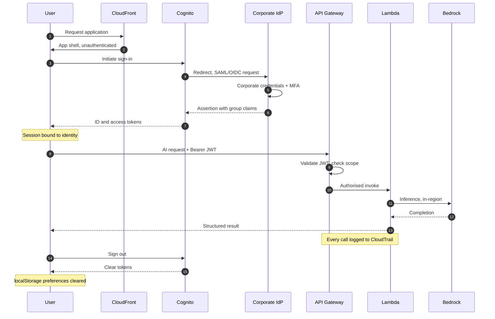

### 8.3 What changes and what does not

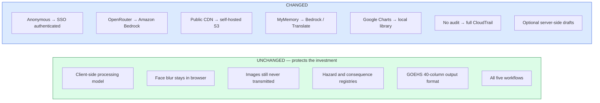

**Migration principle:** the client-side privacy advantage is the application's strongest existing property. Phase 2 preserves it and adds identity, auditability, and contractual data control around it.

### 8.4 Migration sequence

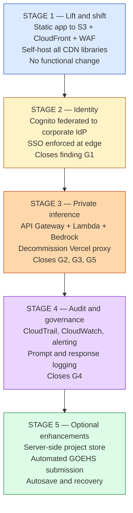

### 8.5 Indicative timeline

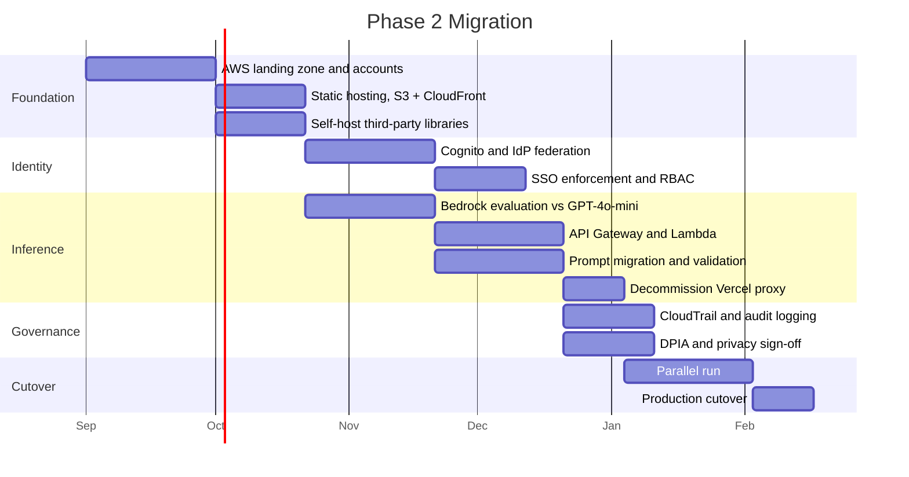

---

## 9. GOEHS Vendor Mapping

The output contract is fixed by the vendor template `Risk_Registry_Batch_Upload_Template.xlsx`.

### 9.1 Transformation pipeline

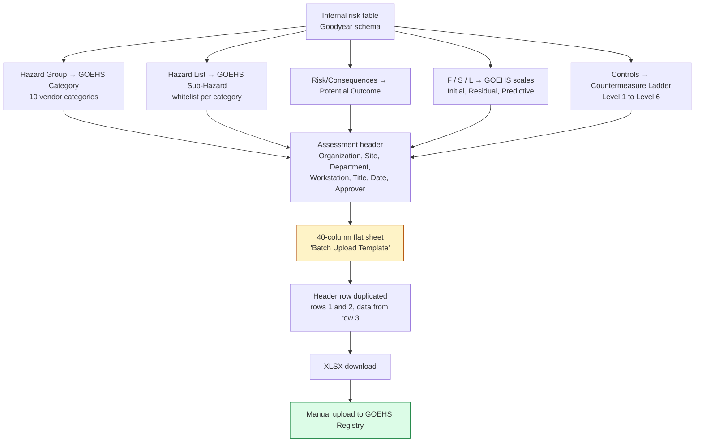

### 9.2 Validation and correction loop

Registry mismatches are surfaced to the user rather than silently exported, which protects the integrity of the vendor submission.

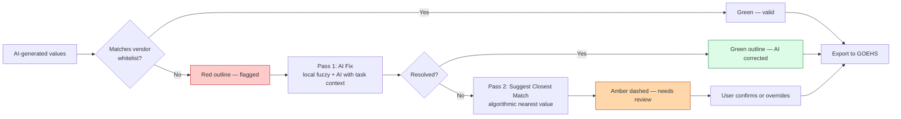

**Control:** a live issue counter shows the number of non-whitelisted values remaining, so an assessment is never exported with silent vendor-format violations.

---

## 10. Data Classification Summary

| Data element | Classification | At rest | In transit to AI | In GOEHS export |
|---|---|---|---|---|
| Workplace photos / video | **Confidential — may contain personal data** | Browser memory; local file after download | **Never sent** | Not included |
| Faces in images | **Personal data** | Blurred client-side before download | **Never sent** | Not included |
| Step descriptions | Internal | Browser memory | **Sent** | Included |
| Hazard / control text | Internal | Browser memory | **Sent** | Included |
| Risk ratings F/S/L | Internal | Browser memory | Sent | Included |
| Org, Site, Department, Workstation | Internal | **`localStorage`** | Not sent | Included |
| Assessor identity | Not captured today | N/A | N/A | Approver field, free text |
| Credentials | None exist today | N/A | N/A | N/A |

**Note for Council:** assessor identity is currently a free-text field with no verification. Phase 2 SSO allows this to be populated authoritatively from the authenticated identity, which materially improves the evidentiary value of the record for a safety-critical system.

---

## 11. Recommendations to the Council

1. **Approve Stage 1–3 as a single work package.** Stages 1 and 2 without Stage 3 leave the open AI proxy in place; the security benefit is not realised until inference moves in-house.
2. **Treat the Vercel proxy as an interim control.** Apply an API key and origin restriction now, before migration, as a compensating control.
3. **Commission a DPIA** covering the AI text egress path, in parallel with Stage 3 rather than after it.
4. **Preserve the client-side image model as a design constraint.** It is the reason no image has ever left a Goodyear device, and it should be an explicit non-functional requirement of the AWS target.
5. **Adopt Bedrock in a pinned region** to make data residency contractual rather than indeterminate.
6. **Populate the GOEHS Approver field from SSO identity** once available, to close the traceability gap on safety-critical records.

---

## Appendix A — Technology Inventory

| Layer | Component | Hosting today | Phase 2 |
|---|---|---|---|
| UI | Single-page app, vanilla JS | Static files | S3 + CloudFront |
| Styling | Tailwind CSS | CDN | Self-hosted |
| Sanitisation | DOMPurify | CDN | Self-hosted |
| Spreadsheet | SheetJS (XLSX) | CDN | Self-hosted |
| Face detection | face-api.js + local models | **Already local** | Unchanged |
| Archive | JSZip | Local | Unchanged |
| PDF | PDFKit + blob-stream | Local | Unchanged |
| Charts | Google Charts | Google | Local library |
| AI inference | GPT-4o-mini via OpenRouter | Vercel | Amazon Bedrock |
| Translation | MyMemory | Free API | Bedrock / Translate |
| Registries | Hazard, consequence, GOEHS category | Local JS | Unchanged |

## Appendix B — localStorage Key Reference

| Key | Contents | Sensitivity | Lifetime |
|---|---|---|---|
| `appLanguage` | UI language code | None | Indefinite |
| `goehsAssessmentData` | Org, Location, Department, Workstation | Low — organisational | Indefinite |
| `batchOrgName` | Org for batch import | Low | Indefinite |
| `batchLocation` | Location for batch import | Low | Indefinite |
| CBA baseline key | Cost-benefit baseline dataset | Low — financial assumptions | Until cleared |
| `guide_seen_*` | Onboarding flags | None | Indefinite |

No key contains assessment content, personal data, or credentials.

---

## Appendix C — Standalone Architecture Diagrams

Two self-contained diagrams for direct reuse in slide decks. C.1 is the single-slide executive view; C.2 is the technical appendix view.

### C.1 High-Level Architecture — current state

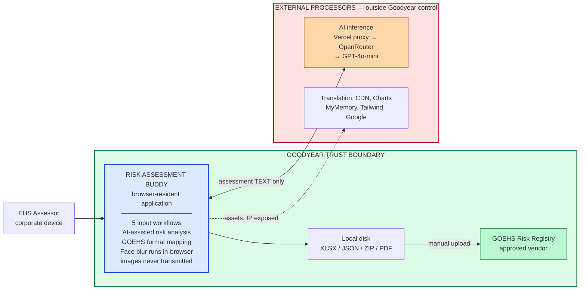

**Single takeaway for the slide:** the application is entirely browser-resident. The only assessment data that crosses the trust boundary is free text sent for AI analysis. Images never leave the device.

### C.2 Detailed Architecture — current state

```mermaid
flowchart TB
    subgraph CLIENT["CLIENT TIER — browser runtime, no server-side session"]

        subgraph PRES["Presentation and workflow modules"]
            direction LR
            P1["index.html<br/>SPA shell, main risk table,<br/>Rich Media, Free Text"]
            P2["excel-mapper-core.js<br/>excel-mapper-ui.js<br/>column mapping engine"]
            P3["fire-risk-assessment.js<br/>fra/*.js<br/>fra-app, fra-ai, fra-data,<br/>fra-floorplan, click-mapper"]
            P4["cba/*.js<br/>cba-engine, cba-ai,<br/>cba-baseline, cba-ui"]
            P5["image-editor.js<br/>workflow-guides.js<br/>how-to-guide.js"]
        end

        AIC["AI ORCHESTRATION<br/>callAI / callAPI<br/>single egress choke point<br/>batching, prompt build,<br/>rating-preservation logic"]

        subgraph DOMAIN["Domain and mapping layer"]
            direction LR
            D1["ra-registry.js<br/>HAZARD_CATEGORIES<br/>COUNTERMEASURE_LADDER<br/>TRANSLATIONS"]
            D2["HAZARD_REGISTRY<br/>CONSEQUENCE_REGISTRY<br/>F / S / L scales"]
            D3["goehs-integration.js<br/>vendor mapping,<br/>buildGoehsBatchWorkbook,<br/>40-column export"]
        end

        subgraph LIBS["Client-side libraries"]
            direction LR
            L1["lib/face-api.min.js<br/>+ models/ SSD MobileNet,<br/>Tiny Face Detector<br/>RUNS FULLY LOCAL"]
            L2["lib/jszip.min.js<br/>lib/pdfkit.min.js<br/>lib/blob-stream.min.js"]
            L3["lib/gif.worker.js<br/>shareable_html_generator.js"]
            L4["Runtime CDN libraries<br/>Tailwind, DOMPurify,<br/>SheetJS, Google Charts"]
        end

        subgraph STATE["Browser state"]
            direction LR
            M1["IN-MEMORY — volatile<br/>images, GIF frames,<br/>risk table rows, AI results"]
            M2["localStorage — persisted<br/>appLanguage,<br/>goehsAssessmentData,<br/>batchOrgName, batchLocation,<br/>CBA baseline, guide_seen_*"]
        end
    end

    subgraph EXTERNAL["EXTERNAL SERVICES — outside Goodyear control"]
        direction TB
        X1["server.js on Vercel<br/>CORS allow-all, no auth<br/>holds OPENROUTER_API_KEY"]
        X2["OpenRouter<br/>routes to sub-provider"]
        X3["GPT-4o-mini"]
        X4["MyMemory translation API"]
        X5["CDNs — Tailwind, DOMPurify,<br/>SheetJS, Google Charts"]
    end

    subgraph OUT["OUTPUTS AND DESTINATION"]
        direction TB
        O1["GOEHS Batch Upload XLSX<br/>40 columns, header on rows 1-2,<br/>data from row 3"]
        O2["Project JSON<br/>full state + base64 images"]
        O3["Project ZIP / PDF report"]
        O4["GOEHS Risk Registry<br/>approved vendor"]
    end

    P1 --> AIC
    P2 --> AIC
    P3 --> AIC
    P4 --> AIC

    P1 --> D2
    P2 --> D2
    P3 --> D1
    P4 --> D2
    P1 --> L1
    P1 --> L2
    P5 --> L3

    D1 --> D3
    D2 --> D3

    P1 --> M1
    D3 --> M2
    P4 --> M2
    L1 -->|"blurred image<br/>stays in memory"| M1

    AIC -->|"TEXT ONLY"| X1
    AIC -.->|"text"| X4
    L4 -.->|"asset load, IP exposed"| X5
    X1 --> X2 --> X3

    D3 --> O1
    P1 --> O2
    L2 --> O3
    O1 -->|"manual upload"| O4

    style CLIENT fill:#e0f2fe,stroke:#0369a1,stroke-width:2px
    style EXTERNAL fill:#fee2e2,stroke:#b91c1c,stroke-width:2px
    style OUT fill:#dcfce7,stroke:#15803d,stroke-width:2px
    style M2 fill:#fed7aa,stroke:#c2410c
    style M1 fill:#fef3c7,stroke:#b45309
    style X1 fill:#fecaca,stroke:#b91c1c
    style D3 fill:#fef3c7,stroke:#b45309,stroke-width:2px
    style O4 fill:#bbf7d0,stroke:#15803d
    style L1 fill:#dcfce7,stroke:#15803d
    style AIC fill:#fed7aa,stroke:#c2410c,stroke-width:3px
```

**Reading the detailed view:**

| Layer | Purpose | Security relevance |
|---|---|---|
| Presentation | Five workflow modules, all client-side | No auth gate on any of them |
| Domain | Hazard/consequence registries and GOEHS vendor mapping | Enforces vendor whitelist before export |
| Libraries | Face blur, archive, PDF, GIF — all local | Face models local, so no image egress |
| Browser state | Volatile memory vs. `localStorage` | Only preferences persist; no content, no credentials |
| External | Vercel proxy → OpenRouter → LLM | Open CORS, no auth, no DPA — findings G2, G3, G5 |
| Outputs | XLSX to vendor, JSON/ZIP to disk | JSON carries base64 images — treat as sensitive |
