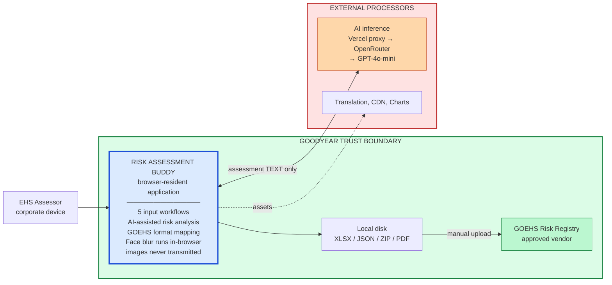
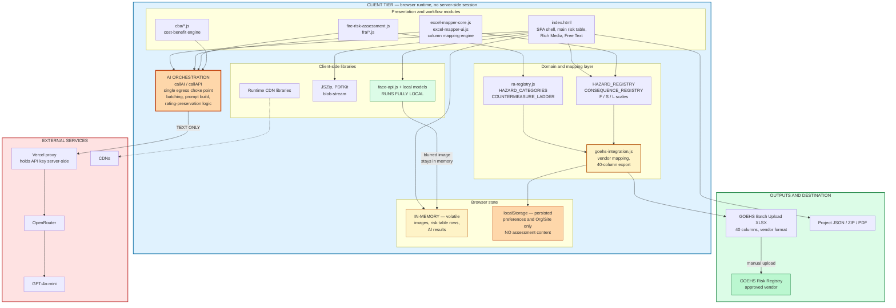
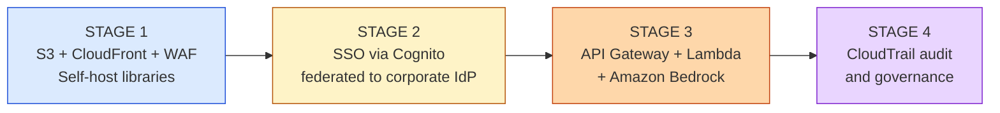

# Risk Assessment Buddy — AI Council Brief

**Application:** Risk Assessment Buddy (SMART 3.0) · **Output:** GOEHS Risk Registry (approved vendor)
**Ask:** Approve Phase 2 migration to AWS with SSO.

---

## 1. What It Is — in one paragraph

A browser-resident EHS risk assessment tool. Assessors capture workplace hazards via photo, text, or existing Excel; an LLM structures the content into a standard risk table; the tool maps it to the GOEHS vendor format and exports an XLSX for upload to the registry. **There is no application server and no database.** All content is processed in the browser.

---

## 2. Existing Bottlenecks and Need for Change

We are addressing a clear process gap in current EHS workflows: risk assessments are still produced through manual, disconnected steps that consume specialist time and create avoidable quality variation.

### 2.1 Current Pain Points

Analysis of current manual workflows (Source: EHS Field Audit Review) identifies four recurring bottlenecks:

- **Time-intensive transfer work:** Field notes and media are manually moved into multiple artifacts (slides, spreadsheets, tracker files), creating hours of administrative overhead per assessment.
- **Manual privacy handling:** Faces in photos and video frames must be blurred one-by-one, which is repetitive and non-value-added.
- **Inconsistent risk data:** Scoring and control phrasing vary by assessor, producing inconsistent records and additional review loops.
- **High specialist dependency:** End-to-end completion depends heavily on EHS specialist intervention, limiting throughput and scalability.

### 2.2 Current-State Time Burden (Without the Accelerator)

For new risk assessments, the typical workflow is:

1. **Site visit (~1.0-1.5 hours):** Observe operations, capture photos/video, interview associates, and verbally flag critical risks.
2. **Report preparation (~1.0-2.0 hours):** Manually transcribe notes, prepare slides or spreadsheets, and blur faces image-by-image.
3. **Risk control agreement meeting (~1.0-2.0 hours):** Align controls with operations context and manually update JSA/Excel records.
4. **GOEHS formatting and upload task:** Reformat output to GOEHS vendor structure, then upload or copy data into the approved registry.

**Total estimated time:** ~3.0 to 5.5 hours per assessment, excluding rework from formatting or validation defects.

### 2.3 Legacy Assessment Migration Bottleneck

Legacy assessments are valid, but difficult to operationalize in the GOEHS pipeline because:

1. Legacy files exist in multiple Excel layouts.
2. Some legacy files include outdated embedded images that must be replaced.
3. Source columns do not match the GOEHS upload schema.

Current migration requires line-by-line manual transfer and vendor dropdown selection, adding approximately **2-3 hours of administrative effort per assessment**.

For assessments already completed in Excel, there is currently no provision for the vendor platform to ingest those files as-is. GOEHS accepts a constrained upload schema (40-column vendor structure with controlled values), while legacy files vary in tab design, column naming, merged cells, free-text coding, and optional image placement. As a result, files must be purged, cleaned, and normalized before they become uploadable.

In architecture terms, this is exactly the gap handled by the client-side mapping path: `excel-mapper-core.js` and `excel-mapper-ui.js` first align heterogeneous source headers to the internal risk model, then `ra-registry.js` and registry scales enforce valid hazard/control/rating semantics, and finally `goehs-integration.js` materializes the vendor-ready XLSX with whitelist checks. Without this pipeline, conversion remains a manual line-by-line interpretation exercise with high defect risk (dropdown mismatch, invalid taxonomy values, broken rating scales, and rejected uploads).

This is also why the Excel workflow is more than a formatting issue. It is a data-governance and compatibility issue across three layers: source file quality, domain conformity, and target schema compliance. The SMART 3.0 architecture addresses all three layers in one browser-resident flow, reducing administrative burden while improving first-pass GOEHS acceptance.

### 2.4 Why the Current Architecture Is the Right Response

The current SMART 3.0 architecture directly targets these bottlenecks:

- **Browser-resident capture and processing:** Reduces tool switching and keeps the assessment workflow in one runtime.
- **Local face blur (`face-api.js`):** Removes manual privacy editing while ensuring images never leave the device.
- **AI structuring through a single text-only egress path:** Standardizes hazard/control wording while preserving assessor-entered F/S/L ratings.
- **GOEHS export mapping (`goehs-integration.js`):** Produces vendor-ready XLSX output with whitelist checks to reduce upload defects.
- **Excel mapping pipeline (`excel-mapper-core.js`, `excel-mapper-ui.js`):** Accelerates legacy conversion by mapping heterogeneous source columns into the approved upload format.

---

## 3. High-Level Architecture

---

## 4. Data Flow — what leaves the browser

| Data | Leaves device? | Destination |
|---|---|---|
| Photos, video, GIF frames | **No — never** | Stays in browser memory / local file |
| Faces in images | **No** — blurred locally before any export | — |
| Step, hazard, control text | **Yes** | LLM for structuring |
| Risk ratings F/S/L | **Yes** | LLM (values preserved, not overwritten) |
| Org / Site / Department | No | Included in GOEHS export only |
| Credentials | None exist | — |

**Only free text is sent for AI processing. No images, ever.**

---

## 5. Detailed Architecture

---

## 6. Security and Privacy Controls In Place

| # | Control | How it works |
|---|---|---|
| 1 | **No image egress** | Photos and video never touch the network. Only text is sent. |
| 2 | **Local face blur** | `face-api.js` with models served from the app itself — detection and blurring happen on-device. |
| 3 | **No content persisted in browser** | `localStorage` holds only UI language and Org/Site/Department. No assessment text, no images, no credentials. |
| 4 | **No cookies, trackers or analytics** | None present in the application. |
| 5 | **Single AI egress point** | All workflows route through one function, so egress is auditable and controllable in one place. |
| 6 | **API key not exposed to the browser** | Held server-side as an environment variable in the proxy; never shipped in client code. |
| 7 | **Vendor whitelist enforced before export** | Values not on the GOEHS list are flagged red with a live issue counter; two correction passes provided. Prevents malformed vendor submissions. |
| 8 | **User risk ratings preserved** | Assessor-entered F/S/L values are locked and cannot be silently overwritten by the AI. |
| 9 | **Output sanitisation** | DOMPurify applied to rendered content. |
| 10 | **Data minimisation by design** | No personal data is required by the workflow; users are instructed not to enter it. |

---

## 7. Known Gaps and Their Fix

Each gap already has a defined remedy in Phase 2. No open questions.

| Gap | Fix | When |
|---|---|---|
| No authentication — URL is the only control | SSO via corporate IdP | Phase 2, Stage 2 |
| AI proxy accepts requests from any origin | API key + origin restriction now; replaced by private endpoint | Immediate / Stage 3 |
| LLM routed via third party, residency indeterminate | Amazon Bedrock in a pinned region | Phase 2, Stage 3 |
| No audit trail of who assessed what | CloudTrail + SSO identity on records | Phase 2, Stage 4 |
| Runtime CDN dependencies | Self-host all libraries in S3 | Phase 2, Stage 1 |

---

## 8. Phase 2 — AWS Migration

**What does not change:** the client-side model, local face blur, no image transmission, the hazard registries, and the GOEHS output format. Phase 2 adds identity, private inference, and auditability around an architecture that already keeps sensitive content on the device.

---

## 9. Decision Requested

1. **Approve Stages 1–3 as one work package.** Stages 1–2 alone leave inference on the external proxy; the security benefit lands at Stage 3.
2. **Note the interim control:** API key and origin restriction applied to the current proxy ahead of migration.
3. **Confirm Bedrock region** for data residency.
