# Risk Assessment Buddy Smart 3.0 - Architecture Diagram

## System Architecture: Current State & Future State

```mermaid
%%{init: {'flowchart': {'htmlLabels': true, 'useMaxWidth': true}, 'theme': 'base', 'themeVariables': {'primaryColor': '#e8f4f8', 'primaryBorderColor': '#2c5f7f', 'lineColor': '#4a6fa5', 'secondBkgColor': '#fff4e6', 'tertiaryColor': '#f0f0f0', 'fontSize': '13px'}, 'handDrawn': true, 'fontFamily': 'comic'}}%%
graph TB
    subgraph Client["🖥️ CLIENT LAYER (GitHub Pages SPA)"]
        direction LR
        UI["📱 HTML5 SPA Interface<br/>Vanilla JS + Tailwind CSS"]
        Cache["💾 Storage Layer<br/>localStorage<br/>sessionStorage<br/>IndexedDB"]
        Validator["✓ Input Validator<br/>DOMPurify<br/>Type Checking"]
        
        subgraph ClientProcessing["⚙️ Client-Side Processing"]
            FaceAPI["👤 Face Detection<br/>face-api.js<br/>TinyFaceDetector"]
            PDFGen["📄 PDF Generator<br/>PDFKit +<br/>BlobStream"]
            ExcelExp["📊 Excel Export<br/>XLSX Library"]
        end
    end
    
    subgraph Security["🔒 SECURITY BOUNDARIES"]
        direction TB
        CORS["🛡️ CORS Policy<br/>Enforced Origins<br/>Credential Handling"]
        TLS["🔐 TLS 1.3<br/>HTTPS/HTTP2"]
        CSP["📋 Content Security<br/>Policy Headers"]
        RateLimit["⏱️ Rate Limiting<br/>Request Throttling<br/>Usage Monitoring"]
    end
    
    subgraph Current["⏱️ CURRENT STATE (Vercel + OpenRouter)"]
        direction TB
        
        subgraph EdgeLayer["🌐 Edge Layer (Vercel)"]
            EdgeAPI["API Gateway<br/>Request Routing<br/>Response Caching"]
            MiddleWare["Middleware Stack<br/>Auth Validation<br/>Logging"]
            SessionMgmt["🔑 Session Manager<br/>JWT Handling<br/>Token Validation"]
        end
        
        subgraph BackendCurrent["Backend Services"]
            ProxyServer["🖥️ Express.js Server<br/>API Proxy<br/>Request Validation"]
            ErrorHandler["⚠️ Error Handler<br/>Status Codes<br/>Error Logging"]
            LocalLogger["📝 Local Logging<br/>Request/Response<br/>Error Tracking"]
        end
        
        subgraph ExternalCurrent["External Services"]
            OpenRouter["🤖 OpenRouter API<br/>Mistral/Claude/GPT<br/>Task Generation<br/>Streaming Support"]
        end
        
        subgraph StorageCurrent["📦 Data Storage"]
            LocalStorage["💾 Client-Side Storage<br/>Assessment Results<br/>User Preferences<br/>Temporary Work"]
        end
    end
    
    subgraph Future["🚀 FUTURE STATE (Azure + Entra ID SSO)"]
        direction TB
        
        subgraph AzureAuth["🔐 Microsoft Entra ID (Azure AD)"]
            EntraSSO["SSO Integration<br/>OAuth 2.0 + OIDC<br/>MFA Support<br/>ONE LOGIN ONLY"]
            EntraToken["Token Service<br/>JWT Generation<br/>Token Refresh"]
            EntraAudit["Audit Logging<br/>Login Events<br/>Access Tracking"]
        end
        
        subgraph AzureInfra["☁️ Azure Infrastructure"]
            ApiMgmt["🛡️ API Management<br/>Gateway<br/>Rate Limiting<br/>Request Throttling<br/>Usage Analytics"]
            AppService["💻 App Service<br/>Node.js Runtime<br/>Auto-Scaling<br/>Health Checks"]
            KeyVault["🔑 Key Vault<br/>Secret Management<br/>Certificate Storage<br/>Key Rotation"]
        end
        
        subgraph AzureAI["🤖 Azure OpenAI"]
            AzureOpenAI["OpenAI Service<br/>GPT-4/3.5<br/>Task Generation<br/>Content Analysis"]
        end
        
        subgraph AzureStorage["📊 Azure Storage (Minimal)"]
            AzureTable["Table Storage<br/>Audit Logs Only<br/>Session Tokens<br/>Compliance Tracking"]
        end
        
        subgraph AzureMonitoring["📊 Monitoring & Logging"]
            AppInsights["📈 Application Insights<br/>Performance Metrics<br/>Error Tracking<br/>Dependency Mapping"]
            LogAnalytics["📝 Log Analytics<br/>Query & Analysis<br/>Alert Rules"]
        end
    end
    
    subgraph ComplianceLayer["📋 COMPLIANCE & AUDIT"]
        direction LR
        AuditLog["📊 Audit Trail<br/>User Actions<br/>API Calls<br/>Data Changes<br/>Timestamps"]
        ComplianceTrack["✓ Compliance Tracking<br/>GDPR<br/>Data Retention<br/>Export Requests"]
        UsageMonitor["📈 Usage Analytics<br/>API Call Volume<br/>Storage Usage<br/>Cost Tracking"]
    end
    
    subgraph DataFlow["📤 DATA FLOW PATTERNS"]
        direction LR
        RequestFlow["REQUEST: Client → Validate → Route → Process → Response"]
        AIFlow["AI TASK: Input Validation → Prompt Engineering → API Call → Result Processing"]
        ExportFlow["EXPORT: Data Retrieval → Format → Generate → Download"]
        AuditFlow["AUDIT: Action Capture → Sanitize → Store → Query & Report"]
    end
    
    UI -->|"HTML/CSS/JS Request"| Validator
    Validator -->|"Validated Input"| Cache
    Cache -->|"Stored State"| ClientProcessing
    ClientProcessing -->|"Client-Side<br/>Processing"| UI
    
    Client -->|"HTTPS/TLS"| CORS
    Client -->|"Cross-Origin<br/>Requests"| TLS
    CORS -->|"Verified Headers"| CSP
    TLS -->|"Encrypted Channel"| RateLimit
    
    RateLimit -->|"Throttled<br/>Requests"| EdgeLayer
    
    EdgeAPI -->|"Route & Cache"| MiddleWare
    MiddleWare -->|"Validate Token"| SessionMgmt
    SessionMgmt -->|"Active Session"| ProxyServer
    
    ProxyServer -->|"REST/JSON"| OpenRouter
    ProxyServer -->|"Handle Response"| ErrorHandler
    OpenRouter -->|"AI-Generated<br/>Tasks/Content"| ProxyServer
    
    ErrorHandler -->|"Status & Error"| LocalLogger
    LocalLogger -->|"Log Events"| LocalStorage
    
    Client -->|"Read/Write"| LocalStorage
    
    AuditLog -->|"Track All"| ComplianceTrack
    ComplianceTrack -->|"Monitor"| UsageMonitor
    
    RequestFlow -.->|"Current Implementation"| Current
    AuditFlow -.->|"Enhanced in Future"| Future
    
    Current -.->|"MIGRATION PATH"| Future
    
    EntraSSO -->|"Issue Token"| EntraToken
    EntraToken -->|"Validate Token"| ApiMgmt
    EntraAudit -->|"Log Access"| LogAnalytics
    
    ApiMgmt -->|"Forward Request"| AppService
    AppService -->|"Fetch Secret"| KeyVault
    AppService -->|"Query AI"| AzureOpenAI
    
    AppService -->|"Store Logs Only"| AzureTable
    AzureTable -->|"Query Logs"| LogAnalytics
    
    AzureOpenAI -->|"AI Response"| AppService
    
    AppService -->|"Metrics"| AppInsights
    AppInsights -->|"Alert on Issues"| LogAnalytics
    
    style Client fill:#e8f4f8,stroke:#2c5f7f,stroke-width:3px
    style Security fill:#ffe6e6,stroke:#cc0000,stroke-width:2px
    style Current fill:#fff4e6,stroke:#ff9900,stroke-width:2px
    style Future fill:#e6f3ff,stroke:#0066cc,stroke-width:2px
    style ComplianceLayer fill:#f0e6ff,stroke:#6600cc,stroke-width:2px
    style DataFlow fill:#e6ffe6,stroke:#009900,stroke-width:2px
    style EdgeLayer fill:#fff9e6,stroke:#ff9900
    style BackendCurrent fill:#fff9e6,stroke:#ff9900
    style ExternalCurrent fill:#fff9e6,stroke:#ff9900
    style StorageCurrent fill:#fff9e6,stroke:#ff9900
    style AzureAuth fill:#e6f3ff,stroke:#0066cc
    style AzureInfra fill:#e6f3ff,stroke:#0066cc
    style AzureAI fill:#e6f3ff,stroke:#0066cc
    style AzureStorage fill:#e6ffe6,stroke:#009900
    style AzureMonitoring fill:#e6f3ff,stroke:#0066cc
    style ClientProcessing fill:#d4ecf7,stroke:#2c5f7f
    style Validator fill:#d4ecf7,stroke:#2c5f7f
    style Cache fill:#d4ecf7,stroke:#2c5f7f
```

---

## Architecture Legend

### 🖥️ Client Layer (Blue)
- **HTML5 SPA**: Single-page application using Vanilla JavaScript and Tailwind CSS
- **Storage Layer**: localStorage, sessionStorage, IndexedDB for offline capability
- **Input Validator**: DOMPurify for sanitization and type checking
- **Client-Side Processing**: Face detection, PDF/Excel generation (zero PII transmission)

### 🔒 Security Boundaries (Red)
- **CORS Policy**: Enforced origins, credential handling
- **TLS 1.3**: Encrypted HTTPS/HTTP2 communication
- **CSP Headers**: Content Security Policy to prevent injection attacks
- **Rate Limiting**: Request throttling and usage monitoring

### ⏱️ Current State (Orange) - Vercel + OpenRouter
- **Edge Layer**: Vercel serverless with API gateway and middleware
- **Backend Services**: Express.js proxy, error handling, local logging
- **External Services**: OpenRouter API for AI task generation
- **Data Storage**: Client-side localStorage only (assessments, preferences)

### 🚀 Future State (Blue) - Azure + Entra ID (SSO Only)
- **Microsoft Entra ID**: ONE LOGIN ONLY (SSO) with OAuth 2.0, OIDC, MFA support
- **Azure Infrastructure**: API Management gateway, App Service, Key Vault
- **Azure OpenAI**: GPT-4/3.5 for task generation and content analysis
- **Azure Storage**: Audit logs and compliance tracking ONLY (no assessment database)
- **Reports**: All reports stay on user's local PC (downloaded, not stored on server)
- **Monitoring**: Application Insights and Log Analytics for system health only

### 📋 Compliance & Audit (Purple)
- **Audit Trail**: Complete tracking of user actions, API calls, and data changes
- **Compliance Tracking**: GDPR, data retention, export request management
- **Usage Analytics**: API call volume, storage usage, cost tracking

### 📤 Data Flow Patterns (Green)
- **REQUEST**: Client → Validate → Route → Process → Response
- **AI TASK**: Input Validation → Prompt Engineering → API Call → Result Processing
- **EXPORT**: Data Retrieval → Format → Generate → Download
- **AUDIT**: Action Capture → Sanitize → Store → Query & Report

---

## Migration Path: Current → Future

1. **Phase 0 (Now)**: Secure current Vercel deployment
2. **Phase 1 (Weeks 1-4)**: Add monitoring and enhance logging
3. **Phase 2 (Q2 2026)**: Migrate to Azure with Entra ID SSO
4. **Phase 3 (Optional Future)**: Add features like legal registry automation, RBAC, SharePoint integration

---

## Key Security Considerations

✅ **No PII leaves the device**: Face detection, PDF generation are client-side only
✅ **No report storage on server**: All reports downloaded to local PC only
✅ **Audit logs only on server**: Just compliance tracking, not assessment data
✅ **SSO authentication only**: One login via Entra ID, no separate app password
✅ **API keys secured**: Azure Key Vault
✅ **TLS 1.3 enforced**: All communication encrypted
✅ **CORS hardened**: Origin verification and credential handling
✅ **Input sanitization**: DOMPurify for all user inputs
✅ **Session management**: Token-based, expires automatically
✅ **GDPR compliant**: No stored personal assessment data on servers

