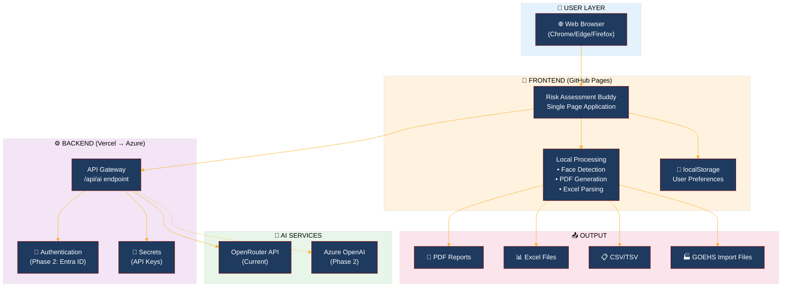
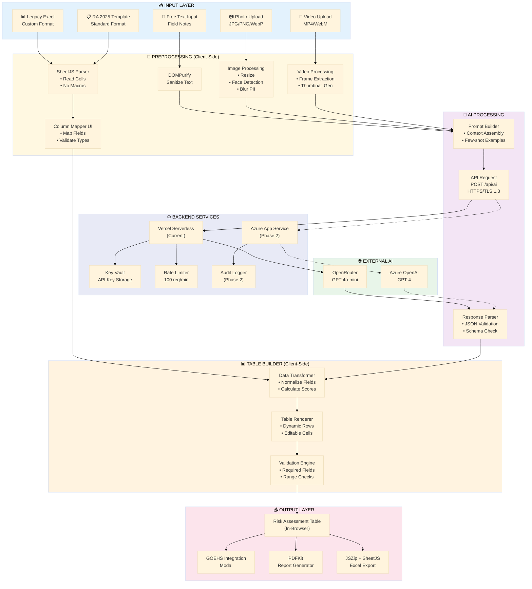
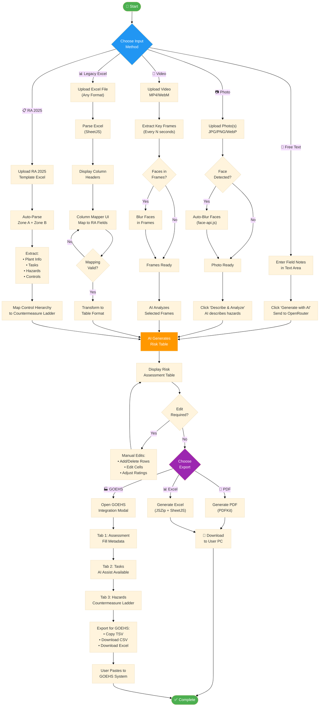
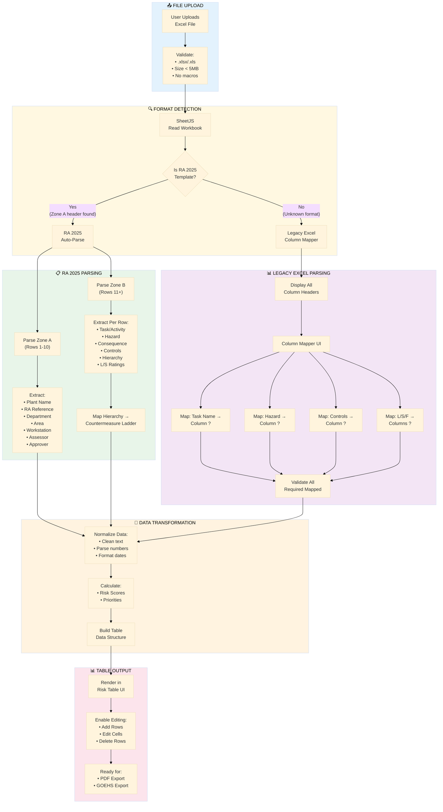
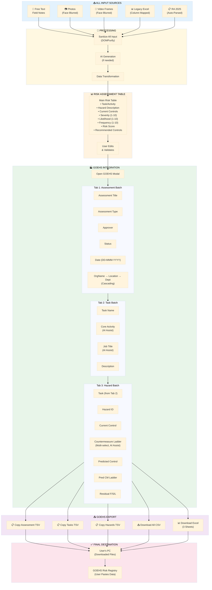
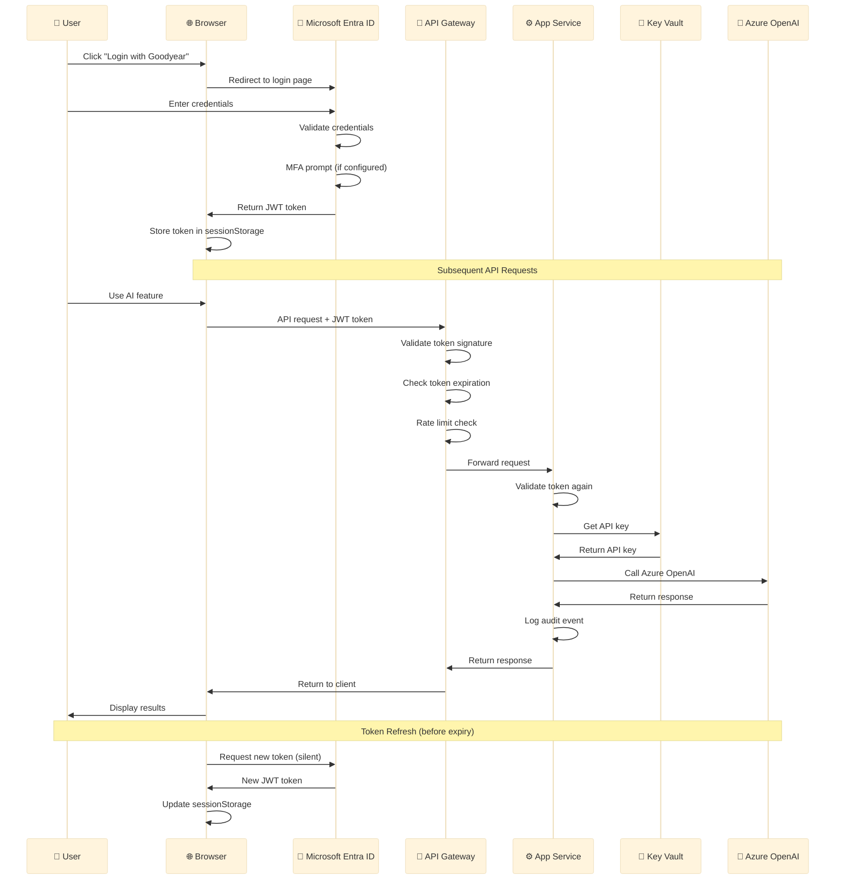
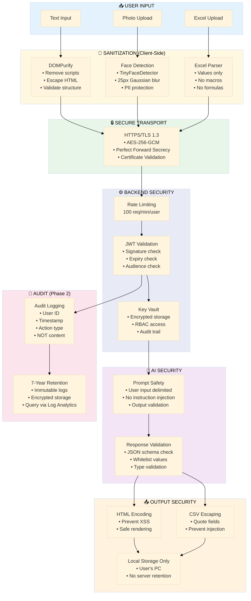

# Risk Assessment Buddy Smart 3.0 — Architecture Diagrams

**Document Version:** 1.0  
**Last Updated:** January 22, 2026  
**Purpose:** Visual architecture and workflow diagrams for IT Security Review

---

## Table of Contents

1. [High-Level System Architecture](#1-high-level-system-architecture)
2. [Detailed Technical Architecture](#2-detailed-technical-architecture)
3. [User Workflow - Complete Journey](#3-user-workflow---complete-journey)
4. [Media Processing Workflow](#4-media-processing-workflow)
5. [Excel Import Workflow](#5-excel-import-workflow)
6. [End-to-End Flow (All Inputs → GOEHS)](#6-end-to-end-flow)
7. [GOEHS Integration Flow](#7-goehs-integration-flow)
8. [Authentication Flow (Phase 2)](#8-authentication-flow-phase-2)
9. [Data Security Flow](#9-data-security-flow)

---

## 1. High-Level System Architecture

---

## 2. Detailed Technical Architecture

---

## 3. User Workflow - Complete Journey

---

## 4. Media Processing Workflow

```mermaid
%%{init: {'theme': 'base'}}%%
flowchart LR
    subgraph PHOTO["📷 PHOTO WORKFLOW"]
        P1["Upload Image"] --> P2["Validate:<br/>• File Type<br/>• Size < 10MB"]
        P2 --> P3["Load to Canvas"]
        P3 --> P4["face-api.js<br/>Detect Faces"]
        P4 --> P5{"Faces<br/>Found?"}
        P5 -->|Yes| P6["Apply Blur Filter<br/>(25px Gaussian)"]
        P5 -->|No| P7["Image Ready"]
        P6 --> P7
        P7 --> P8["Display Preview"]
        P8 --> P9["User Confirms"]
        P9 --> P10["Send to AI<br/>(Optional)"]
    end

    subgraph VIDEO["🎥 VIDEO WORKFLOW"]
        V1["Upload Video"] --> V2["Validate:<br/>• MP4/WebM<br/>• Size < 100MB"]
        V2 --> V3["Load Video<br/>Element"]
        V3 --> V4["Extract Frames<br/>Every 2 seconds"]
        V4 --> V5["For Each Frame:<br/>Detect Faces"]
        V5 --> V6["Blur Detected<br/>Faces"]
        V6 --> V7["Display Frame<br/>Gallery"]
        V7 --> V8["User Selects<br/>Key Frames"]
        V8 --> V9["Send Selected<br/>to AI"]
    end

    subgraph AI_DESCRIBE["🤖 AI DESCRIPTION"]
        A1["Receive Image/<br/>Frame Data"]
        A1 --> A2["Build Prompt:<br/>'Describe workplace<br/>hazards visible...'"]
        A2 --> A3["API Call<br/>OpenRouter"]
        A3 --> A4["Parse Response:<br/>Hazard descriptions"]
        A4 --> A5["Add to<br/>Risk Table"]
    end

    P10 --> A1
    V9 --> A1

    style PHOTO fill:#e3f2fd
    style VIDEO fill:#fff3e0
    style AI_DESCRIBE fill:#e8f5e9
```

---

## 5. Excel Import Workflow

---

## 6. End-to-End Flow

---

## 7. GOEHS Integration Flow

```mermaid
%%{init: {'theme': 'base'}}%%
flowchart TB
    subgraph TRIGGER["🚀 ENTRY POINT"]
        MainTable["Risk Assessment<br/>Table Complete"]
        ClickBtn["User Clicks<br/>'GOEHS Integration'"]
    end

    subgraph MODAL["🏭 GOEHS MODAL"]
        subgraph T1["📋 Tab 1: Assessment"]
            A1["Assessment Title"]
            A2["Assessment Type<br/>(Dropdown)"]
            A3["Approver"]
            A4["Status"]
            A5["Date DD-MMM-YYYY"]
            A6["OrgName"]
            A7["Location<br/>(Filtered by OrgName)"]
            A8["Department<br/>(Filtered by Location)"]
        end

        subgraph T2["📝 Tab 2: Tasks"]
            B1["Task Name<br/>(from main table)"]
            B2["Core Activity<br/>(Dropdown)"]
            B3["Job Title<br/>(Dropdown)"]
            B4["Description"]
            B5["⚡ Intelligent Fill<br/>(Keyword Match)"]
            B6["🤖 AI Assist<br/>(GPT-4o-mini)"]
        end

        subgraph T3["⚠️ Tab 3: Hazards"]
            C1["Task<br/>(from Tab 2)"]
            C2["Hazard ID"]
            C3["Current Control"]
            C4["Countermeasure Ladder<br/>(Multi-select 6 levels)"]
            C5["Predicted Control"]
            C6["Pred CM Ladder"]
            C7["Residual F/S/L<br/>(1-10 each)"]
            C8["⚡ Intelligent Fill<br/>(Control Keywords)"]
            C9["🤖 AI Assist<br/>(Hierarchy Classification)"]
        end
    end

    subgraph VALIDATE["✅ VALIDATION"]
        V1["Check Required Fields"]
        V2["Validate Date Format"]
        V3["Validate Dropdown Values"]
        V4["Validate CM Ladder<br/>(Exact Match)"]
        V5["Validate Ratings<br/>(1-10 Range)"]
    end

    subgraph EXPORT["📤 EXPORT OPTIONS"]
        E1["📋 Copy to Clipboard<br/>(TSV, no headers)"]
        E2["📥 Download CSV<br/>(with headers)"]
        E3["📊 Download Excel<br/>(3 sheets)"]
    end

    subgraph DEST["🎯 DESTINATION"]
        D1["User's PC<br/>(Files)"]
        D2["GOEHS System<br/>(Paste/Upload)"]
    end

    MainTable --> ClickBtn
    ClickBtn --> T1
    T1 --> T2
    T2 --> T3
    
    B5 -.-> B2
    B5 -.-> B3
    B6 -.-> B2
    B6 -.-> B3
    
    C8 -.-> C4
    C9 -.-> C4
    C8 -.-> C6
    C9 -.-> C6

    T3 --> V1
    V1 --> V2
    V2 --> V3
    V3 --> V4
    V4 --> V5
    V5 --> E1
    V5 --> E2
    V5 --> E3

    E1 --> D1
    E2 --> D1
    E3 --> D1
    D1 --> D2

    style TRIGGER fill:#e3f2fd
    style MODAL fill:#fff3e0
    style VALIDATE fill:#e8f5e9
    style EXPORT fill:#f3e5f5
    style DEST fill:#fce4ec
```

---

## 8. Authentication Flow (Phase 2)

---

## 9. Data Security Flow

---

## Rendering Instructions

### VS Code
1. Install extension: "Markdown Preview Mermaid Support" or "Mermaid Markdown Syntax Highlighting"
2. Open this file
3. Press `Ctrl+Shift+V` to preview

### GitHub
- Mermaid diagrams render automatically in markdown files

### Online Editor
- Visit https://mermaid.live
- Paste diagram code to edit interactively

### Export to Image
1. Use https://mermaid.live
2. Paste diagram code
3. Click "Export" → PNG/SVG

---

**Document Version:** 1.0  
**Last Updated:** January 22, 2026  
**Related Document:** IT_SECURITY_REVIEW_PREPARATION.md
