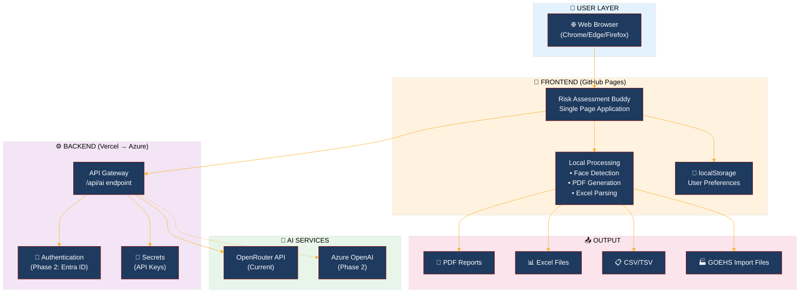
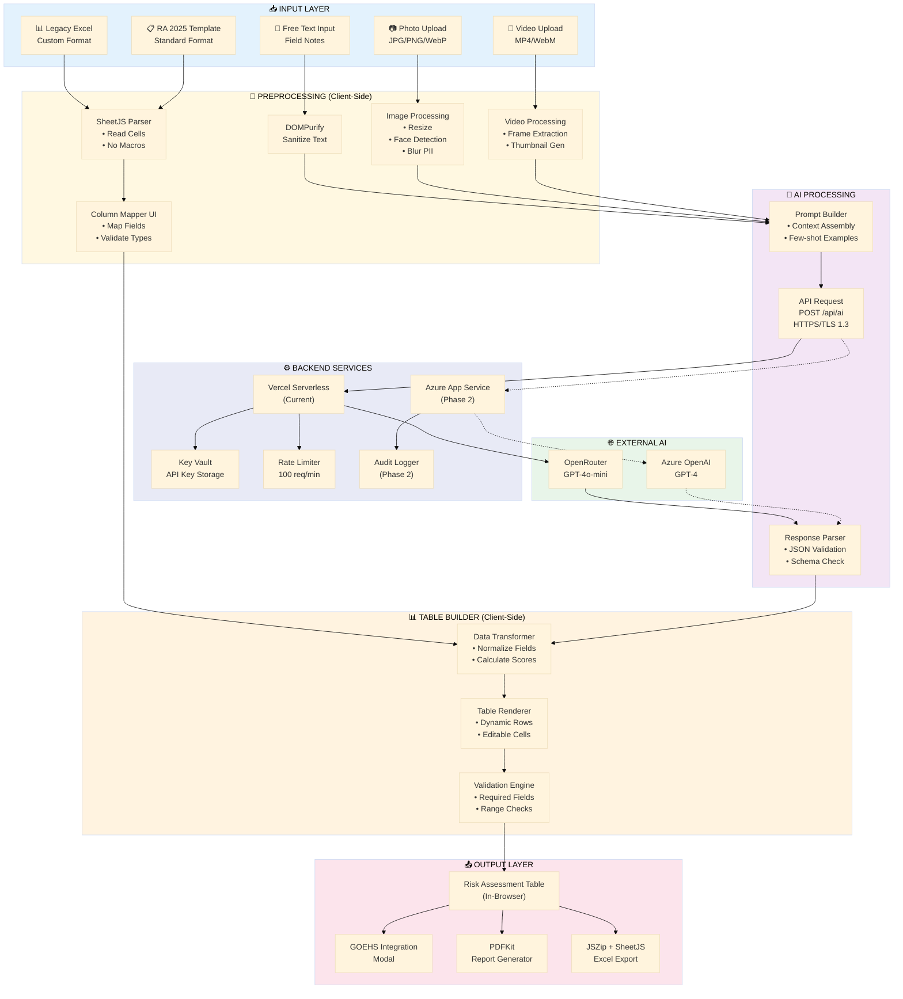
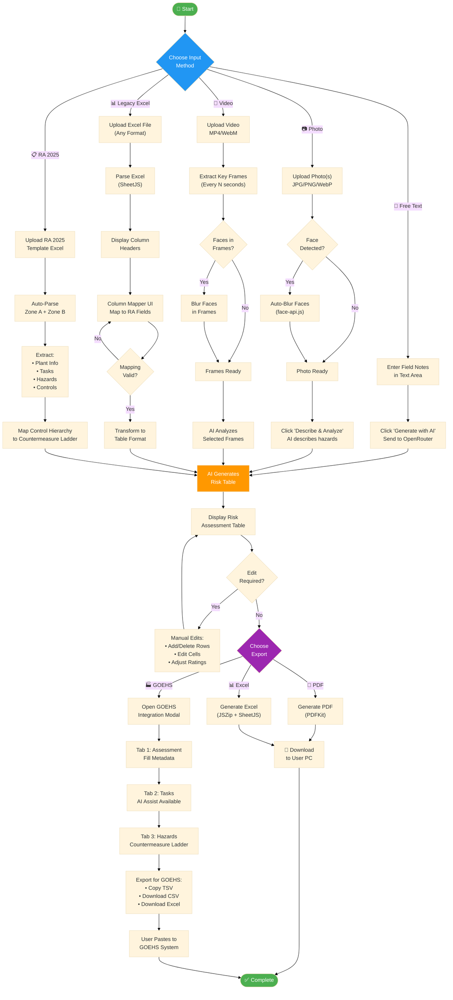
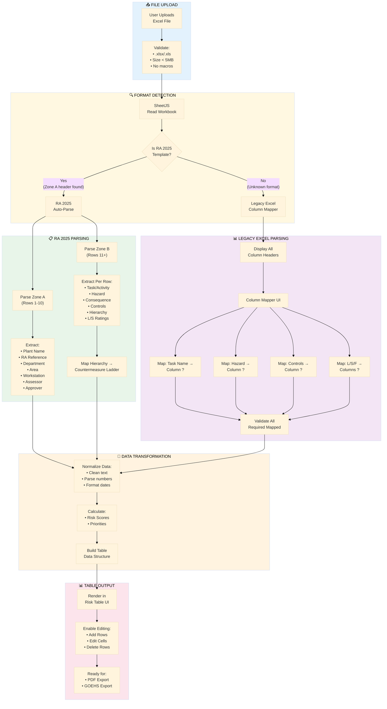
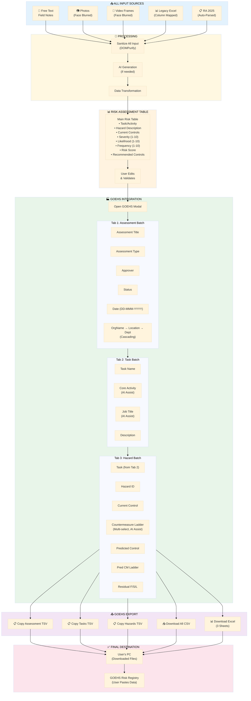

# Risk Assessment Buddy Smart 3.0
## IT Security Review - Detailed Preparation Document

**Date:** January 22, 2026  
**Prepared for:** Goodyear IT Security Team  
**Solution:** Risk Assessment Buddy Smart 3.0 (Web Application)  
**Current Status:** Phase 0 (Pilot Deployment)
**Document Type:** Detailed Technical Reference (includes GOEHS Integration)

---

## EXECUTIVE SUMMARY

**Business Use Case:**
Risk Assessment Buddy Smart is a web-based application designed to streamline workplace hazard identification, risk evaluation, and control implementation. It enables Safety Engineers and Managers to document hazards using multimedia (photos/videos), generate AI-powered safety recommendations, and export professional risk assessment reports.

**Current Deployment:** 
- Frontend hosted on GitHub Pages (static, public)
- Backend API on Vercel (serverless, third-party)
- Uses OpenRouter API for AI task generation
- No authentication currently (open access)
- All data stored locally on user computers

**Future State (Phase 2 - Q2 2026):**
- Migrate to Microsoft Azure infrastructure
- Implement Microsoft Entra ID (SSO) authentication
- Switch from OpenRouter to Azure OpenAI
- Add comprehensive audit logging
- No backend database for assessments (reports downloaded locally only)

---

## 1. HOW SYSTEMS ARE ACCESSED, MANAGED, AND GOVERNED

### 1.1 Current State (Phase 0)

**Access Model:**
- **Public Access:** Frontend accessible via public URL (GitHub Pages)
- **No Authentication:** Currently no login required (pilot phase)
- **Access Control:** None implemented
- **IP Restrictions:** None
- **Endpoint Protection:** HTTPS/TLS 1.3 only

**URLs:**
- **Frontend:** `https://yourusername.github.io/RISK-ASSESSMENT-BUDDY-SMART-3.0`
- **API Backend:** `https://risk-assessment-api-nine.vercel.app/api/ai`

**Management:**
- GitHub repository (private) contains source code
- Vercel linked to GitHub for automatic deployments
- Manual configuration of environment variables in Vercel dashboard

**Governance:**
- Currently: Minimal governance (pilot phase)
- Change control: Pull requests on GitHub
- Deployment: Automatic when code merged to main branch
- No formal approval workflow yet

### 1.2 Future State (Phase 2 - Q2 2026)

**Access Model:**
```
┌─────────────────────────┐
│  Goodyear Corporate     │
│  Azure AD / Entra ID    │
│                         │
│  - Employee login       │
│  - MFA/2FA supported    │
│  - Session management   │
│  - Token refresh        │
└────────┬────────────────┘
         │
         ▼
┌─────────────────────────┐
│  API Gateway            │
│  (Azure API Mgmt)       │
│                         │
│  - Rate limiting        │
│  - Token validation     │
│  - CORS enforcement     │
│  - Request logging      │
└────────┬────────────────┘
         │
         ▼
┌─────────────────────────┐
│  App Service            │
│  (Node.js Backend)      │
│                         │
│  - Request processing   │
│  - Key Vault access     │
│  - Audit logging        │
│  - Error handling       │
└─────────────────────────┘
```

**Access Requirements:**
- ✅ Goodyear email (@goodyear.com)
- ✅ Active Azure AD account
- ✅ Optional: MFA enrollment for sensitive operations
- ✅ Network: Company network or VPN required (future consideration)

**Governance (Proposed):**
- Azure resource groups per environment (Dev, Test, Prod)
- Role-based access control (RBAC)
- Formal change management via Azure DevOps
- Approval workflows for deployments
- Audit trail of all changes

---

## 2. HOW USERS ARE AUTHENTICATED AND ACCESS IS AUTHORIZED AND LOGGED

### 2.1 Current Authentication (Phase 0)

**Status:** ❌ No authentication implemented

**Current Flow:**
```
User
  ↓
Opens URL in browser
  ↓
Frontend loads (no login required)
  ↓
Can immediately use app
  ↓
Browser makes direct API calls to Vercel
  ↓
Vercel processes without user verification
```

**Risk:** **HIGH** - Anyone with the URL can access

**Mitigation:** App is currently pilot only, not widely shared

### 2.2 Future Authentication (Phase 2 - Q2 2026)

**Authentication Method: Microsoft Entra ID (Azure AD)**

**Login Flow:**
```
1. User visits app
   ↓
2. App redirects to Entra ID login
   ↓
3. User enters Goodyear credentials
   ↓
4. Entra ID verifies identity
   ↓
5. Optional: MFA prompt (if configured)
   ├─ Approve on phone
   ├─ Enter code
   └─ Biometric authentication
   ↓
6. Entra ID issues JWT token
   ├─ Token contains: User ID, Department, Email
   ├─ Signed by Entra ID
   ├─ Expires: 1 hour
   └─ Refresh token: 90 days
   ↓
7. Token returned to browser
   ↓
8. User accesses app with token
```

**Authorization Rules:**

| User Type | Access Level | Capabilities |
|-----------|--------------|--------------|
| Authenticated User | Full | Create/view/export assessments |
| Safety Engineer | Enhanced | Admin features (future) |
| Manager | Read-Only | View only, no create |
| Admin | Full | Manage users, audit logs |

**Token Management:**
- **Stored in:** Browser sessionStorage (not persistent)
- **Sent in:** Authorization header of every API request
- **Validation:** 
  - API Gateway validates signature
  - App Service validates expiration
  - Checks against Entra ID in real-time (future)
- **Refresh:** Automatic before expiration
- **Revocation:** Immediate if user account disabled

### 2.3 Access Logging

**Current (Phase 0):** Minimal logging

**Future (Phase 2):** Comprehensive Audit Trail

**What Gets Logged:**

```json
{
  "timestamp": "2026-01-16 14:30:45.123Z",
  "user_id": "john.smith@goodyear.com",
  "user_email": "john.smith@goodyear.com",
  "department": "Safety Engineering",
  "action": "ASSESSMENT_CREATED",
  "resource_type": "Assessment",
  "resource_id": "ASS-2026-0001",
  "hazard_type": "Fall from Height",
  "location": "Building A",
  "ip_address": "192.168.1.100",
  "browser": "Chrome 119",
  "device_type": "Windows Laptop",
  "status": "SUCCESS",
  "response_time_ms": 245,
  "api_endpoint": "/api/ai",
  "method": "POST"
}
```

**Audit Log Storage:**
- **Location:** Azure Table Storage (immutable)
- **Retention:** [**TO BE CONFIRMED** - See Section 4.2 below]
- **Access:** Only IT admins and compliance officers
- **Query Tool:** Azure Log Analytics

**Log Types:**
1. **Authentication Logs**
   - Login attempts (success/failure)
   - MFA events
   - Token refresh
   - Session timeout

2. **Activity Logs**
   - Assessment creation/modification
   - AI task generation
   - Report downloads
   - Data exports

3. **System Logs**
   - API errors
   - Performance metrics
   - Service health
   - Integration failures

4. **Security Logs**
   - Rate limit violations
   - CORS rejections
   - Invalid tokens
   - Suspicious patterns

**Audit Report Examples:**

**Query 1:** "Show all assessments created by John Smith in January 2026"
```
Results:
- ASS-2026-0001: Building A, Fall Hazard, 14:30:45
- ASS-2026-0015: Building B, Chemical Exposure, 15:45:22
- ASS-2026-0023: Warehouse, LOTO, 16:12:10
```

**Query 2:** "Show failed login attempts in past 24 hours"
```
Results:
- 2026-01-16 09:15:30: User "jane.doe@goodyear.com" - Invalid password (3 attempts)
- 2026-01-16 14:22:15: Unknown user "test.user@goodyear.com" - Account not found
```

---

## 3. HOW DATA MOVES, IS SECURED, AND WHAT DATA TYPES ARE IN SCOPE

### 3.1 Data Types in Scope

**Assessment Data (Created by Users):**
- Hazard descriptions (text)
- Location information (text)
- Severity/Frequency/Likelihood ratings (numeric)
- Photos/Videos of hazards (multimedia)
- AI-generated safety tasks (text)
- Control recommendations (text)

**User Data:**
- Name (from Entra ID)
- Email address (from Entra ID)
- Department (from Entra ID)
- Role (from Entra ID)

**System Data:**
- API request logs
- Performance metrics
- Error messages
- Audit trail entries

**Classification:**
- **Public:** Hazard category names, generic task templates
- **Internal Use Only:** Assessment results, user identifiers
- **Confidential:** Photos containing employee faces, specific location details
- **Restricted:** API keys, database credentials

### 3.2 Data Flow Diagram

**Current State (Phase 0):**

```
┌─────────────────────────────┐
│  User's Browser             │
│  (Client-Side)              │
│                             │
│  - Loads Index.HTML         │
│  - Runs JavaScript          │
│  - Face detection (local)   │
│  - Processes images locally │
│  - Generates PDFs locally   │
│  - Data stays on user PC    │
└────────────┬────────────────┘
             │
             │ HTTPS/TLS 1.3
             │ (All traffic encrypted)
             │
             ▼
┌─────────────────────────────┐
│  Vercel (Backend)           │
│  - Receives API requests    │
│ - Validates request         │
│  - Reads API_KEY from env   │
│  - Calls OpenRouter API     │
│  - Returns JSON response    │
│  - Does NOT store data      │
└────────────┬────────────────┘
             │
             │ HTTPS/TLS 1.3
             │ (All traffic encrypted)
             │
             ▼
┌─────────────────────────────┐
│  OpenRouter (Third-party)   │
│  - Processes AI requests    │
│  - Generates text responses │
│  - Returns to Vercel        │
│  - Does NOT log user data   │
└─────────────────────────────┘
```

**Data in Transit Protection:**
- ✅ TLS 1.3 encryption (AES-256)
- ✅ HTTPS only (no HTTP)
- ✅ Perfect forward secrecy
- ✅ Certificate pinning (future)

**Future State (Phase 2):**

```
┌──────────────────────────┐
│  User's Browser          │
│  (Client-Side)           │
│  - Loads app from GitHub │
│  - Authenticates via SSO │
│  - Runs JS locally       │
│  - Face blur local       │
│  - PDF generation local  │
│  - Stores temp data only │
└────────┬─────────────────┘
         │
         │ HTTPS/TLS 1.3
         │
         ▼
┌──────────────────────────┐
│  Entra ID (Auth)         │
│  - Validates user        │
│  - Issues JWT token      │
│  - Manages sessions      │
│  - Logs auth events      │
└──────────────────────────┘
         │
         │ Token included
         │
         ▼
┌──────────────────────────┐
│  API Gateway (Azure)     │
│  - Validates token       │
│  - Enforces rate limits  │
│  - Routes requests       │
│  - Logs traffic          │
└────────┬─────────────────┘
         │
         │ HTTPS/TLS 1.3
         │
         ▼
┌──────────────────────────┐
│  App Service (Node.js)   │
│  - Validates token again │
│  - Retrieves API key     │
│  - Processes request     │
│  - Calls Azure OpenAI    │
│  - Returns response      │
│  - Logs action           │
│  - Does NOT store data   │
└────────┬─────────────────┘
         │
         │ HTTPS/TLS 1.3
         │
         ▼
┌──────────────────────────┐
│  Azure OpenAI            │
│  - Processes AI task     │
│  - Returns JSON response │
│  - Does NOT log content  │
└──────────────────────────┘
         │
         │ Response back
         │
         ▼
┌──────────────────────────┐
│  Browser receives data   │
│  - Displays results      │
│  - User can export PDF   │
│  - Audit log created     │
└──────────────────────────┘
```
---

## SECTION 3A: GOEHS INTEGRATION - DETAILED TECHNICAL DOCUMENTATION

### 3A.1 GOEHS Integration Overview

**What is GOEHS?**
GOEHS (Goodyear Occupational Environmental Health & Safety) is the corporate vendor Risk Registry system used to track and manage workplace hazards, risk assessments, and control measures across all Goodyear facilities globally.

**Purpose of Integration:**
Risk Assessment Buddy Smart 3.0 provides a streamlined interface to prepare and export risk assessment data in the exact format required by GOEHS, eliminating manual data entry errors and ensuring data consistency.

**Integration Type:** 
- **Current:** Export-only (no direct API connection to GOEHS)
- **User-Mediated:** User copies/downloads data and pastes/uploads to GOEHS manually
- **Future (Phase 3):** Potential direct API integration with GOEHS (pending vendor approval)

**Key Benefits:**
1. Reduces manual data entry errors
2. Ensures consistent date formats (DD-MMM-YYYY)
3. Validates Countermeasure Ladder values against exact vendor requirements
4. AI-assisted field population for faster data entry
5. Batch processing of multiple tasks/hazards simultaneously

---

### 3A.2 GOEHS Data Architecture

#### 3A.2.1 Three-Tier Data Structure

```
┌─────────────────────────────────────────────────────────────────────────────┐
│                         GOEHS DATA HIERARCHY                                 │
├─────────────────────────────────────────────────────────────────────────────┤
│                                                                              │
│   ┌─────────────────────────────────────────────────────────────────────┐   │
│   │                    TIER 1: ASSESSMENT BATCH                          │   │
│   │                                                                      │   │
│   │   One assessment record containing:                                  │   │
│   │   • Assessment Title (unique identifier)                             │   │
│   │   • Assessment Type (Initial/Periodic/Change-Triggered)              │   │
│   │   • Assessment Approver (authorized person)                          │   │
│   │   • Status (Draft/Submitted/Approved/Rejected)                       │   │
│   │   • Creation Date (DD-MMM-YYYY format)                               │   │
│   │   • OrgName (organizational unit)                                    │   │
│   │   • Location (facility/plant)                                        │   │
│   │   • Department/Workstation                                           │   │
│   │                                                                      │   │
│   └───────────────────────────────┬─────────────────────────────────────┘   │
│                                   │                                          │
│                                   │ 1:N relationship                         │
│                                   ▼                                          │
│   ┌─────────────────────────────────────────────────────────────────────┐   │
│   │                    TIER 2: TASK BATCH                                │   │
│   │                                                                      │   │
│   │   Multiple task records (one per work activity):                     │   │
│   │   • Task Name (work activity description)                            │   │
│   │   • Core Activity (from vendor-defined list)                         │   │
│   │   • Job Title (from vendor-defined list)                             │   │
│   │   • Description (detailed task explanation)                          │   │
│   │   • Assessment Title (foreign key to Tier 1)                         │   │
│   │                                                                      │   │
│   └───────────────────────────────┬─────────────────────────────────────┘   │
│                                   │                                          │
│                                   │ 1:N relationship                         │
│                                   ▼                                          │
│   ┌─────────────────────────────────────────────────────────────────────┐   │
│   │                    TIER 3: HAZARD BATCH                              │   │
│   │                                                                      │   │
│   │   Multiple hazard records (one per identified hazard):               │   │
│   │   • Task Name (foreign key to Tier 2)                                │   │
│   │   • Hazard ID (unique hazard identifier)                             │   │
│   │   • Current Control (existing control measures)                      │   │
│   │   • Countermeasure Ladder (hierarchy of controls, Levels 1-6)        │   │
│   │   • Predicted Control (planned additional controls)                  │   │
│   │   • Predicted Countermeasure Ladder                                  │   │
│   │   • Residual Frequency (1-10 scale)                                  │   │
│   │   • Residual Severity (1-10 scale)                                   │   │
│   │   • Residual Likelihood (1-10 scale)                                 │   │
│   │   • Residual Risk Score (calculated: F × S × L)                      │   │
│   │                                                                      │   │
│   └─────────────────────────────────────────────────────────────────────┘   │
│                                                                              │
└─────────────────────────────────────────────────────────────────────────────┘
```

#### 3A.2.2 Countermeasure Ladder (Hierarchy of Controls)

The Countermeasure Ladder is a critical field in GOEHS that classifies control measures according to their effectiveness. Values must match exactly (case-sensitive):

| Level | Full Value (Exact Match Required) | Description | Examples |
|-------|-----------------------------------|-------------|----------|
| **6** | `Level 6 - Elimination` | Remove the hazard entirely | Remove hazardous chemical, eliminate manual lifting |
| **5** | `Level 5 - Substitution` | Replace with less hazardous alternative | Substitute solvent, replace manual process with automated |
| **4** | `Level 4 - Engineering Controls` | Physical barriers/changes to environment | Guards, ventilation, interlocks, barriers |
| **3** | `Level 3 - Visual Controls` | Visual warnings and indicators | Signs, labels, floor markings, mirrors, lights |
| **2** | `Level 2 - Administrative Controls` | Procedures and training | SOPs, training, permits, job rotation, supervision |
| **1** | `Level 1 - Individual Target (PPE)` | Personal protective equipment | Gloves, helmets, respirators, safety glasses, ear protection |

**Important:** Higher levels (5-6) are more effective but harder to implement. GOEHS expects most hazards to have a combination of levels selected.

#### 3A.2.3 Data Types and Validation Rules

| Field | Data Type | Max Length | Validation | Required |
|-------|-----------|------------|------------|----------|
| Assessment Title | String | 100 | No special HTML chars | ✅ Yes |
| Assessment Type | Enum | N/A | Must be from dropdown | ✅ Yes |
| Assessment Approver | String | 50 | Alphanumeric + spaces | ✅ Yes |
| Status | Enum | N/A | Draft/Submitted/Approved/Rejected | ✅ Yes |
| Creation Date | Date | 11 | DD-MMM-YYYY (e.g., 22-Jan-2026) | ✅ Yes |
| OrgName | Enum | N/A | Must be from vendor list | ✅ Yes |
| Location | Enum | N/A | Filtered by OrgName | ✅ Yes |
| Department | Enum | N/A | Filtered by Location | ✅ Yes |
| Task Name | String | 200 | No HTML, descriptive | ✅ Yes |
| Core Activity | Enum | N/A | From vendor Core Activity list | ✅ Yes |
| Job Title | Enum | N/A | From vendor Job Title list | ✅ Yes |
| Description | String | 500 | Free text, sanitized | ❌ No |
| Hazard ID | String | 50 | Alphanumeric | ✅ Yes |
| Current Control | String | 500 | Free text, sanitized | ✅ Yes |
| Countermeasure Ladder | Multi-Enum | N/A | 0-6 levels, exact values | ✅ Yes |
| Predicted Control | String | 500 | Free text, sanitized | ❌ No |
| Residual F/S/L | Integer | N/A | 1-10 | ✅ Yes |

---

### 3A.3 GOEHS Integration Data Flow

**Purpose:** Enable batch upload of risk assessments to GOEHS vendor Risk Registry with AI-assisted field population

**Components:**
- GOEHS Modal (3 tabs: Assessment, Task, Hazard batch uploads)
- Cascading dropdowns (OrgName → Location → Department/Workstation)
- AI Assist via OpenRouter (suggests Countermeasure Ladder, Core Activity, Job Title)
- Intelligent Fill (keyword-based local suggestions, no API calls)
- Export tools (CSV, Excel, TSV, clipboard copy)

**Data Types in GOEHS Flow:**
- Assessment metadata (Title, Type, Approver, Status, Creation Date)
- Task data (Task Name, Core Activity, Job Title, Description)
- Hazard data (Hazard ID, Current Control, Predicted Control)
- Countermeasure Ladder (multi-select: Level 1-6)
- Risk ratings (Residual Frequency, Severity, Likelihood)
- Vendor-specific selections (OrgName, Location, Department)
- Dates (strict DD-MMM-YYYY format: 22-Jan-2026)

**GOEHS Upload Flow - Step by Step:**

```mermaid
%%{init: {'theme': 'base'}}%%
flowchart TB
    subgraph TRIGGER["🚀 ENTRY POINT"]
        ClickBtn["User Clicks<br/>'GOEHS Integration'"]
    end

    subgraph MODAL["🏭 GOEHS MODAL"]
        subgraph T1["📋 Tab 1: Assessment"]
            A1["Assessment Title"]
            A2["Assessment Type<br/>(Dropdown)"]
            A3["Approver"]
            A4["Status"]
            A5["Date DD-MMM-YYYY"]
            A6["OrgName"]
            A7["Location<br/>(Filtered by OrgName)"]
            A8["Department<br/>(Filtered by Location)"]
        end

        subgraph T2["📝 Tab 2: Tasks"]
            B1["Task Name"]
            B2["Core Activity<br/>(Dropdown)"]
            B3["Job Title<br/>(Dropdown)"]
            B4["Description"]
            B5["⚡ Intelligent Fill"]
            B6["🤖 AI Assist"]
        end

        subgraph T3["⚠️ Tab 3: Hazards"]
            C1["Task<br/>(from Tab 2)"]
            C2["Hazard ID"]
            C3["Current Control"]
            C4["Countermeasure Ladder<br/>(6 levels)"]
            C5["Predicted Control"]
            C6["Pred CM Ladder"]
            C7["Residual F/S/L"]
            C8["⚡ Intelligent Fill"]
            C9["🤖 AI Assist"]
        end
    end

    subgraph VALIDATE["✅ VALIDATION"]
        V1["Required Fields?"]
        V2["Date Format Valid?"]
        V3["Dropdown Values OK?"]
        V4["CM Ladder Match?"]
        V5["Ratings in Range?"]
    end

    subgraph EXPORT["📤 EXPORT OPTIONS"]
        E1["📋 Copy TSV"]
        E2["📥 Download CSV"]
        E3["📊 Download Excel"]
    end

    subgraph DEST["🎯 DESTINATION"]
        D1["User's PC"]
        D2["GOEHS System"]
    end

    ClickBtn --> T1
    T1 --> T2
    T2 --> T3
    T3 --> V1
    V1 -->|No| T3
    V1 -->|Yes| V2
    V2 -->|No| T3
    V2 -->|Yes| V3
    V3 -->|No| T3
    V3 -->|Yes| V4
    V4 -->|No| T3
    V4 -->|Yes| V5
    V5 -->|No| T3
    V5 -->|Yes| E1
    V5 -->|Yes| E2
    V5 -->|Yes| E3

    E1 --> D1
    E2 --> D1
    E3 --> D1
    D1 --> D2

    style TRIGGER fill:#e3f2fd
    style MODAL fill:#fff3e0
    style VALIDATE fill:#e8f5e9
    style EXPORT fill:#f3e5f5
    style DEST fill:#fce4ec
```



**AI Features Detailed:**

**A. Intelligent Fill (⚡ Keyword-Based - No API Call)**

*For Task Batch (Core Activity & Job Title):*
- Function: `aiPopulateTaskFields()`
- Analyzes task name text
- Matches against known Core Activities list
- Matches against known Job Titles list
- Examples:
  - "Forklift Operation" → Core Activity: "Equipment Operation", Job Title: "Forklift Operator"
  - "Chemical Handling" → Core Activity: "Material Handling", Job Title: "Warehouse Technician"
- Returns instantly (no network latency)
- Visual indicator: Gold highlight on filled fields

*For Hazard Batch (Countermeasure Ladder):*
- Function: `aiPopulateHazardFields()`
- Analyzes Current Control description text
- Comprehensive keyword matching:
  - "PPE", "glove", "helmet", "respirator" → Level 1 - Individual Target
  - "training", "SOP", "procedure", "permit" → Level 2 - Administrative Controls
  - "sign", "label", "marking", "mirror" → Level 3 - Visual Controls
  - "guard", "barrier", "interlock", "ventilation" → Level 4 - Engineering Controls
  - "substitute", "replace", "alternative" → Level 5 - Substitution
  - "eliminate", "remove", "discontinue" → Level 6 - Elimination
- Returns instantly
- Can match multiple levels per description
- Visual indicator: Gold highlight on selected levels

**B. AI Assist (🤖 External API - OpenRouter)**

*For Task Batch:*
- Function: `aiAssistTaskFields()`
- Collects all task names from Tab 2
- Builds prompt listing all known Core Activities and Job Titles
- Sends to OpenRouter (model: openai/gpt-4o-mini)
- AI returns JSON: `[{"taskIndex": 0, "coreActivity": "...", "jobTitle": "..."}, ...]`
- Validates suggestions against allowed values
- Applies only valid suggestions
- Visual indicator: Same gold highlight
- Fallback: If API fails, shows error with "Try Intelligent Fill" suggestion

*For Hazard Batch:*
- Function: `aiAssistHazardFields()`
- Collects control descriptions (both Current and Predicted)
- Builds prompt listing all 6 Countermeasure Ladder levels with explanations
- Explains each level (what it includes, examples)
- Sends to OpenRouter (model: openai/gpt-4o-mini)
- AI returns JSON: `[{"index": 0, "currentLevels": [...], "predictedLevels": [...]}, ...]`
- Validates suggestions against exact level names
- Applies suggestions to multi-select controls
- Visual indicator: Same gold highlight
- Fallback: If API fails, shows error with "Try Intelligent Fill" suggestion

---

### 3A.4 AI Features - Complete Technical Specification

#### 3A.4.1 Intelligent Fill (Local Keyword Matching)

**Characteristic:** No external API calls - instant response, works offline

**A. Task Batch Intelligent Fill**

```javascript
// Function: aiPopulateTaskFields()
// Purpose: Suggest Core Activity and Job Title based on task name keywords

// Keyword Mapping Examples:
const CORE_ACTIVITY_KEYWORDS = {
    "Equipment Operation": ["forklift", "crane", "machine", "operate", "drive", "vehicle"],
    "Material Handling": ["lift", "carry", "move", "transport", "load", "unload", "chemical"],
    "Maintenance": ["repair", "fix", "maintain", "service", "inspect", "troubleshoot"],
    "Assembly": ["assemble", "build", "construct", "install", "mount"],
    "Quality Control": ["inspect", "test", "measure", "check", "verify", "audit"],
    "Cleaning": ["clean", "wash", "sanitize", "sweep", "mop"],
    // ... additional mappings
};

const JOB_TITLE_KEYWORDS = {
    "Forklift Operator": ["forklift", "pallet jack", "reach truck"],
    "Machine Operator": ["machine", "CNC", "press", "lathe"],
    "Maintenance Technician": ["maintain", "repair", "troubleshoot", "electrical"],
    "Warehouse Technician": ["warehouse", "storage", "inventory", "picking"],
    "Quality Inspector": ["inspect", "quality", "test", "measure"],
    // ... additional mappings
};

// Process:
1. User clicks "⚡ Intelligent Fill" button
2. For each task row in Tab 2:
   a. Extract task name text
   b. Convert to lowercase
   c. Search for keyword matches in CORE_ACTIVITY_KEYWORDS
   d. If match found, set Core Activity dropdown
   e. Search for keyword matches in JOB_TITLE_KEYWORDS
   f. If match found, set Job Title dropdown
3. Highlight filled fields with gold border
4. Show toast: "Filled X fields based on keywords"
```

**B. Hazard Batch Intelligent Fill (Countermeasure Ladder)**

```javascript
// Function: aiPopulateHazardFields()
// Purpose: Suggest Countermeasure Ladder levels based on control description keywords

const COUNTERMEASURE_KEYWORDS = {
    "Level 6 - Elimination": [
        "eliminate", "remove", "discontinue", "stop", "cease", "abolish",
        "get rid of", "phase out", "no longer"
    ],
    "Level 5 - Substitution": [
        "substitute", "replace", "alternative", "switch to", "use instead",
        "less hazardous", "safer material", "automated"
    ],
    "Level 4 - Engineering Controls": [
        "guard", "barrier", "interlock", "ventilation", "enclosure",
        "exhaust", "machine guarding", "isolation", "containment",
        "physical barrier", "safety device", "sensor", "automation"
    ],
    "Level 3 - Visual Controls": [
        "sign", "label", "marking", "floor marking", "color code",
        "warning light", "mirror", "indicator", "display", "poster",
        "visual indicator", "andon", "kanban"
    ],
    "Level 2 - Administrative Controls": [
        "training", "SOP", "procedure", "permit", "work permit",
        "job rotation", "supervision", "buddy system", "schedule",
        "safe work instruction", "JSA", "risk assessment", "briefing",
        "toolbox talk", "competency", "certification"
    ],
    "Level 1 - Individual Target (PPE)": [
        "PPE", "glove", "helmet", "hard hat", "safety glasses",
        "goggles", "respirator", "ear plug", "ear muff", "face shield",
        "safety shoes", "steel toe", "high visibility", "vest",
        "harness", "fall protection", "apron", "coverall"
    ]
};

// Process:
1. User clicks "⚡ Intelligent Fill" button
2. For each hazard row in Tab 3:
   a. Extract Current Control text
   b. Convert to lowercase
   c. For each Countermeasure Ladder level:
      - Search for any keyword match
      - If found, add level to selection
   d. Repeat for Predicted Control text
3. Update multi-select controls with matched levels
4. Highlight filled fields with gold border
5. Show toast: "Analyzed X hazards, suggested Y control levels"
```

#### 3A.4.2 AI Assist (External API - OpenRouter)

**Characteristic:** Uses GPT-4o-mini model, requires API call, more accurate than keyword matching

**A. Task Batch AI Assist**

```javascript
// Function: aiAssistTaskFields()
// Endpoint: https://risk-assessment-api-nine.vercel.app/api/ai
// Model: openai/gpt-4o-mini

// EXACT PROMPT SENT TO AI:
const taskPrompt = `You are an expert occupational health and safety classifier.

Given the following task names from a risk assessment, suggest the most appropriate 
Core Activity and Job Title for each task.

TASK NAMES:
${taskNames.map((name, i) => `${i + 1}. "${name}"`).join('\n')}

AVAILABLE CORE ACTIVITIES (you MUST choose from this list only):
- Equipment Operation
- Material Handling
- Maintenance
- Assembly
- Quality Control
- Cleaning
- Administrative Work
- Electrical Work
- Welding/Hot Work
- Confined Space Entry
- Working at Heights
- Chemical Handling
- Warehousing
- Transportation
- Construction

AVAILABLE JOB TITLES (you MUST choose from this list only):
- Forklift Operator
- Machine Operator
- Maintenance Technician
- Assembly Worker
- Quality Inspector
- Warehouse Technician
- Electrical Technician
- Welder
- Safety Officer
- Production Supervisor
- General Laborer
- Chemical Handler
- Crane Operator
- Truck Driver
- Cleaner

Respond in JSON format only:
[
  {"taskIndex": 0, "coreActivity": "Equipment Operation", "jobTitle": "Forklift Operator"},
  {"taskIndex": 1, "coreActivity": "Material Handling", "jobTitle": "Warehouse Technician"}
]

Rules:
1. Use ONLY values from the provided lists
2. If unsure, pick the closest match
3. Return valid JSON only, no explanation`;

// API Request:
const response = await fetch('https://risk-assessment-api-nine.vercel.app/api/ai', {
    method: 'POST',
    headers: { 'Content-Type': 'application/json' },
    body: JSON.stringify({
        model: 'openai/gpt-4o-mini',
        messages: [{ role: 'user', content: taskPrompt }]
    })
});

// Response Processing:
1. Parse JSON response
2. Validate each coreActivity against allowed list
3. Validate each jobTitle against allowed list
4. Apply only valid suggestions to form fields
5. Reject any hallucinated values not in lists
```

**B. Hazard Batch AI Assist (Countermeasure Ladder)**

```javascript
// Function: aiAssistHazardFields()
// Endpoint: https://risk-assessment-api-nine.vercel.app/api/ai
// Model: openai/gpt-4o-mini

// EXACT PROMPT SENT TO AI:
const hazardPrompt = `You are an expert occupational health and safety classifier specializing in the Hierarchy of Controls.

Analyze the following control measures and classify them according to the Countermeasure Ladder levels.

CONTROL MEASURES TO ANALYZE:
${hazards.map((h, i) => `
Hazard ${i + 1}:
- Current Control: "${h.currentControl}"
- Predicted Control: "${h.predictedControl || 'None specified'}"
`).join('\n')}

COUNTERMEASURE LADDER LEVELS (use EXACT values):
- "Level 6 - Elimination" = Completely removing the hazard (e.g., removing the chemical, eliminating the task)
- "Level 5 - Substitution" = Replacing with something less hazardous (e.g., using water-based instead of solvent-based)
- "Level 4 - Engineering Controls" = Physical changes to isolate people from hazard (e.g., guards, ventilation, barriers, interlocks)
- "Level 3 - Visual Controls" = Visual warnings and indicators (e.g., signs, labels, floor markings, warning lights)
- "Level 2 - Administrative Controls" = Procedures and training (e.g., SOPs, permits, job rotation, training programs)
- "Level 1 - Individual Target (PPE)" = Personal protective equipment (e.g., gloves, helmets, safety glasses, respirators)

Respond in JSON format only:
[
  {
    "index": 0,
    "currentLevels": ["Level 4 - Engineering Controls", "Level 1 - Individual Target (PPE)"],
    "predictedLevels": ["Level 6 - Elimination"]
  }
]

Rules:
1. Use EXACT level names as shown above (case-sensitive)
2. A single control description may include multiple levels
3. Return empty array [] if no controls match
4. Return valid JSON only, no explanation
5. "PPE", "gloves", "helmet" = Level 1
6. "training", "SOP" = Level 2
7. "sign", "label" = Level 3
8. "guard", "barrier", "ventilation" = Level 4
9. "substitute", "replace" = Level 5
10. "eliminate", "remove hazard" = Level 6`;

// Response Validation:
const VALID_LEVELS = [
    "Level 1 - Individual Target (PPE)",
    "Level 2 - Administrative Controls",
    "Level 3 - Visual Controls",
    "Level 4 - Engineering Controls",
    "Level 5 - Substitution",
    "Level 6 - Elimination"
];

// Only apply suggestions that exactly match valid levels
suggestions.forEach(s => {
    s.currentLevels = s.currentLevels.filter(l => VALID_LEVELS.includes(l));
    s.predictedLevels = s.predictedLevels.filter(l => VALID_LEVELS.includes(l));
});
```

#### 3A.4.3 AI Data Flow Security

```
┌─────────────────────────────────────────────────────────────────────────────┐
│                    AI ASSIST DATA FLOW (SECURITY VIEW)                       │
├─────────────────────────────────────────────────────────────────────────────┤
│                                                                              │
│   USER'S BROWSER                                                             │
│   ┌─────────────────────────────────────────────────────────────────────┐   │
│   │ 1. User clicks "AI Assist" button                                    │   │
│   │ 2. JavaScript collects task/hazard descriptions                      │   │
│   │ 3. DOMPurify sanitizes all text (prevents XSS in prompts)            │   │
│   │ 4. Builds prompt with sanitized data                                 │   │
│   └───────────────────────────────┬─────────────────────────────────────┘   │
│                                   │                                          │
│                                   │ HTTPS/TLS 1.3                            │
│                                   ▼                                          │
│   VERCEL BACKEND (Current) / AZURE APP SERVICE (Phase 2)                     │
│   ┌─────────────────────────────────────────────────────────────────────┐   │
│   │ 5. Receives POST request with prompt                                 │   │
│   │ 6. Validates request structure (no code injection)                   │   │
│   │ 7. Retrieves API key from environment/Key Vault                      │   │
│   │ 8. Forwards to OpenRouter/Azure OpenAI                               │   │
│   │ 9. Logs: timestamp, user (Phase 2), request type, token count        │   │
│   │    (Does NOT log prompt content or response content)                 │   │
│   └───────────────────────────────┬─────────────────────────────────────┘   │
│                                   │                                          │
│                                   │ HTTPS/TLS 1.3                            │
│                                   ▼                                          │
│   AI SERVICE (OpenRouter / Azure OpenAI)                                     │
│   ┌─────────────────────────────────────────────────────────────────────┐   │
│   │ 10. Processes prompt                                                 │   │
│   │ 11. Generates JSON response                                          │   │
│   │ 12. Returns suggestions                                              │   │
│   │     (Azure OpenAI: data NOT used for training per enterprise DPA)    │   │
│   └───────────────────────────────┬─────────────────────────────────────┘   │
│                                   │                                          │
│                                   │ Response (JSON)                          │
│                                   ▼                                          │
│   USER'S BROWSER                                                             │
│   ┌─────────────────────────────────────────────────────────────────────┐   │
│   │ 13. Receives JSON response                                           │   │
│   │ 14. Validates structure (catches malformed JSON)                     │   │
│   │ 15. Validates values against whitelist (prevents hallucination)      │   │
│   │ 16. Applies only valid suggestions to form fields                    │   │
│   │ 17. Highlights filled fields for user review                         │   │
│   └─────────────────────────────────────────────────────────────────────┘   │
│                                                                              │
└─────────────────────────────────────────────────────────────────────────────┘

WHAT IS SENT TO AI:
✅ Task names (work activity descriptions)
✅ Control measure descriptions (text)
✅ Pre-built prompt template

WHAT IS NOT SENT TO AI:
❌ Photos or images
❌ User credentials or tokens
❌ Employee names or personal data
❌ Location/facility specifics (unless in task description)
❌ API keys (server-side only)
```

---

### 3A.5 GOEHS User Interface Flow

#### 3A.5.1 Complete User Journey

```
┌─────────────────────────────────────────────────────────────────────────────┐
│                    GOEHS INTEGRATION USER FLOW                               │
├─────────────────────────────────────────────────────────────────────────────┤
│                                                                              │
│   STEP 1: ENTRY POINTS                                                       │
│   ┌─────────────────────────────────────────────────────────────────────┐   │
│   │                                                                      │   │
│   │   Option A: From Main Risk Table                                     │   │
│   │   ┌─────────────────────┐                                            │   │
│   │   │ User has completed  │                                            │   │
│   │   │ risk assessment in  │ → Click "GOEHS Integration" button         │   │
│   │   │ main table          │                                            │   │
│   │   └─────────────────────┘                                            │   │
│   │                                                                      │   │
│   │   Option B: Upload RA 2025 Template                                  │   │
│   │   ┌─────────────────────┐                                            │   │
│   │   │ User has existing   │                                            │   │
│   │   │ RA 2025 Excel file  │ → Click "Upload RA 2025 Template"          │   │
│   │   │ (legacy format)     │ → Select Excel file                        │   │
│   │   └─────────────────────┘ → Auto-parses and populates main table     │   │
│   │                           → Then click "GOEHS Integration"            │   │
│   │                                                                      │   │
│   └───────────────────────────────┬─────────────────────────────────────┘   │
│                                   │                                          │
│                                   ▼                                          │
│   STEP 2: GOEHS MODAL OPENS                                                  │
│   ┌─────────────────────────────────────────────────────────────────────┐   │
│   │                                                                      │   │
│   │   ┌──────────────────────────────────────────────────────────────┐  │   │
│   │   │  GOEHS Integration                                      [X]  │  │   │
│   │   ├──────────────────────────────────────────────────────────────┤  │   │
│   │   │  [Tab 1: Assessment] [Tab 2: Tasks] [Tab 3: Hazards]         │  │   │
│   │   ├──────────────────────────────────────────────────────────────┤  │   │
│   │   │                                                              │  │   │
│   │   │  Assessment data pre-populated from main table if available  │  │   │
│   │   │                                                              │  │   │
│   │   └──────────────────────────────────────────────────────────────┘  │   │
│   │                                                                      │   │
│   └───────────────────────────────┬─────────────────────────────────────┘   │
│                                   │                                          │
│                                   ▼                                          │
│   STEP 3: TAB 1 - ASSESSMENT BATCH                                           │
│   ┌─────────────────────────────────────────────────────────────────────┐   │
│   │                                                                      │   │
│   │   Fields:                                                            │   │
│   │   ┌────────────────────────┐  ┌────────────────────────┐            │   │
│   │   │ Assessment Title:      │  │ Assessment Type:       │            │   │
│   │   │ [___________________]  │  │ [Initial Assessment ▼] │            │   │
│   │   └────────────────────────┘  └────────────────────────┘            │   │
│   │   ┌────────────────────────┐  ┌────────────────────────┐            │   │
│   │   │ Assessment Approver:   │  │ Status:                │            │   │
│   │   │ [___________________]  │  │ [Draft ▼]              │            │   │
│   │   └────────────────────────┘  └────────────────────────┘            │   │
│   │   ┌────────────────────────┐                                        │   │
│   │   │ Creation Date:         │  Format: DD-MMM-YYYY                   │   │
│   │   │ [22-Jan-2026_________] │  Example: 22-Jan-2026                  │   │
│   │   └────────────────────────┘                                        │   │
│   │                                                                      │   │
│   │   Cascading Dropdowns:                                               │   │
│   │   ┌────────────────────────┐                                        │   │
│   │   │ OrgName:               │ ← Select first                         │   │
│   │   │ [Mfg - EMEA ▼]         │                                        │   │
│   │   └────────────────────────┘                                        │   │
│   │              │ Filters...                                            │   │
│   │              ▼                                                       │   │
│   │   ┌────────────────────────┐                                        │   │
│   │   │ Location:              │ ← Only shows locations for Mfg - EMEA  │   │
│   │   │ [Luxembourg ▼]         │                                        │   │
│   │   └────────────────────────┘                                        │   │
│   │              │ Filters...                                            │   │
│   │              ▼                                                       │   │
│   │   ┌────────────────────────┐                                        │   │
│   │   │ Department:            │ ← Only shows depts for Luxembourg      │   │
│   │   │ [Assembly ▼]           │                                        │   │
│   │   └────────────────────────┘                                        │   │
│   │                                                                      │   │
│   └───────────────────────────────┬─────────────────────────────────────┘   │
│                                   │                                          │
│                                   ▼                                          │
│   STEP 4: TAB 2 - TASK BATCH                                                 │
│   ┌─────────────────────────────────────────────────────────────────────┐   │
│   │                                                                      │   │
│   │   [⚡ Intelligent Fill] [🤖 AI Assist] [+ Add Task Row]              │   │
│   │                                                                      │   │
│   │   ┌─────────────────────────────────────────────────────────────┐   │   │
│   │   │ Row 1:                                                       │   │   │
│   │   │ Task Name: [Operate forklift in warehouse_______________]   │   │   │
│   │   │ Core Activity: [Equipment Operation ▼]  ← AI suggested      │   │   │
│   │   │ Job Title: [Forklift Operator ▼]        ← AI suggested      │   │   │
│   │   │ Description: [Move pallets from receiving to storage____]   │   │   │
│   │   └─────────────────────────────────────────────────────────────┘   │   │
│   │   ┌─────────────────────────────────────────────────────────────┐   │   │
│   │   │ Row 2:                                                       │   │   │
│   │   │ Task Name: [Chemical mixing in lab_______________________]   │   │   │
│   │   │ Core Activity: [Chemical Handling ▼]                         │   │   │
│   │   │ Job Title: [Chemical Handler ▼]                              │   │   │
│   │   │ Description: [Mix adhesive compounds per SOP____________]   │   │   │
│   │   └─────────────────────────────────────────────────────────────┘   │   │
│   │                                                                      │   │
│   └───────────────────────────────┬─────────────────────────────────────┘   │
│                                   │                                          │
│                                   ▼                                          │
│   STEP 5: TAB 3 - HAZARD BATCH                                               │
│   ┌─────────────────────────────────────────────────────────────────────┐   │
│   │                                                                      │   │
│   │   [⚡ Intelligent Fill] [🤖 AI Assist] [+ Add Hazard Row]            │   │
│   │                                                                      │   │
│   │   ┌─────────────────────────────────────────────────────────────┐   │   │
│   │   │ Hazard 1:                                                    │   │   │
│   │   │ Task: [Operate forklift in warehouse ▼] ← Links to Tab 2    │   │   │
│   │   │ Hazard ID: [HAZ-001_______]                                  │   │   │
│   │   │ Current Control: [Operator training, floor markings,        │   │   │
│   │   │                   seat belt, speed limit signs_________]    │   │   │
│   │   │ Countermeasure Ladder:                                       │   │   │
│   │   │   ☑ Level 1 - Individual Target (PPE)     ← seat belt       │   │   │
│   │   │   ☑ Level 2 - Administrative Controls     ← training        │   │   │
│   │   │   ☑ Level 3 - Visual Controls             ← floor markings  │   │   │
│   │   │   ☐ Level 4 - Engineering Controls                          │   │   │
│   │   │   ☐ Level 5 - Substitution                                   │   │   │
│   │   │   ☐ Level 6 - Elimination                                    │   │   │
│   │   │ Predicted Control: [Install proximity sensors, add______    │   │   │
│   │   │                     physical barriers at pedestrian zones]  │   │   │
│   │   │ Pred Countermeasure Ladder:                                  │   │   │
│   │   │   ☐ Level 1  ☐ Level 2  ☐ Level 3                           │   │   │
│   │   │   ☑ Level 4 - Engineering Controls  ← sensors, barriers     │   │   │
│   │   │   ☐ Level 5  ☐ Level 6                                       │   │   │
│   │   │ Residual: F:[3] S:[4] L:[2] = Risk Score: [24]               │   │   │
│   │   └─────────────────────────────────────────────────────────────┘   │   │
│   │                                                                      │   │
│   └───────────────────────────────┬─────────────────────────────────────┘   │
│                                   │                                          │
│                                   ▼                                          │
│   STEP 6: VALIDATION & EXPORT                                                │
│   ┌─────────────────────────────────────────────────────────────────────┐   │
│   │                                                                      │   │
│   │   Before Export - Validation Checks:                                 │   │
│   │   ✓ All required fields filled                                       │   │
│   │   ✓ Date format correct (DD-MMM-YYYY)                                │   │
│   │   ✓ Dropdown values from valid lists                                 │   │
│   │   ✓ At least one Countermeasure Ladder level selected                │   │
│   │   ✓ Risk scores within range (1-10 each)                             │   │
│   │                                                                      │   │
│   │   Export Options:                                                    │   │
│   │   ┌──────────────────────────────────────────────────────────────┐  │   │
│   │   │ Clipboard (for direct paste to GOEHS):                       │  │   │
│   │   │ [📋 Copy Assessment TSV] [📋 Copy Tasks TSV] [📋 Copy Hazards]│  │   │
│   │   │                                                              │  │   │
│   │   │ Download (for records/backup):                               │  │   │
│   │   │ [📥 Download Assessment CSV] [📥 Download Tasks CSV]          │  │   │
│   │   │ [📥 Download Hazards CSV] [📊 Download Excel (All Tabs)]     │  │   │
│   │   └──────────────────────────────────────────────────────────────┘  │   │
│   │                                                                      │   │
│   └───────────────────────────────┬─────────────────────────────────────┘   │
│                                   │                                          │
│                                   ▼                                          │
│   STEP 7: USER UPLOADS TO GOEHS (External System)                            │
│   ┌─────────────────────────────────────────────────────────────────────┐   │
│   │                                                                      │   │
│   │   1. User opens GOEHS Risk Registry (separate system)                │   │
│   │   2. User pastes/uploads the exported data                           │   │
│   │   3. GOEHS validates and imports the records                         │   │
│   │   4. Risk Assessment Buddy does NOT interact with GOEHS directly     │   │
│   │                                                                      │   │
│   └─────────────────────────────────────────────────────────────────────┘   │
│                                                                              │
└─────────────────────────────────────────────────────────────────────────────┘
```

---

### 3A.6 Cascading Dropdown System

#### 3A.6.1 Vendor Database Mapping

The GOEHS system requires specific organizational values. Our cascading dropdown system ensures users can only select valid combinations:

```javascript
// Vendor Database Structure (Simplified Example)
const VENDOR_DATABASE = {
    "Mfg - EMEA": {
        locations: {
            "Luxembourg": ["Assembly", "Quality", "Maintenance", "Warehouse"],
            "Spain": ["Assembly", "Quality", "Packaging", "Shipping"],
            "Germany": ["R&D", "Testing", "Quality", "Administration"],
            "France": ["Production", "Logistics", "Quality"]
        }
    },
    "Mfg - Americas": {
        locations: {
            "Ohio - Akron": ["Tire Building", "Curing", "Quality", "Maintenance"],
            "Texas - Houston": ["Operations", "Safety", "Engineering", "Logistics"],
            "Mexico - San Luis Potosi": ["Assembly", "Quality", "Warehouse"]
        }
    },
    "Mfg - APAC": {
        locations: {
            "China - Pulandian": ["Production", "Quality", "Maintenance"],
            "Thailand": ["Manufacturing", "Quality", "Logistics"],
            "Japan": ["R&D", "Testing", "Quality"]
        }
    }
};

// Cascading Logic:
function updateLocationDropdown(selectedOrgName) {
    const locationDropdown = document.getElementById('location');
    locationDropdown.innerHTML = '<option value="">Select Location</option>';
    
    if (selectedOrgName && VENDOR_DATABASE[selectedOrgName]) {
        Object.keys(VENDOR_DATABASE[selectedOrgName].locations).forEach(loc => {
            const option = document.createElement('option');
            option.value = loc;
            option.textContent = loc;
            locationDropdown.appendChild(option);
        });
    }
    
    // Clear dependent dropdown
    updateDepartmentDropdown(null, null);
}

function updateDepartmentDropdown(selectedOrgName, selectedLocation) {
    const deptDropdown = document.getElementById('department');
    deptDropdown.innerHTML = '<option value="">Select Department</option>';
    
    if (selectedOrgName && selectedLocation && 
        VENDOR_DATABASE[selectedOrgName]?.locations[selectedLocation]) {
        VENDOR_DATABASE[selectedOrgName].locations[selectedLocation].forEach(dept => {
            const option = document.createElement('option');
            option.value = dept;
            option.textContent = dept;
            deptDropdown.appendChild(option);
        });
    }
}
```

#### 3A.6.2 Core Activity and Job Title Lists

```javascript
// Complete lists from GOEHS vendor requirements
const CORE_ACTIVITIES = [
    "Equipment Operation",
    "Material Handling", 
    "Maintenance",
    "Assembly",
    "Quality Control",
    "Cleaning",
    "Administrative Work",
    "Electrical Work",
    "Welding/Hot Work",
    "Confined Space Entry",
    "Working at Heights",
    "Chemical Handling",
    "Warehousing",
    "Transportation",
    "Construction",
    "Demolition",
    "Excavation",
    "Laboratory Work",
    "Office Work",
    "Security/Patrol"
];

const JOB_TITLES = [
    "Forklift Operator",
    "Machine Operator",
    "Maintenance Technician",
    "Assembly Worker",
    "Quality Inspector",
    "Warehouse Technician",
    "Electrical Technician",
    "Welder",
    "Safety Officer",
    "Production Supervisor",
    "General Laborer",
    "Chemical Handler",
    "Crane Operator",
    "Truck Driver",
    "Cleaner",
    "Security Guard",
    "Lab Technician",
    "Engineer",
    "Manager",
    "Administrative Assistant"
];
```

---

### 3A.7 RA 2025 Template Import

#### 3A.7.1 Excel Template Structure

The RA 2025 Template is the legacy risk assessment format used at Goodyear plants. The system can parse this format and convert it for GOEHS upload:

```
┌─────────────────────────────────────────────────────────────────────────────┐
│                    RA 2025 EXCEL TEMPLATE STRUCTURE                          │
├─────────────────────────────────────────────────────────────────────────────┤
│                                                                              │
│   ZONE A (Header Information) - Rows 1-10                                    │
│   ┌─────────────────────────────────────────────────────────────────────┐   │
│   │ Cell A1: "Plant Name"        Cell B1: [Plant Value]                  │   │
│   │ Cell A2: "RA Reference"      Cell B2: [Reference Number]             │   │
│   │ Cell A3: "Department"        Cell B3: [Department Name]              │   │
│   │ Cell A4: "Area"              Cell B4: [Work Area]                    │   │
│   │ Cell A5: "Work Station"      Cell B5: [Workstation Name]             │   │
│   │ Cell A6: "Assessment Date"   Cell B6: [Date]                         │   │
│   │ Cell A7: "Assessor"          Cell B7: [Assessor Name]                │   │
│   │ Cell A8: "Approver"          Cell B8: [Approver Name]                │   │
│   └─────────────────────────────────────────────────────────────────────┘   │
│                                                                              │
│   ZONE B (Risk Items) - Rows 11+                                             │
│   ┌─────────────────────────────────────────────────────────────────────┐   │
│   │ Column A: Task/Activity Description                                  │   │
│   │ Column B: Hazard Description                                         │   │
│   │ Column C: Potential Consequence                                      │   │
│   │ Column D: Existing Controls                                          │   │
│   │ Column E: Control Hierarchy (Elimination/Substitution/Engineering/   │   │
│   │           Visual/Administrative/PPE)                                 │   │
│   │ Column F: Likelihood (1-5)                                           │   │
│   │ Column G: Severity (1-5)                                             │   │
│   │ Column H: Risk Rating (L × S)                                        │   │
│   │ Column I: Additional Controls Required                               │   │
│   │ Column J: Predicted Control Hierarchy                                │   │
│   │ Column K: Residual Likelihood                                        │   │
│   │ Column L: Residual Severity                                          │   │
│   │ Column M: Residual Risk Rating                                       │   │
│   │ Column N: Action Owner                                               │   │
│   │ Column O: Due Date                                                   │   │
│   └─────────────────────────────────────────────────────────────────────┘   │
│                                                                              │
└─────────────────────────────────────────────────────────────────────────────┘
```

#### 3A.7.2 Parsing and Conversion Logic

```javascript
// Function: parseRA2025Template(workbook)
// Purpose: Extract data from RA 2025 Excel format

async function parseRA2025Template(file) {
    const workbook = await readExcelFile(file);
    const sheet = workbook.Sheets[workbook.SheetNames[0]];
    
    // Extract Zone A (Header)
    const zoneA = {
        plantName: sheet['B1']?.v || '',
        raReference: sheet['B2']?.v || '',
        department: sheet['B3']?.v || '',
        area: sheet['B4']?.v || '',
        workStation: sheet['B5']?.v || '',
        assessmentDate: sheet['B6']?.v || '',
        assessor: sheet['B7']?.v || '',
        approver: sheet['B8']?.v || ''
    };
    
    // Extract Zone B (Risk Items) starting from row 11
    const zoneB = [];
    let row = 11;
    
    while (sheet[`A${row}`]) {
        const item = {
            taskActivity: sheet[`A${row}`]?.v || '',
            hazardDescription: sheet[`B${row}`]?.v || '',
            consequence: sheet[`C${row}`]?.v || '',
            existingControls: sheet[`D${row}`]?.v || '',
            controlHierarchy: sheet[`E${row}`]?.v || '',
            likelihood: parseInt(sheet[`F${row}`]?.v) || 1,
            severity: parseInt(sheet[`G${row}`]?.v) || 1,
            additionalControls: sheet[`I${row}`]?.v || '',
            predictedHierarchy: sheet[`J${row}`]?.v || '',
            residualLikelihood: parseInt(sheet[`K${row}`]?.v) || 1,
            residualSeverity: parseInt(sheet[`L${row}`]?.v) || 1
        };
        zoneB.push(item);
        row++;
    }
    
    return { zoneA, zoneB };
}

// Function: mapControlHierarchyToLadder(hierarchyText)
// Purpose: Convert RA 2025 hierarchy to GOEHS Countermeasure Ladder

function mapControlHierarchyToLadder(hierarchyText) {
    const levels = [];
    const text = hierarchyText.toLowerCase();
    
    if (text.includes('elimination')) levels.push('Level 6 - Elimination');
    if (text.includes('substitution')) levels.push('Level 5 - Substitution');
    if (text.includes('engineering')) levels.push('Level 4 - Engineering Controls');
    if (text.includes('visual') || text.includes('warning')) levels.push('Level 3 - Visual Controls');
    if (text.includes('administrative') || text.includes('training')) levels.push('Level 2 - Administrative Controls');
    if (text.includes('ppe') || text.includes('personal')) levels.push('Level 1 - Individual Target (PPE)');
    
    return levels;
}
```

---

### 3A.8 GOEHS Security Controls

#### 3A.8.1 Input Validation

| Field | Validation Method | Attack Prevention |
|-------|-------------------|-------------------|
| Assessment Title | Max 100 chars, regex `^[a-zA-Z0-9\s\-_]+$` | XSS, SQL injection |
| All Text Fields | DOMPurify sanitization | XSS |
| Dropdown Values | Whitelist validation | Injection, tampering |
| Dates | Regex `^\d{2}-[A-Z][a-z]{2}-\d{4}$` | Format attacks |
| Countermeasure Ladder | Exact string match against 6 values | Data integrity |
| Risk Scores | Integer 1-10 only | Overflow, injection |

#### 3A.8.2 Export Security

```javascript
// CSV Export with Proper Escaping
function escapeCSVField(value) {
    if (value === null || value === undefined) return '';
    
    const stringValue = String(value);
    
    // Escape if contains comma, quote, or newline
    if (stringValue.includes(',') || 
        stringValue.includes('"') || 
        stringValue.includes('\n') ||
        stringValue.includes('\r')) {
        // Double any existing quotes and wrap in quotes
        return '"' + stringValue.replace(/"/g, '""') + '"';
    }
    
    // Prevent formula injection (=, +, -, @, tab, carriage return)
    if (/^[=+\-@\t\r]/.test(stringValue)) {
        return "'" + stringValue; // Prefix with single quote
    }
    
    return stringValue;
}

// Excel Export Security
function generateSecureExcel(data) {
    // Use JSZip with secure settings
    // - No macros allowed
    // - No external references
    // - All formulas are simple calculations only
    // - No VBA or scripts
}
```

#### 3A.8.3 Security Control Matrix

| Control | Current (Phase 0) | Phase 2 |
|---------|-------------------|---------|
| Input Sanitization | ✅ DOMPurify | ✅ DOMPurify + Server |
| Dropdown Validation | ✅ Client-side | ✅ Server-side |
| CSV Injection Prevention | ✅ Field escaping | ✅ Field escaping |
| Formula Injection Prevention | ✅ Prefix protection | ✅ Prefix protection |
| Date Format Enforcement | ✅ Regex validation | ✅ Server validation |
| Countermeasure Ladder Validation | ✅ Exact match | ✅ Server whitelist |
| AI Suggestion Validation | ✅ Whitelist check | ✅ Whitelist + logging |
| Export Audit | ❌ None | ✅ Full audit trail |
| Rate Limiting | ❌ None | ✅ 100 req/min |
| User Attribution | ❌ Anonymous | ✅ Entra ID user |

#### 3A.8.4 Error Handling

| Scenario | User Message | Fallback Action | Logged (Phase 2) |
|----------|--------------|-----------------|------------------|
| Required field empty | "Please fill all required fields" | Highlight fields | Yes |
| Invalid date format | "Use format: DD-MMM-YYYY (e.g., 22-Jan-2026)" | Show example | Yes |
| Invalid dropdown value | "Please select from the list" | Reset to empty | Yes |
| AI Assist timeout (>10s) | "AI service unavailable. Try Intelligent Fill." | Suggest local option | Yes |
| AI Assist 404 | "Service temporarily unavailable" | Manual entry | Yes |
| AI returns invalid JSON | "AI response error. Try again." | Retry or manual | Yes |
| AI suggests invalid value | (Silent skip) | Only apply valid values | Yes |
| Clipboard copy fails | "Copy failed. Try download instead." | Offer file download | Yes |
| Export validation fails | "Please fix highlighted errors" | Highlight issues | Yes |

---

### 3A.9 localStorage Usage

#### 3A.9.1 What is Stored

```javascript
// localStorage keys used by GOEHS Integration
const GOEHS_STORAGE = {
    // User Preferences (persisted)
    'goehs_assessmentApprover': 'John Smith',           // Default approver name
    'goehs_assessmentType': 'Initial Assessment',       // Default type
    'goehs_preferredOrgName': 'Mfg - EMEA',             // Last used OrgName
    'goehs_preferredLocation': 'Luxembourg',            // Last used Location
    'goehs_lastExportDate': '2026-01-22T10:30:00Z',     // Timestamp
    
    // NOT Stored (privacy by design)
    // - Assessment content (stays in session only)
    // - Task/Hazard details (user exports to files)
    // - User credentials (handled by Entra ID)
    // - API keys (server-side only)
};

// Clear on user request
function clearGoehsDefaults() {
    Object.keys(localStorage)
        .filter(key => key.startsWith('goehs_'))
        .forEach(key => localStorage.removeItem(key));
}
```

#### 3A.9.2 Phase 2 Enhancement: Encrypted Storage

```javascript
// Phase 2: Encrypt preferences before storing
async function setEncryptedPreference(key, value) {
    const encryptionKey = await deriveKeyFromUserToken();
    const encrypted = await encryptAES(value, encryptionKey);
    localStorage.setItem(key, encrypted);
}

async function getEncryptedPreference(key) {
    const encrypted = localStorage.getItem(key);
    if (!encrypted) return null;
    
    const encryptionKey = await deriveKeyFromUserToken();
    return await decryptAES(encrypted, encryptionKey);
}
```

---

### 3A.10 GOEHS Phase Roadmap

| Phase | Timeline | GOEHS Features |
|-------|----------|----------------|
| **Phase 0** (Current) | Now | Basic 3-tab modal, client-side validation, CSV/Excel export |
| **Phase 1** | Q1 2026 | Enhanced keyword matching, better error messages, usage analytics |
| **Phase 2** | Q2 2026 | Server-side validation, audit logging, encrypted localStorage, rate limiting |
| **Phase 3** | Q3 2026 | Direct GOEHS API integration (pending vendor approval), auto-sync |

---

### 3A.11 GOEHS Integration Q&A for Security Review

**Q: Does the GOEHS integration store any data on Goodyear servers?**
A: No. All GOEHS data is processed client-side and exported to the user's device. The only server interaction is for AI Assist calls, which log metadata (timestamp, request type) but not content.

**Q: What data is sent to the AI service for GOEHS fields?**
A: Only task names and control descriptions (text). No photos, no user credentials, no location specifics unless the user typed them in the description.

**Q: How do you ensure Countermeasure Ladder values are correct?**
A: We validate against an exact whitelist of 6 values. AI suggestions are filtered to only include exact matches. Invalid suggestions are silently discarded.

**Q: What happens if the AI suggests incorrect values?**
A: Each AI suggestion is validated against the allowed list. If the AI "hallucinates" a value not in the list, it's not applied. Users must review and confirm all suggestions.

**Q: Can users upload malicious Excel files via RA 2025 import?**
A: The Excel parser only reads cell values, not formulas or macros. All extracted text is sanitized with DOMPurify before display.

**Q: Is there an audit trail for GOEHS exports?**
A: Phase 0: No. Phase 2: Yes - every export action logged with user ID, timestamp, export type, and assessment title (not full content).

**Q: What vendor data is hardcoded in the application?**
A: OrgName, Location, and Department mappings are embedded in the JavaScript. Core Activities and Job Titles are also embedded. This data is not sensitive and comes from GOEHS documentation.

---

## SECTION 3B: AI TABLE GENERATION - DETAILED TECHNICAL DOCUMENTATION

### 3B.1 AI Table Generation Overview

**Purpose:**
The AI Table Generation feature transforms unstructured safety observations into structured risk assessment tables. Users can input data via multiple channels, and AI processes the content to generate comprehensive hazard identification, risk ratings, and control recommendations.

**Input Channels Supported:**
1. **Free Text Notes** - Manual entry of field observations
2. **Photo/Image Upload** - Visual hazard documentation with AI description
3. **Video Upload** - Frame extraction and AI analysis
4. **Legacy Excel Import** - Column mapping from existing spreadsheets
5. **RA 2025 Template Import** - Direct parsing of standard format

**Output:**
Structured risk assessment table with:
- Hazard descriptions
- Severity, Likelihood, Frequency ratings
- Current control measures
- Recommended additional controls
- Control hierarchy classification
- Risk scores and prioritization

---

### 3B.2 Architecture Diagrams (Mermaid)

#### 3B.2.1 High-Level System Architecture



#### 3B.2.2 Detailed Technical Architecture



#### 3B.2.3 User Workflow - Complete Journey



#### 3B.2.4 Media Processing Workflow

```mermaid
%%{init: {'theme': 'base'}}%%
flowchart LR
    subgraph PHOTO["📷 PHOTO WORKFLOW"]
        P1["Upload Image"] --> P2["Validate:<br/>• File Type<br/>• Size < 10MB"]
        P2 --> P3["Load to Canvas"]
        P3 --> P4["face-api.js<br/>Detect Faces"]
        P4 --> P5{"Faces<br/>Found?"}
        P5 -->|Yes| P6["Apply Blur Filter<br/>(25px Gaussian)"]
        P5 -->|No| P7["Image Ready"]
        P6 --> P7
        P7 --> P8["Display Preview"]
        P8 --> P9["User Confirms"]
        P9 --> P10["Send to AI<br/>(Optional)"]
    end

    subgraph VIDEO["🎥 VIDEO WORKFLOW"]
        V1["Upload Video"] --> V2["Validate:<br/>• MP4/WebM<br/>• Size < 100MB"]
        V2 --> V3["Load Video<br/>Element"]
        V3 --> V4["Extract Frames<br/>Every 2 seconds"]
        V4 --> V5["For Each Frame:<br/>Detect Faces"]
        V5 --> V6["Blur Detected<br/>Faces"]
        V6 --> V7["Display Frame<br/>Gallery"]
        V7 --> V8["User Selects<br/>Key Frames"]
        V8 --> V9["Send Selected<br/>to AI"]
    end

    subgraph AI_DESCRIBE["🤖 AI DESCRIPTION"]
        A1["Receive Image/<br/>Frame Data"]
        A1 --> A2["Build Prompt:<br/>'Describe workplace<br/>hazards visible...'"]
        A2 --> A3["API Call<br/>OpenRouter"]
        A3 --> A4["Parse Response:<br/>Hazard descriptions"]
        A4 --> A5["Add to<br/>Risk Table"]
    end

    P10 --> A1
    V9 --> A1

    style PHOTO fill:#e3f2fd
    style VIDEO fill:#fff3e0
    style AI_DESCRIBE fill:#e8f5e9
```



#### 3B.2.5 Excel Import Workflow (Legacy & RA 2025)



#### 3B.2.6 Complete End-to-End Flow (All Inputs → GOEHS)



---

### 3B.3 Free Text Input - Technical Details

#### 3B.3.1 User Interface

```
┌─────────────────────────────────────────────────────────────────────────────┐
│                        FREE TEXT INPUT INTERFACE                             │
├─────────────────────────────────────────────────────────────────────────────┤
│                                                                              │
│   ┌─────────────────────────────────────────────────────────────────────┐   │
│   │ 📝 Field Notes / Observations                                        │   │
│   ├─────────────────────────────────────────────────────────────────────┤   │
│   │                                                                      │   │
│   │ Enter your workplace observations here. Describe:                    │   │
│   │ • What tasks are being performed                                     │   │
│   │ • What hazards you observed                                          │   │
│   │ • Current safety measures in place                                   │   │
│   │ • Any concerns or recommendations                                    │   │
│   │                                                                      │   │
│   │ Example:                                                             │   │
│   │ "Workers in the warehouse are using forklifts to move pallets.       │   │
│   │ Observed: narrow aisles, pedestrians walking without high-vis        │   │
│   │ vests, no floor markings. Forklift operators have training           │   │
│   │ certificates displayed. Need better traffic management."             │   │
│   │                                                                      │   │
│   │ ┌─────────────────────────────────────────────────────────────────┐ │   │
│   │ │ [User types their field notes here...]                          │ │   │
│   │ │                                                                  │ │   │
│   │ │                                                                  │ │   │
│   │ │                                                                  │ │   │
│   │ └─────────────────────────────────────────────────────────────────┘ │   │
│   │                                                                      │   │
│   │ Character count: 0 / 5000                                            │   │
│   │                                                                      │   │
│   │ [🤖 Generate Risk Assessment with AI]  [🔄 Clear]                    │   │
│   └─────────────────────────────────────────────────────────────────────┘   │
│                                                                              │
└─────────────────────────────────────────────────────────────────────────────┘
```

#### 3B.3.2 AI Prompt for Free Text Analysis

```javascript
// Function: generateRiskAssessmentFromText(userNotes)
// Purpose: Transform field notes into structured risk assessment

const freeTextPrompt = `You are an expert occupational health and safety professional conducting a risk assessment.

Analyze the following field observations and generate a structured risk assessment table.

FIELD OBSERVATIONS:
"""
${sanitizedUserNotes}
"""

For each hazard identified, provide:
1. Task/Activity - What work activity is being performed
2. Hazard Description - Specific hazard identified
3. Potential Consequence - What could happen if the hazard causes an incident
4. Current Controls - Safety measures already in place (from the notes)
5. Severity (1-10) - Potential severity if incident occurs
   - 1-3: Minor (first aid, minor discomfort)
   - 4-6: Moderate (medical treatment, temporary disability)
   - 7-9: Serious (hospitalization, permanent disability)
   - 10: Catastrophic (fatality, multiple fatalities)
6. Likelihood (1-10) - Probability of incident occurring
   - 1-3: Unlikely (rare circumstances)
   - 4-6: Possible (could occur)
   - 7-9: Likely (expected to occur)
   - 10: Almost certain
7. Frequency (1-10) - How often the task is performed
   - 1-3: Rare (yearly or less)
   - 4-6: Occasional (monthly/weekly)
   - 7-9: Frequent (daily)
   - 10: Continuous
8. Recommended Controls - Additional safety measures to implement
9. Control Hierarchy - Classify recommended controls:
   - Elimination, Substitution, Engineering, Visual, Administrative, PPE

Respond in JSON format:
{
  "assessmentTitle": "Generated title based on location/activity",
  "hazards": [
    {
      "taskActivity": "...",
      "hazardDescription": "...",
      "potentialConsequence": "...",
      "currentControls": "...",
      "severity": 7,
      "likelihood": 5,
      "frequency": 8,
      "riskScore": 280,
      "recommendedControls": "...",
      "controlHierarchy": ["Engineering", "Administrative", "PPE"]
    }
  ]
}

Rules:
1. Identify ALL hazards mentioned or implied in the notes
2. Be specific - don't use generic descriptions
3. Risk Score = Severity × Likelihood × Frequency
4. If information is missing, make reasonable assumptions based on industry standards
5. Return valid JSON only, no explanation text`;

// API Call
const response = await fetch('/api/ai', {
    method: 'POST',
    headers: { 'Content-Type': 'application/json' },
    body: JSON.stringify({
        model: 'openai/gpt-4o-mini',
        messages: [{ role: 'user', content: freeTextPrompt }]
    })
});
```

#### 3B.3.3 Response Processing

```javascript
// Process AI response and populate table
function processAIResponse(response) {
    try {
        // Parse JSON response
        const data = JSON.parse(response);
        
        // Validate structure
        if (!data.hazards || !Array.isArray(data.hazards)) {
            throw new Error('Invalid response structure');
        }
        
        // Validate each hazard entry
        const validatedHazards = data.hazards.map((hazard, index) => {
            return {
                id: `HAZ-${String(index + 1).padStart(3, '0')}`,
                taskActivity: sanitize(hazard.taskActivity) || 'Unspecified Task',
                hazardDescription: sanitize(hazard.hazardDescription) || 'Unspecified Hazard',
                potentialConsequence: sanitize(hazard.potentialConsequence) || '',
                currentControls: sanitize(hazard.currentControls) || 'None identified',
                severity: clamp(parseInt(hazard.severity) || 5, 1, 10),
                likelihood: clamp(parseInt(hazard.likelihood) || 5, 1, 10),
                frequency: clamp(parseInt(hazard.frequency) || 5, 1, 10),
                riskScore: 0, // Calculated below
                recommendedControls: sanitize(hazard.recommendedControls) || '',
                controlHierarchy: validateHierarchy(hazard.controlHierarchy)
            };
        });
        
        // Calculate risk scores
        validatedHazards.forEach(h => {
            h.riskScore = h.severity * h.likelihood * h.frequency;
        });
        
        // Sort by risk score (highest first)
        validatedHazards.sort((a, b) => b.riskScore - a.riskScore);
        
        return {
            title: sanitize(data.assessmentTitle) || 'AI Generated Risk Assessment',
            hazards: validatedHazards
        };
        
    } catch (error) {
        console.error('AI response parsing failed:', error);
        throw new Error('Failed to parse AI response. Please try again.');
    }
}

// Helper functions
function sanitize(text) {
    return DOMPurify.sanitize(text || '');
}

function clamp(value, min, max) {
    return Math.min(Math.max(value, min), max);
}

function validateHierarchy(hierarchy) {
    const valid = ['Elimination', 'Substitution', 'Engineering', 'Visual', 'Administrative', 'PPE'];
    if (!Array.isArray(hierarchy)) return ['Administrative'];
    return hierarchy.filter(h => valid.includes(h));
}
```

---

### 3B.4 Photo/Video Processing - Technical Details

#### 3B.4.1 Face Detection and Blurring

```javascript
// Load face-api.js models
async function loadFaceDetectionModels() {
    const MODEL_URL = './models';
    await Promise.all([
        faceapi.nets.tinyFaceDetector.loadFromUri(MODEL_URL),
        faceapi.nets.ssdMobilenetv1.loadFromUri(MODEL_URL)
    ]);
}

// Detect and blur faces in image
async function processImageWithFaceBlur(imageElement) {
    // Detect faces using TinyFaceDetector (faster)
    const detections = await faceapi.detectAllFaces(
        imageElement,
        new faceapi.TinyFaceDetectorOptions({
            inputSize: 416,
            scoreThreshold: 0.5
        })
    );
    
    // Create canvas for processing
    const canvas = document.createElement('canvas');
    canvas.width = imageElement.naturalWidth;
    canvas.height = imageElement.naturalHeight;
    const ctx = canvas.getContext('2d');
    
    // Draw original image
    ctx.drawImage(imageElement, 0, 0);
    
    // Apply blur to each detected face
    detections.forEach(detection => {
        const { x, y, width, height } = detection.box;
        
        // Add padding around face
        const padding = 20;
        const blurX = Math.max(0, x - padding);
        const blurY = Math.max(0, y - padding);
        const blurW = Math.min(canvas.width - blurX, width + padding * 2);
        const blurH = Math.min(canvas.height - blurY, height + padding * 2);
        
        // Extract face region
        const faceData = ctx.getImageData(blurX, blurY, blurW, blurH);
        
        // Apply Gaussian blur (25px radius)
        const blurredData = applyGaussianBlur(faceData, 25);
        
        // Put blurred region back
        ctx.putImageData(blurredData, blurX, blurY);
    });
    
    return {
        canvas: canvas,
        facesDetected: detections.length,
        blurredImageUrl: canvas.toDataURL('image/jpeg', 0.9)
    };
}

// Video frame extraction
async function extractVideoFrames(videoElement, intervalSeconds = 2) {
    const frames = [];
    const duration = videoElement.duration;
    const canvas = document.createElement('canvas');
    const ctx = canvas.getContext('2d');
    
    canvas.width = videoElement.videoWidth;
    canvas.height = videoElement.videoHeight;
    
    for (let time = 0; time < duration; time += intervalSeconds) {
        // Seek to time
        videoElement.currentTime = time;
        await new Promise(resolve => {
            videoElement.onseeked = resolve;
        });
        
        // Capture frame
        ctx.drawImage(videoElement, 0, 0);
        
        // Process for face blur
        const processed = await processImageWithFaceBlur(canvas);
        
        frames.push({
            timestamp: time,
            originalUrl: canvas.toDataURL('image/jpeg'),
            blurredUrl: processed.blurredImageUrl,
            facesDetected: processed.facesDetected
        });
    }
    
    return frames;
}
```

#### 3B.4.2 AI Image Description Prompt

```javascript
// Prompt for describing workplace hazards in images
const imageDescriptionPrompt = `You are a workplace safety inspector analyzing a photo for hazard identification.

Describe what you observe in terms of:
1. Work environment and setting
2. Activities being performed
3. Visible hazards or unsafe conditions
4. Safety equipment present or missing
5. Compliance with safety standards

Focus on:
- Physical hazards (machinery, heights, electrical)
- Chemical hazards (labels, storage, spills)
- Ergonomic hazards (posture, lifting, repetition)
- Environmental hazards (lighting, noise, temperature)
- Behavioral hazards (PPE usage, procedures)

Do NOT describe or identify any individuals. Focus only on hazards and safety conditions.

Respond in JSON format:
{
  "environment": "Description of work environment",
  "activities": ["List of observed activities"],
  "hazards": [
    {
      "type": "Physical/Chemical/Ergonomic/Environmental/Behavioral",
      "description": "Specific hazard description",
      "location": "Where in the image",
      "severity": "Low/Medium/High/Critical"
    }
  ],
  "safetyEquipment": {
    "present": ["List of safety equipment visible"],
    "missing": ["List of expected but missing equipment"]
  },
  "recommendations": ["List of immediate recommendations"]
}`;
```

---

### 3B.5 Column Mapper - Technical Details

#### 3B.5.1 Column Mapper User Interface

```
┌─────────────────────────────────────────────────────────────────────────────┐
│                        LEGACY EXCEL COLUMN MAPPER                            │
├─────────────────────────────────────────────────────────────────────────────┤
│                                                                              │
│   📊 Uploaded File: safety_audit_2025.xlsx                                   │
│   📋 Sheet: Sheet1 (47 rows detected)                                        │
│                                                                              │
│   ─────────────────────────────────────────────────────────────────────────  │
│                                                                              │
│   Map your Excel columns to Risk Assessment fields:                          │
│                                                                              │
│   ┌─────────────────────────────┐    ┌─────────────────────────────────┐    │
│   │ REQUIRED FIELDS             │    │ YOUR EXCEL COLUMNS              │    │
│   ├─────────────────────────────┤    ├─────────────────────────────────┤    │
│   │                             │    │                                 │    │
│   │ Task/Activity *             │ →  │ [Column A: "Work Activity" ▼]   │    │
│   │                             │    │                                 │    │
│   │ Hazard Description *        │ →  │ [Column B: "Hazard" ▼]          │    │
│   │                             │    │                                 │    │
│   │ Current Controls *          │ →  │ [Column D: "Controls" ▼]        │    │
│   │                             │    │                                 │    │
│   │ Severity (1-10) *           │ →  │ [Column E: "Sev" ▼]             │    │
│   │                             │    │                                 │    │
│   │ Likelihood (1-10) *         │ →  │ [Column F: "Prob" ▼]            │    │
│   │                             │    │                                 │    │
│   └─────────────────────────────┘    └─────────────────────────────────┘    │
│                                                                              │
│   ┌─────────────────────────────┐    ┌─────────────────────────────────┐    │
│   │ OPTIONAL FIELDS             │    │ YOUR EXCEL COLUMNS              │    │
│   ├─────────────────────────────┤    ├─────────────────────────────────┤    │
│   │                             │    │                                 │    │
│   │ Potential Consequence       │ →  │ [Column C: "Consequence" ▼]     │    │
│   │                             │    │                                 │    │
│   │ Frequency (1-10)            │ →  │ [-- Not Mapped -- ▼]            │    │
│   │                             │    │                                 │    │
│   │ Recommended Controls        │ →  │ [Column G: "Actions" ▼]         │    │
│   │                             │    │                                 │    │
│   │ Control Hierarchy           │ →  │ [-- Not Mapped -- ▼]            │    │
│   │                             │    │                                 │    │
│   └─────────────────────────────┘    └─────────────────────────────────┘    │
│                                                                              │
│   ─────────────────────────────────────────────────────────────────────────  │
│                                                                              │
│   📋 PREVIEW (First 3 rows):                                                 │
│   ┌────────────────────────────────────────────────────────────────────────┐│
│   │ Task        │ Hazard           │ Controls        │ Sev │ Like │ Score ││
│   ├────────────────────────────────────────────────────────────────────────┤│
│   │ Forklift    │ Pedestrian       │ Training, signs │ 7   │ 5    │ 35    ││
│   │ operation   │ collision        │                 │     │      │       ││
│   ├────────────────────────────────────────────────────────────────────────┤│
│   │ Chemical    │ Skin contact     │ Gloves, SOP     │ 6   │ 4    │ 24    ││
│   │ handling    │ with solvent     │                 │     │      │       ││
│   └────────────────────────────────────────────────────────────────────────┘│
│                                                                              │
│   ⚠️ Unmapped fields will use default values (Frequency=5, Hierarchy=Admin)  │
│                                                                              │
│   [❌ Cancel]                      [✅ Import 47 Rows]                        │
│                                                                              │
└─────────────────────────────────────────────────────────────────────────────┘
```

#### 3B.5.2 Column Mapper Logic

```javascript
// Column Mapper Implementation
class ColumnMapper {
    constructor() {
        this.requiredFields = [
            { id: 'taskActivity', label: 'Task/Activity', type: 'string' },
            { id: 'hazardDescription', label: 'Hazard Description', type: 'string' },
            { id: 'currentControls', label: 'Current Controls', type: 'string' },
            { id: 'severity', label: 'Severity (1-10)', type: 'number', min: 1, max: 10 },
            { id: 'likelihood', label: 'Likelihood (1-10)', type: 'number', min: 1, max: 10 }
        ];
        
        this.optionalFields = [
            { id: 'potentialConsequence', label: 'Potential Consequence', type: 'string', default: '' },
            { id: 'frequency', label: 'Frequency (1-10)', type: 'number', min: 1, max: 10, default: 5 },
            { id: 'recommendedControls', label: 'Recommended Controls', type: 'string', default: '' },
            { id: 'controlHierarchy', label: 'Control Hierarchy', type: 'string', default: 'Administrative' }
        ];
        
        this.mapping = {};
    }
    
    // Parse Excel and extract column headers
    parseExcelHeaders(workbook) {
        const sheet = workbook.Sheets[workbook.SheetNames[0]];
        const range = XLSX.utils.decode_range(sheet['!ref']);
        const headers = [];
        
        for (let col = range.s.c; col <= range.e.c; col++) {
            const cellAddress = XLSX.utils.encode_cell({ r: 0, c: col });
            const cell = sheet[cellAddress];
            headers.push({
                index: col,
                letter: XLSX.utils.encode_col(col),
                value: cell ? String(cell.v) : `Column ${XLSX.utils.encode_col(col)}`
            });
        }
        
        return headers;
    }
    
    // Validate mapping
    validateMapping() {
        const errors = [];
        
        this.requiredFields.forEach(field => {
            if (!this.mapping[field.id] && this.mapping[field.id] !== 0) {
                errors.push(`Required field "${field.label}" is not mapped`);
            }
        });
        
        return {
            valid: errors.length === 0,
            errors: errors
        };
    }
    
    // Transform Excel data using mapping
    transformData(workbook) {
        const sheet = workbook.Sheets[workbook.SheetNames[0]];
        const rawData = XLSX.utils.sheet_to_json(sheet, { header: 1 });
        
        // Skip header row
        const dataRows = rawData.slice(1);
        
        return dataRows.map((row, index) => {
            const transformed = {
                id: `HAZ-${String(index + 1).padStart(3, '0')}`
            };
            
            // Map required fields
            this.requiredFields.forEach(field => {
                const colIndex = this.mapping[field.id];
                let value = row[colIndex];
                
                if (field.type === 'number') {
                    value = parseInt(value) || field.default || 5;
                    value = Math.min(Math.max(value, field.min), field.max);
                } else {
                    value = DOMPurify.sanitize(String(value || ''));
                }
                
                transformed[field.id] = value;
            });
            
            // Map optional fields with defaults
            this.optionalFields.forEach(field => {
                const colIndex = this.mapping[field.id];
                let value;
                
                if (colIndex !== undefined && colIndex !== null) {
                    value = row[colIndex];
                } else {
                    value = field.default;
                }
                
                if (field.type === 'number') {
                    value = parseInt(value) || field.default;
                    value = Math.min(Math.max(value, field.min), field.max);
                } else {
                    value = DOMPurify.sanitize(String(value || field.default));
                }
                
                transformed[field.id] = value;
            });
            
            // Calculate risk score
            transformed.riskScore = transformed.severity * transformed.likelihood * transformed.frequency;
            
            return transformed;
        }).filter(row => row.taskActivity || row.hazardDescription); // Filter empty rows
    }
}
```

---

### 3B.6 RA 2025 Template Auto-Parser

#### 3B.6.1 Template Detection Logic

```javascript
// Detect if Excel file is RA 2025 Template format
function isRA2025Template(workbook) {
    const sheet = workbook.Sheets[workbook.SheetNames[0]];
    
    // Check for Zone A signature fields
    const signatures = [
        { cell: 'A1', expected: ['plant', 'name', 'facility'] },
        { cell: 'A2', expected: ['ra', 'reference', 'assessment'] },
        { cell: 'A3', expected: ['department', 'dept'] },
        { cell: 'A4', expected: ['area', 'location'] },
        { cell: 'A5', expected: ['work', 'station', 'workstation'] }
    ];
    
    let matchCount = 0;
    
    signatures.forEach(sig => {
        const cell = sheet[sig.cell];
        if (cell && cell.v) {
            const cellValue = String(cell.v).toLowerCase();
            if (sig.expected.some(exp => cellValue.includes(exp))) {
                matchCount++;
            }
        }
    });
    
    // If 3+ signature fields match, it's likely RA 2025 format
    return matchCount >= 3;
}

// Parse RA 2025 Template
function parseRA2025Template(workbook) {
    const sheet = workbook.Sheets[workbook.SheetNames[0]];
    
    // Extract Zone A (Header metadata)
    const zoneA = {
        plantName: getCellValue(sheet, 'B1'),
        raReference: getCellValue(sheet, 'B2'),
        department: getCellValue(sheet, 'B3'),
        area: getCellValue(sheet, 'B4'),
        workStation: getCellValue(sheet, 'B5'),
        assessmentDate: getCellValue(sheet, 'B6'),
        assessor: getCellValue(sheet, 'B7'),
        approver: getCellValue(sheet, 'B8')
    };
    
    // Find Zone B start row (typically row 11, but search for header row)
    let zoneBStartRow = 11;
    const headerKeywords = ['task', 'activity', 'hazard', 'control'];
    
    for (let row = 8; row <= 15; row++) {
        const cellA = getCellValue(sheet, `A${row}`);
        if (cellA && headerKeywords.some(kw => cellA.toLowerCase().includes(kw))) {
            zoneBStartRow = row + 1; // Data starts after header
            break;
        }
    }
    
    // Extract Zone B (Risk items)
    const zoneB = [];
    let row = zoneBStartRow;
    
    while (getCellValue(sheet, `A${row}`)) {
        const item = {
            taskActivity: getCellValue(sheet, `A${row}`),
            hazardDescription: getCellValue(sheet, `B${row}`),
            potentialConsequence: getCellValue(sheet, `C${row}`),
            existingControls: getCellValue(sheet, `D${row}`),
            controlHierarchy: getCellValue(sheet, `E${row}`),
            likelihood: parseFloat(getCellValue(sheet, `F${row}`)) || 5,
            severity: parseFloat(getCellValue(sheet, `G${row}`)) || 5,
            initialRiskRating: parseFloat(getCellValue(sheet, `H${row}`)) || 25,
            additionalControls: getCellValue(sheet, `I${row}`),
            predictedHierarchy: getCellValue(sheet, `J${row}`),
            residualLikelihood: parseFloat(getCellValue(sheet, `K${row}`)) || 3,
            residualSeverity: parseFloat(getCellValue(sheet, `L${row}`)) || 3,
            residualRiskRating: parseFloat(getCellValue(sheet, `M${row}`)) || 9,
            actionOwner: getCellValue(sheet, `N${row}`),
            dueDate: getCellValue(sheet, `O${row}`)
        };
        
        // Map control hierarchy to Countermeasure Ladder
        item.countermeasureLadder = mapHierarchyToLadder(item.controlHierarchy);
        item.predictedCountermeasureLadder = mapHierarchyToLadder(item.predictedHierarchy);
        
        zoneB.push(item);
        row++;
    }
    
    return { zoneA, zoneB };
}

// Map RA 2025 hierarchy text to GOEHS Countermeasure Ladder
function mapHierarchyToLadder(hierarchyText) {
    if (!hierarchyText) return [];
    
    const text = hierarchyText.toLowerCase();
    const levels = [];
    
    const mappings = [
        { keywords: ['elimination', 'eliminate', 'remove hazard'], level: 'Level 6 - Elimination' },
        { keywords: ['substitution', 'substitute', 'replace'], level: 'Level 5 - Substitution' },
        { keywords: ['engineering', 'guard', 'barrier', 'ventilation'], level: 'Level 4 - Engineering Controls' },
        { keywords: ['visual', 'sign', 'label', 'marking'], level: 'Level 3 - Visual Controls' },
        { keywords: ['administrative', 'training', 'sop', 'procedure'], level: 'Level 2 - Administrative Controls' },
        { keywords: ['ppe', 'personal', 'protective', 'equipment', 'glove', 'helmet'], level: 'Level 1 - Individual Target (PPE)' }
    ];
    
    mappings.forEach(mapping => {
        if (mapping.keywords.some(kw => text.includes(kw))) {
            levels.push(mapping.level);
        }
    });
    
    // Default to Administrative if nothing matched
    if (levels.length === 0) {
        levels.push('Level 2 - Administrative Controls');
    }
    
    return levels;
}

// Helper function
function getCellValue(sheet, cellRef) {
    const cell = sheet[cellRef];
    return cell ? DOMPurify.sanitize(String(cell.v || '')) : '';
}
```

---

### 3B.7 Table Builder - Technical Details

#### 3B.7.1 Risk Table Data Structure

```javascript
// Risk Assessment Table Schema
const riskTableSchema = {
    assessment: {
        title: String,           // Assessment title
        createdDate: Date,       // When created
        lastModified: Date,      // Last edit timestamp
        source: String,          // 'freeText', 'photo', 'video', 'legacyExcel', 'ra2025'
        status: String           // 'draft', 'complete', 'exported'
    },
    hazards: [{
        id: String,              // HAZ-001, HAZ-002, etc.
        taskActivity: String,    // Work activity description
        hazardDescription: String, // Hazard identified
        potentialConsequence: String, // What could happen
        currentControls: String, // Existing safety measures
        severity: Number,        // 1-10 scale
        likelihood: Number,      // 1-10 scale
        frequency: Number,       // 1-10 scale
        riskScore: Number,       // severity × likelihood × frequency
        riskLevel: String,       // 'Low', 'Medium', 'High', 'Critical'
        recommendedControls: String, // Additional measures
        controlHierarchy: [String], // ['Engineering', 'PPE']
        photos: [String],        // Array of image data URLs
        notes: String,           // Additional notes
        status: String           // 'open', 'mitigated', 'closed'
    }]
};

// Risk Level Calculation
function calculateRiskLevel(riskScore) {
    if (riskScore >= 500) return { level: 'Critical', color: '#d32f2f' };
    if (riskScore >= 200) return { level: 'High', color: '#f57c00' };
    if (riskScore >= 50) return { level: 'Medium', color: '#fbc02d' };
    return { level: 'Low', color: '#388e3c' };
}

// Build table from any data source
function buildTableFromData(data, source) {
    const table = {
        assessment: {
            title: data.title || `Risk Assessment - ${new Date().toLocaleDateString()}`,
            createdDate: new Date(),
            lastModified: new Date(),
            source: source,
            status: 'draft'
        },
        hazards: []
    };
    
    // Normalize hazards from different sources
    if (data.hazards) {
        table.hazards = data.hazards.map((h, index) => {
            const severity = clamp(h.severity || 5, 1, 10);
            const likelihood = clamp(h.likelihood || 5, 1, 10);
            const frequency = clamp(h.frequency || 5, 1, 10);
            const riskScore = severity * likelihood * frequency;
            
            return {
                id: h.id || `HAZ-${String(index + 1).padStart(3, '0')}`,
                taskActivity: sanitize(h.taskActivity || h.task || ''),
                hazardDescription: sanitize(h.hazardDescription || h.hazard || ''),
                potentialConsequence: sanitize(h.potentialConsequence || h.consequence || ''),
                currentControls: sanitize(h.currentControls || h.controls || ''),
                severity: severity,
                likelihood: likelihood,
                frequency: frequency,
                riskScore: riskScore,
                riskLevel: calculateRiskLevel(riskScore).level,
                recommendedControls: sanitize(h.recommendedControls || h.recommendations || ''),
                controlHierarchy: h.controlHierarchy || h.hierarchy || ['Administrative'],
                photos: h.photos || [],
                notes: sanitize(h.notes || ''),
                status: 'open'
            };
        });
    }
    
    // Sort by risk score (highest first)
    table.hazards.sort((a, b) => b.riskScore - a.riskScore);
    
    return table;
}
```

#### 3B.7.2 Table Rendering

```javascript
// Render risk assessment table in UI
function renderRiskTable(tableData) {
    const container = document.getElementById('riskTableContainer');
    
    let html = `
        <div class="risk-table-header">
            <h2>${escapeHtml(tableData.assessment.title)}</h2>
            <div class="table-meta">
                <span>Created: ${tableData.assessment.createdDate.toLocaleDateString()}</span>
                <span>Source: ${tableData.assessment.source}</span>
                <span>Hazards: ${tableData.hazards.length}</span>
            </div>
        </div>
        <table class="risk-assessment-table">
            <thead>
                <tr>
                    <th>ID</th>
                    <th>Task/Activity</th>
                    <th>Hazard</th>
                    <th>Consequence</th>
                    <th>Current Controls</th>
                    <th>S</th>
                    <th>L</th>
                    <th>F</th>
                    <th>Risk Score</th>
                    <th>Level</th>
                    <th>Recommended</th>
                    <th>Actions</th>
                </tr>
            </thead>
            <tbody>
    `;
    
    tableData.hazards.forEach((hazard, index) => {
        const riskColor = calculateRiskLevel(hazard.riskScore).color;
        
        html += `
            <tr data-hazard-id="${hazard.id}">
                <td>${hazard.id}</td>
                <td contenteditable="true" data-field="taskActivity">${escapeHtml(hazard.taskActivity)}</td>
                <td contenteditable="true" data-field="hazardDescription">${escapeHtml(hazard.hazardDescription)}</td>
                <td contenteditable="true" data-field="potentialConsequence">${escapeHtml(hazard.potentialConsequence)}</td>
                <td contenteditable="true" data-field="currentControls">${escapeHtml(hazard.currentControls)}</td>
                <td><input type="number" min="1" max="10" value="${hazard.severity}" data-field="severity"></td>
                <td><input type="number" min="1" max="10" value="${hazard.likelihood}" data-field="likelihood"></td>
                <td><input type="number" min="1" max="10" value="${hazard.frequency}" data-field="frequency"></td>
                <td style="background-color: ${riskColor}; color: white; font-weight: bold;">${hazard.riskScore}</td>
                <td style="background-color: ${riskColor}; color: white;">${hazard.riskLevel}</td>
                <td contenteditable="true" data-field="recommendedControls">${escapeHtml(hazard.recommendedControls)}</td>
                <td>
                    <button onclick="deleteHazardRow('${hazard.id}')" title="Delete">🗑️</button>
                    <button onclick="editHazardRow('${hazard.id}')" title="Edit">✏️</button>
                </td>
            </tr>
        `;
    });
    
    html += `
            </tbody>
        </table>
        <div class="table-actions">
            <button onclick="addNewHazardRow()">➕ Add Hazard</button>
            <button onclick="openGOEHSModal()">🏭 GOEHS Integration</button>
            <button onclick="exportToPDF()">📄 Export PDF</button>
            <button onclick="exportToExcel()">📊 Export Excel</button>
        </div>
    `;
    
    container.innerHTML = html;
    
    // Attach event listeners for live editing
    attachTableEventListeners();
}
```

---

### 3B.8 Security Controls for AI Table Generation

#### 3B.8.1 Input Validation Matrix

| Input Type | Validation | Sanitization | Size Limit |
|------------|------------|--------------|------------|
| Free Text | DOMPurify, no scripts | HTML entity encoding | 5,000 chars |
| Photo | File type check (.jpg/.png/.webp) | Face blur, EXIF strip | 10 MB |
| Video | File type check (.mp4/.webm) | Frame extraction, face blur | 100 MB |
| Excel | No macros, values only | DOMPurify on all text | 5 MB |

#### 3B.8.2 AI Request Security

| Control | Implementation |
|---------|----------------|
| Prompt Injection Prevention | User input wrapped in quotes, delimiter separation |
| Response Validation | JSON schema validation, type checking |
| Value Whitelisting | Control hierarchy validated against allowed list |
| Rate Limiting | 100 requests/min per user (Phase 2) |
| Audit Logging | Request metadata logged (not content) |

#### 3B.8.3 Data Flow Security

```
User Input → DOMPurify Sanitize → Build Prompt → HTTPS/TLS 1.3 → API
                                                                  ↓
                                            API Key from Key Vault
                                                                  ↓
User Display ← Validate JSON ← Parse Response ← HTTPS/TLS 1.3 ← AI Response
     ↓
  HTML Escape (output encoding)
```

---

### 3B.9 AI Table Generation Q&A for Security Review

**Q: What user data is sent to the AI for table generation?**
A: Only the text content (field notes, task descriptions, control descriptions). Photos are processed locally for face blurring and are NOT sent to the AI service.

**Q: How do you prevent prompt injection attacks?**
A: User input is sanitized with DOMPurify, wrapped in delimiters, and the prompt structure explicitly instructs the AI to treat user content as data only, not instructions.

**Q: What happens if the AI generates inappropriate content?**
A: All AI responses are validated against expected JSON schema. Text content is sanitized before display. Control hierarchy values are validated against a whitelist.

**Q: How are photos protected?**
A: Face detection runs locally in the browser using face-api.js. Faces are blurred before any display or export. Original unblurred images never leave the user's device.

**Q: What Excel security measures are in place?**
A: SheetJS parses only cell values, not formulas or macros. All extracted text is sanitized. File size is limited to 5MB. No executable content is processed.

**Q: Is there an audit trail for AI-generated content?**
A: Phase 0: Minimal (console logs). Phase 2: Full audit trail including user ID, timestamp, input source type, and AI model used (but not the actual content).

---

### 3.3 Data Security Controls

**At Rest (Stored Data):**
- ✅ Audit logs: AES-256 encryption in Azure Table Storage
- ✅ API keys: Encrypted in Azure Key Vault
- ✅ Assessment data: NOT stored on servers (user PC only)
- ✅ Database: Future - encrypted SQL Server (Azure)

**In Transit (Moving Data):**
- ✅ TLS 1.3 minimum
- ✅ HTTPS enforced
- ✅ No HTTP fallback
- ✅ Certificate validation

**At Application Level:**
- ✅ Input validation (DOMPurify)
- ✅ Output encoding (prevents XSS)
- ✅ SQL injection prevention (parameterized queries)
- ✅ CSRF tokens (future)
- ✅ Rate limiting (API calls)

**Specific Controls:**

| Data Type | Control | Method |
|-----------|---------|--------|
| Passwords | Not stored | SSO via Entra ID |
| API Keys | Encrypted | Azure Key Vault |
| Audit Logs | Encrypted | AES-256 |
| Photos | Faces blurred | Client-side processing |
| Assessment Data | User owns | Downloads to local PC |
| Session Tokens | Encrypted | JWT signed by Entra ID |

---

## 4. DATA GOVERNANCE AND LIFECYCLE

### 4.1 Data Classification

```
PUBLIC (No Restriction)
├── Hazard category names
├── Generic safety task templates
└── General guidance documents

INTERNAL USE ONLY (Company use only)
├── Risk assessment results (aggregated)
├── User department information
├── Application metrics
└── Non-personal audit logs

CONFIDENTIAL (Limited access)
├── Photos/videos from assessments
├── Specific assessment details
├── Employee names associated with hazards
└── Building-specific information

RESTRICTED (Highly sensitive)
├── API keys and credentials
├── Database connection strings
├── System passwords
├── Personal employee identifiers
└── Sensitive incident data
```

### 4.2 Data Retention Policy

**User-Generated Assessment Data:**
- **Storage Location:** User's local computer
- **Retention:** User determines (we don't store)
- **Owner:** User (company has no copy)
- **Export:** User can download as PDF/Excel anytime

**Audit Logs - Retention Decision Required:**

⚠️ **ACTION REQUIRED:** Confirm with Goodyear IT Security which retention period applies to this application's audit logs.

| Retention Period | Use Case | Pros | Cons |
|------------------|----------|------|------| 
| **1 Year** | Short-term troubleshooting | Lower storage costs | May not meet compliance |
| **3 Years** | Standard IT audit trail | Balances cost & coverage | Insufficient for some |
| **5 Years** | Extended investigation | Covers most scenarios | Moderate storage cost |
| **7 Years** | Maximum compliance | Longest history | Higher storage cost |
| **Custom** | Per policy/law | Tailored to needs | Requires documentation |

**Note on OSHA:**
- This app is NOT directly subject to OSHA's 7-year rule
- OSHA applies to occupational safety records (injury logs, medical files)
- Your retention policy should follow Goodyear's standard audit log requirement, not OSHA

**Before Phase 2:**
- Confirm with IT Security: What is Goodyear's standard audit log retention policy?
- Document the decision
- Configure Azure storage with chosen retention period

**API Logs (Vercel - Current):**
- **Storage:** Vercel (third-party)
- **Retention:** 30 days (Vercel default)
- **Owner:** Vercel
- **Access:** IT team via Vercel dashboard

**Session Data:**
- **Storage:** Browser memory (sessionStorage)
- **Retention:** Duration of browser session
- **Owner:** User
- **Deletion:** Automatic on browser close

**Temporary Files:**
- **PDFs:** Generated locally, user controls
- **Images:** Local cache during session
- **Exports:** Downloaded by user
- **Cleanup:** Automatic on browser clear

### 4.3 Data Lifecycle

```
┌─────────────────────────────────┐
│ 1. DATA CREATION                │
│                                 │
│ User enters hazard description  │
│ Uploads photo                   │
│ Selects risk ratings            │
│ → Stored in browser (local)     │
└──────────────┬──────────────────┘
               │
               ▼
┌─────────────────────────────────┐
│ 2. DATA PROCESSING              │
│                                 │
│ AI generates tasks              │
│ Face detection blurs faces      │
│ Calculations performed          │
│ → Still local                   │
└──────────────┬──────────────────┘
               │
               ▼
┌─────────────────────────────────┐
│ 3. DATA EXPORT                  │
│                                 │
│ User clicks "Download PDF"      │
│ PDFKit generates file           │
│ File saved to Downloads         │
│ Audit log created on server     │
└──────────────┬──────────────────┘
               │
               ▼
┌─────────────────────────────────┐
│ 4. DATA RETENTION               │
│                                 │
│ User's PC: Indefinite          │
│ Audit log: [Per retention policy]
│ Server: No assessment storage   │
└──────────────┬──────────────────┘
               │
               ▼
┌─────────────────────────────────┐
│ 5. DATA DELETION                │
│                                 │
│ User: Manual delete from PC    │
│ Audit log: Auto-purge per policy│
│ Server: No action needed        │
└─────────────────────────────────┘
```

### 4.4 Export and Data Portability

**User Can Export:**
- ✅ PDF reports (current)
- ✅ Excel spreadsheets (current)
- ✅ Raw assessment data (future)
- ✅ All personal data (GDPR compliance)

**Process:**
1. User clicks "Download Project ZIP"
2. System gathers all assessment data
3. Generates PDF and Excel files
4. Creates ZIP archive
5. Downloads to user's computer
6. Server: NO COPY retained
7. Audit log: Records the export action

**Format:** ZIP file containing:
```
project_export_2026-01-16.zip
├── assessments/
│   ├── ASS-001.json
│   ├── ASS-002.json
│   └── ASS-003.json
├── photos/
│   ├── hazard_001.jpg (faces blurred)
│   ├── hazard_002.jpg
│   └── hazard_003.jpg
└── reports/
    ├── Assessment_Report_2026-01-16.pdf
    └── Tasks_Summary.xlsx
```

---

## 5. INTEGRATION POINTS WITH GOODYEAR SYSTEMS

### 5.1 Current Integrations (Phase 0)

**None.** App is currently standalone.

**External Dependencies:**
- GitHub (code hosting)
- Vercel (hosting)
- OpenRouter (API)

### 5.2 Planned Future Integrations (Phase 2-3)

#### 5.2.1 Microsoft Entra ID (Authentication)

**Integration Type:** OAuth 2.0 + OIDC

**Data Exchanged:**
```
Request: User ID, Password
↓
Entra ID verifies credentials
↓
Response: JWT Token containing:
- User ID
- Email
- Display Name
- Department (if available in AD)
- Groups/Roles
```

**Security:**
- ✅ HTTPS/TLS 1.3
- ✅ Token signed
- ✅ Token expiration enforced
- ✅ MFA supported

#### 5.2.2 Microsoft Azure Services

**Components:**
1. **API Management**
   - HTTPS enforcement
   - Rate limiting
   - Request logging

2. **Key Vault**
   - Stores API keys
   - Stores connection strings
   - Access controlled via RBAC

3. **App Service**
   - Hosts backend
   - Runs Node.js
   - Integrates with Key Vault

4. **Table Storage**
   - Stores audit logs
   - 7-year retention
   - Encrypted

5. **Log Analytics**
   - Queries audit logs
   - Generates compliance reports
   - Real-time monitoring

**All Azure components inside Goodyear's subscription → No data leaves corporate infrastructure**

#### 5.2.3 Future: SharePoint Integration (Phase 3)

**Purpose:** Enable users to upload risk assessments to corporate SharePoint

**Data Flow:**
```
User clicks "Upload to SharePoint"
    ↓
App generates PDF
    ↓
Authenticates using user's Entra ID token
    ↓
Uploads PDF to designated SharePoint folder
    ↓
SharePoint permissions inherited
    ↓
Audit log created
    ↓
PDF stored on SharePoint (corporate control)
```

**Security:**
- ✅ User must have SharePoint access
- ✅ Uses same Entra ID token (no additional credentials)
- ✅ Upload audited
- ✅ Encrypted in transit (HTTPS)
- ✅ Encrypted at rest (SharePoint encryption)

#### 5.2.4 Future: Teams Integration (Phase 3)

**Purpose:** Post risk assessment summaries to Teams for team awareness

**Data Flow:**
```
User clicks "Share to Teams"
    ↓
App creates summary message
    ↓
Posts to designated Teams channel
    ↓
Team members notified
    ↓
Audit log created
```

**Security:**
- ✅ Only summary (not full data)
- ✅ Uses app service account (delegated permissions)
- ✅ User must have Teams channel access
- ✅ All traffic HTTPS
- ✅ Posted by app service (audit trail)

#### 5.2.5 Future: Splunk Integration (Phase 3)

**Purpose:** Send audit logs to Splunk for centralized logging

**Data Flow:**
```
Audit events occur in Azure
    ↓
Log Analytics collects
    ↓
Splunk forwarder reads (HTTPS)
    ↓
Sends to Splunk infrastructure
    ↓
Splunk indexes and archives
    ↓
IT security team can query
```

**Security:**
- ✅ Splunk forwarder uses API token (encrypted in Key Vault)
- ✅ HTTPS/TLS 1.3 for log transmission
- ✅ Logs encrypted in transit and at rest
- ✅ Access controlled in Splunk

### 5.3 Integration Security Model

**Principle: Zero Trust**

```
Every integration follows:

1. AUTHENTICATION
   - Entra ID for user actions
   - Managed identities for service-to-service
   - API tokens for third-party

2. AUTHORIZATION
   - User has explicit permission
   - Minimal scope (least privilege)
   - Role-based access control

3. ENCRYPTION
   - HTTPS/TLS 1.3 minimum
   - Encrypted credentials (Key Vault)
   - Encrypted logs

4. AUDIT
   - Every integration logged
   - Who, what, when, where recorded
   - Retained 7 years
   - Queryable via Log Analytics
```

---

## 6. UPDATES AND UPGRADES

### 6.1 Current Update Process (Phase 0)

**Manual Process:**
```
Developer makes changes
    ↓
Commits to GitHub
    ↓
Creates Pull Request
    ↓
Manual code review
    ↓
Merges to main branch
    ↓
Vercel auto-deploys
    ↓
Changes live (5-10 minutes)
```

**No downtime required** (frontend + backend both stateless)

**Rollback:** 
- If issue detected, can revert commit
- Vercel redeploys previous version (~5 minutes)
- No data affected (no data stored)

### 6.2 Future Update Process (Phase 2)

**Automated CI/CD:**
```
Developer commits to GitHub
    ↓
GitHub Actions runs tests
    ├─ Unit tests
    ├─ Integration tests
    ├─ Security scanning
    └─ Code quality analysis
    ↓
If tests pass:
    Developer creates Pull Request
    ↓
Automated review (SAST)
    ↓
Manual approval required
    ↓
Merge to main
    ↓
GitHub Actions builds & deploys
    ├─ Builds Docker image
    ├─ Runs security scan
    ├─ Pushes to Azure Container Registry
    └─ Deploys to staging
    ↓
Automated tests in staging
    ↓
Manual approval for production
    ↓
Deploys to production (blue-green)
    ↓
Health check validates
    ↓
Monitoring alerts if issues
```

**Deployment Strategy:**
- **Blue-Green Deployment:** Two identical production environments
  - Blue (current): Handles user traffic
  - Green (new): Gets new version
  - Switch traffic to green after validation
  - If issues: Instantly switch back to blue
  - Zero downtime guaranteed

**Testing Gates:**
1. **Unit Tests:** Code-level functionality
2. **Integration Tests:** API calls work correctly
3. **Security Scanning:** SAST (Static Application Security Testing)
4. **Penetration Testing:** Quarterly manual security review
5. **Staging Validation:** Full end-to-end testing
6. **Production Monitoring:** Real-time health checks

### 6.3 Underlying Technologies

**Frontend Stack:**
| Component | Technology | Version | Notes |
|-----------|-----------|---------|-------|
| Core | Vanilla JavaScript | ES6+ | Modern browser APIs |
| UI Framework | Tailwind CSS | CDN | No build step needed |
| Face Detection | face-api.js | Latest | TensorFlow.js-based |
| PDF Generation | PDFKit | Latest | Client-side, no server |
| Excel Export | XLSX | Latest | Client-side library |
| Input Validation | DOMPurify | 3.1.6 | Prevents XSS attacks |

**Backend Stack (Current):**
| Component | Technology | Version | Purpose |
|-----------|-----------|---------|---------|
| Runtime | Node.js | 18 LTS | Stable, enterprise-ready |
| Framework | Express.js | 4.18.2 | Lightweight, fast |
| Hosting | Vercel | Serverless | Automatic scaling |
| API Provider | OpenRouter | - | Access to multiple LLMs |

**Backend Stack (Future):**
| Component | Technology | Version | Purpose |
|-----------|-----------|---------|---------|
| Runtime | Node.js | 18 LTS | Same, tested |
| Framework | Express.js | 4.18.2 | Same, proven |
| Hosting | Azure App Service | - | Enterprise cloud |
| Auth | Entra ID | - | SSO integration |
| Secrets | Key Vault | - | Secure credential storage |
| Logging | Log Analytics | - | Centralized audit logs |
| AI | Azure OpenAI | - | GPT-4/3.5 models |
| Monitoring | App Insights | - | Performance tracking |

**Security Libraries:**
- `@microsoft/msal-node`: SSO authentication
- `@azure/identity`: Azure authentication
- `@azure/keyvault-secrets`: Key Vault access
- `helmet`: HTTP security headers
- `express-rate-limit`: Rate limiting
- `joi`: Input validation

**Infrastructure as Code (Future):**
- Azure Resource Manager (ARM) templates
- Version controlled (GitHub)
- Repeatable deployments
- Disaster recovery capability

### 6.4 Dependency Management

**Current:**
- npm packages locked in `package-lock.json`
- Vercel cached dependencies
- Manual security updates via npm audit

**Future:**
- Automated dependency scanning (Snyk)
- Automated security patches
- Staged rollout of updates
- Tested in staging first
- Approval workflow for prod

**Version Control:**
- All changes tracked in Git
- Branch protection on main
- Require code review
- Require passing tests
- Require security scan

---

## 7. IDENTIFIED RISKS & MITIGATION STRATEGIES

### 7.1 Risk Register

#### **Risk 1: No Authentication (Phase 0)**
**Severity:** 🔴 HIGH  
**Likelihood:** HIGH  
**Impact:** Unauthorized access to app and AI features

**Current State:**
- Anyone with URL can use app
- No user tracking

**Mitigations Implemented:**
- App is pilot-only (limited distribution)
- URL not publicly advertised
- GitHub repo is private
- Vercel URL restricted to known users (honor system)

**Risk Score:** HIGH (Acceptable for pilot phase)

**Phase 2 Mitigation:**
- ✅ Mandatory Entra ID SSO
- ✅ MFA available
- ✅ Access logs for all users
- ✅ Session timeout after 1 hour
- ✅ Risk Score: LOW

---

#### **Risk 2: No Backend Database (Current Design)**
**Severity:** 🟡 MEDIUM  
**Likelihood:** MEDIUM  
**Impact:** Can't retrieve historical assessments from server

**Current Design:**
- All data stored on user's local PC
- User responsible for backup
- No server-side archive

**Mitigations Implemented:**
- User can export data anytime (ZIP file)
- Encourages cloud storage (SharePoint, OneDrive)
- Works intentionally offline
- Audit logs stored 7 years on server

**Rationale:**
- Simpler architecture
- Lower compliance burden (no PII on servers)
- Better privacy (user owns data)
- Reduced costs

**Alternative Considered:**
- Backend SQL database to store assessments
- Rejected to: Minimize data retention liability, reduce complexity, improve privacy

**Risk Score:** MEDIUM-LOW (By design choice)

**Future Decision Point:**
- Phase 3: Customers may request backend storage
- If implemented: Would add SQL Server, enhanced retention, access controls

---

#### **Risk 3: Third-Party API Dependency (OpenRouter)**
**Severity:** 🟡 MEDIUM  
**Likelihood:** MEDIUM  
**Impact:** Service unavailable if OpenRouter is down

**Current Design:**
- All AI calls go to OpenRouter
- Single point of failure

**Mitigations Implemented:**
- Graceful error handling (shows error message)
- Users can continue without AI (use manually)
- Alternative models available via OpenRouter (Mistral, Claude, GPT)

**Phase 2 Mitigation:**
- ✅ Switch to Azure OpenAI (under company control)
- ✅ Service Level Agreement (SLA)
- ✅ 99.99% uptime guaranteed
- ✅ Automatic failover

**Risk Score:** MEDIUM → LOW (Phase 2)

---

#### **Risk 4: Data Exposure via Third-Party APIs**
**Severity:** 🟡 MEDIUM  
**Likelihood:** LOW  
**Impact:** Assessment content seen by third-party

**Current Risk:**
- Assessment descriptions sent to OpenRouter
- Photos NOT sent (face detection is local)
- User can see OpenRouter's privacy policy
- OpenRouter uses data for LLM training

**Mitigations Implemented:**
- Users instructed NOT to include PII in descriptions
- Photos never leave user's PC (faces blurred locally)
- Prompts sanitized before sending
- Users can review requests before sending

**Phase 2 Mitigation:**
- ✅ Switch to Azure OpenAI (enterprise data processing agreement)
- ✅ Data not used for training
- ✅ Encrypted in transit (TLS 1.3)
- ✅ Complies with GDPR

**Risk Score:** MEDIUM → LOW (Phase 2)

---

#### **Risk 5: CORS and Cross-Site Attacks**
**Severity:** 🟡 MEDIUM  
**Likelihood:** LOW  
**Impact:** Unauthorized access from malicious websites

**Current Mitigations:**
- CORS headers restrict to GitHub Pages and Vercel only
- No credentials sent in cross-origin requests
- CSRF tokens (future)

**Phase 2 Mitigations:**
- ✅ API Gateway enforces CORS
- ✅ Origin validation required
- ✅ Token-based auth (JWT)
- ✅ Session tokens not shared

**Risk Score:** MEDIUM → LOW (Phase 2)

---

#### **Risk 6: No Input Validation (Initial)**
**Severity:** 🟡 MEDIUM  
**Likelihood:** MEDIUM  
**Impact:** XSS, injection attacks

**Current Mitigations:**
- DOMPurify 3.1.6 sanitizes all user input
- Type checking in JavaScript
- HTML special characters escaped in output

**Phase 2 Mitigations:**
- ✅ Server-side validation (Joi schema)
- ✅ WAF (Web Application Firewall) via API Gateway
- ✅ Penetration testing (quarterly)

**Risk Score:** MEDIUM → LOW (Phase 2)

---

#### **Risk 7: No Rate Limiting (Initial)**
**Severity:** 🟡 MEDIUM  
**Likelihood:** MEDIUM  
**Impact:** DDoS attack, API abuse, high costs

**Current State:**
- No rate limiting on Vercel
- Vulnerable to abuse

**Phase 2 Mitigations:**
- ✅ API Gateway rate limiting (100 req/min per user)
- ✅ Throttling for overloaded users
- ✅ IP-based blocking for suspicious patterns
- ✅ Usage alerts configured

**Risk Score:** MEDIUM → LOW (Phase 2)

---

#### **Risk 8: No Audit Logging (Initial)**
**Severity:** 🟡 MEDIUM  
**Likelihood:** HIGH  
**Impact:** Can't investigate incidents, no compliance proof

**Current State:**
- Minimal logging on Vercel
- Local logs not queryable
- 30-day retention (Vercel default)

**Phase 2 Mitigations:**
- ✅ Comprehensive audit logging in Azure
- ✅ 7-year retention (OSHA requirement)
- ✅ Immutable logs (can't be deleted)
- ✅ Log Analytics for queries
- ✅ Real-time alerts for suspicious activity

**Risk Score:** MEDIUM → LOW (Phase 2)

---

#### **Risk 9: API Key Exposed**
**Severity:** 🔴 HIGH  
**Likelihood:** LOW (Already Mitigated)  
**Impact:** Unauthorized API access, billing charges

**Current Status:**
- ✅ API key removed from source code
- ✅ Now in Vercel environment variables only
- ✅ Key rotated (old one compromised in git)
- ✅ Access logged

**Permanent Mitigations:**
- ✅ Azure Key Vault (Phase 2)
- ✅ Encrypted secret management
- ✅ Access audit trail
- ✅ Auto-rotation policies

**Risk Score:** LOW (Resolved)

---

#### **Risk 10: SSL/TLS Configuration**
**Severity:** 🟡 MEDIUM  
**Likelihood:** LOW  
**Impact:** Man-in-the-middle attack, data interception

**Current Mitigations:**
- ✅ TLS 1.3 enforced (GitHub Pages, Vercel)
- ✅ HTTPS only (no fallback to HTTP)
- ✅ Strong ciphers
- ✅ HSTS header sent

**Phase 2 Mitigations:**
- ✅ Azure manages certificates
- ✅ Auto-renewal before expiration
- ✅ Perfect forward secrecy
- ✅ Certificate pinning (future)

**Risk Score:** LOW

---

### 7.2 Risk Summary Table

| # | Risk | Severity | Current Status | Phase 2 Status | Mitigation |
|---|------|----------|----------------|----------------|-----------|
| 1 | No Authentication | HIGH | HIGH RISK | Resolved | Entra ID SSO |
| 2 | No Backend DB | MEDIUM | By Design | By Design | User controls data |
| 3 | Third-party Dependency | MEDIUM | MEDIUM | Resolved | Azure OpenAI |
| 4 | Data Exposure | MEDIUM | MEDIUM | Resolved | Enterprise agreement |
| 5 | CORS/XSS | MEDIUM | LOW | Resolved | CORS + WAF |
| 6 | Input Validation | MEDIUM | LOW | Resolved | Server validation |
| 7 | No Rate Limiting | MEDIUM | HIGH | Resolved | API Gateway |
| 8 | No Audit Logging | MEDIUM | HIGH | Resolved | Log Analytics |
| 9 | API Key Exposed | HIGH | Resolved | Resolved | Key Vault |
| 10 | TLS Configuration | MEDIUM | LOW | Resolved | Azure certs |

---

## 8. IMPLEMENTATION ROADMAP

### Phase 0: NOW (January 2026)
**Status:** Pilot deployment

**✅ Completed:**
- Vercel backend operational
- OpenRouter API integrated
- GitHub Pages frontend working
- API key secured (environment variables)
- HTTPS/TLS 1.3 enforced

**⏳ In Progress:**
- Documentation preparation
- Security architecture finalization
- Stakeholder engagement

### Phase 1: Weeks 1-4 (January-February 2026)
**Status:** Enhanced monitoring & logging

**Deliverables:**
- [ ] Enhanced logging added to Vercel
- [ ] Usage monitoring dashboard
- [ ] Error tracking configured
- [ ] Performance baselines established
- [ ] User training materials
- [ ] Pilot with extended team

**Success Criteria:**
- Zero critical security incidents
- <1% error rate
- Response time <500ms (p95)
- 100% availability

### Phase 2: Weeks 5-12 (February-March 2026)
**Status:** Full Azure migration

**Deliverables:**
- [ ] Azure subscription provisioned
- [ ] Entra ID integration implemented
- [ ] Azure OpenAI integration tested
- [ ] Audit logging to Table Storage
- [ ] App Service deployed (staging)
- [ ] Load testing completed
- [ ] Security penetration test
- [ ] Documentation updated

**Security Gate:**
- [ ] IT security sign-off
- [ ] Risk acknowledgement (if needed)
- [ ] Compliance review passed

### Phase 3: Go-Live (April 2026)
**Status:** Production migration

**Activities:**
- [ ] Production environment setup
- [ ] Data migration plan (if any)
- [ ] Monitoring dashboards
- [ ] Incident response procedures
- [ ] Go-live checklist
- [ ] Rollback procedure tested

**Post-Launch:**
- [ ] Performance monitoring (1 week intensive)
- [ ] User feedback collection
- [ ] Issue triage and fixes
- [ ] Optimization

### Phase 3+: Advanced Features (Q2-Q3 2026)
**Optional Enhancements:**
- [ ] Backend assessment database
- [ ] SharePoint integration
- [ ] Teams integration
- [ ] Splunk logging
- [ ] Mobile app
- [ ] Role-based access control (RBAC)

---

## 9. PRE-DEPLOYMENT SECURITY CHECKLIST

### Authentication & Access
- [ ] Entra ID SSO configured
- [ ] MFA tested and working
- [ ] Session timeout: 1 hour
- [ ] Token expiration validated
- [ ] Logout functionality tested
- [ ] Account disabling tested

### Network & Transport
- [ ] TLS 1.3 minimum enforced
- [ ] HTTPS redirect configured
- [ ] Certificate valid and not expired
- [ ] HSTS header enabled
- [ ] No mixed content (HTTP/HTTPS)
- [ ] CORS properly restricted

### Input & Output
- [ ] Input validation on server
- [ ] DOMPurify enabled (frontend)
- [ ] Output encoding enabled
- [ ] File upload size limits enforced
- [ ] File type validation working
- [ ] No command injection possible

### Data Protection
- [ ] Audit logs encrypted at rest
- [ ] API keys in Key Vault (not code)
- [ ] Database encrypted (if used)
- [ ] Sensitive data not logged
- [ ] Data retention policy enforced
- [ ] Data deletion procedures tested

### Logging & Monitoring
- [ ] Audit logs collecting correctly
- [ ] Alert rules configured
- [ ] Log retention policy confirmed with IT (1/3/5/7 years or custom)
- [ ] Application Insights working
- [ ] Real-time dashboards
- [ ] Anomaly detection enabled

### Infrastructure
- [ ] API Gateway rate limiting: 100 req/min
- [ ] DDoS protection enabled
- [ ] Firewall rules configured
- [ ] Auto-scaling tested
- [ ] Health checks working
- [ ] Backup/disaster recovery tested

### Compliance
- [ ] GDPR data retention compliance
- [ ] Audit log retention policy configured (confirm requirement first)
- [ ] Data export functionality
- [ ] Data deletion functionality
- [ ] Privacy policy updated
- [ ] Terms of service updated

### Testing
- [ ] Security penetration test passed
- [ ] Code review completed
- [ ] SAST scanning passed
- [ ] Load test passed (100+ concurrent users)
- [ ] Failover tested
- [ ] Rollback tested

---

## 10. RECOMMENDED ANSWERS TO COMMON QUESTIONS

### Q1: "How do users access this system?"

**Current (Phase 0):**
"Users open the application URL in their browser. There's no authentication in Phase 0 because this is a pilot. Anyone with the URL can access it, but we've limited distribution to known pilots only."

**Future (Phase 2):**
"Users will click 'Login with Goodyear.' They'll authenticate using their Goodyear email and password via Microsoft Entra ID (Azure AD). We support MFA if configured by IT. Sessions will last 1 hour with automatic token refresh. If users are inactive, they'll be automatically logged out."

---

### Q2: "What happens when someone logs in?"

**Answer:**
"When users click 'Login with Goodyear':
1. Browser redirects to Microsoft Entra ID login page
2. User enters their @goodyear.com credentials
3. Entra ID authenticates and (optionally) prompts for MFA
4. Entra ID returns a JWT token
5. Browser stores token in sessionStorage (not persistent)
6. Token included in every API request
7. API Gateway validates the token
8. App Service validates the token again (defense in depth)
9. If valid, request proceeds
10. Audit log entry created with: user ID, timestamp, action, IP address

The JWT token is signed by Microsoft, so only they can create valid ones. It expires after 1 hour, and we request a new one before expiration. Tokens are never stored on our servers."

---

### Q3: "Where is user data stored?"

**Answer:**
"This is intentional by design. We store NO assessment data on servers. Here's where data lives:

**User's Computer (Local Storage):**
- Risk assessments (while working)
- Uploaded photos (temporary)
- User preferences
- Temporary work-in-progress

**User's Downloads Folder:**
- PDF reports (when user exports)
- Excel spreadsheets (when user exports)
- Project ZIP files (backup copies)

**Goodyear Azure Storage:**
- Only audit logs (who did what, when)
- Only system metrics
- NO assessment content

**User's SharePoint (Optional):**
- If user chooses to upload the PDF there (Phase 3)
- Then it's under Goodyear's SharePoint retention policy

Why? This approach gives users full control of their data, minimizes our liability for data retention, reduces compliance burden, and improves privacy."

---

### Q4: "What happens to audit logs?"

**Answer:**
"Every action is logged:
- Login/logout attempts
- Assessment creation
- AI task generation
- Report downloads
- System errors

Logs include:
- User ID (from Entra ID)
- Timestamp
- Action description
- IP address
- Result (success/failure)
- Response time

Logs are stored in Azure Table Storage with 7-year retention (OSHA requirement). They're encrypted at rest (AES-256). After 7 years, they're automatically purged.

Only IT administrators and compliance officers can access logs. We can query them via Log Analytics to answer questions like:
- 'Who created assessments in Building A in January?'
- 'What failed login attempts happened today?'
- 'How many AI requests were made last week?'"

---

### Q5: "What data moves between systems, and is it encrypted?"

**Answer:**
"Let me walk you through the data flow:

1. **Browser → API Gateway (HTTPS/TLS 1.3)**
   - User's assessment text and AI request
   - Encrypted end-to-end
   - Server can't intercept

2. **API Gateway → App Service (Internal Azure Network)**
   - Request validated and routed
   - Still encrypted over TLS
   - Microsoft manages the infrastructure

3. **App Service → Key Vault (Secure Azure Call)**
   - Requests the OpenAI API key
   - Key Vault returns encrypted key
   - Key never visible in logs

4. **App Service → Azure OpenAI (HTTPS/TLS 1.3)**
   - Assessment text sent (no photos)
   - Encrypted in transit
   - Azure OpenAI generates tasks
   - Response returned encrypted

5. **App Service → Browser (HTTPS/TLS 1.3)**
   - AI-generated tasks
   - Encrypted in transit

6. **Audit Event → Log Analytics**
   - Logging what happened (not the data)
   - Example: 'John Smith created 1 assessment'
   - NOT: The actual assessment content

Photos never leave the user's computer. Face blurring happens locally in their browser before any upload."

---

### Q6: "What if there's a security incident?"

**Answer:**
"Our incident response plan includes:

1. **Detection:**
   - Real-time monitoring via Application Insights
   - Alert rules trigger on anomalies
   - Example: 100 login failures in 5 minutes

2. **Investigation:**
   - Query audit logs to find affected users
   - Check what data was accessed
   - Review API calls and responses

3. **Containment:**
   - Immediately revoke compromised tokens
   - Disable affected user accounts (Entra ID)
   - Block suspicious IP addresses

4. **Notification:**
   - Alert IT security team
   - Notify affected users
   - Escalate to management if needed

5. **Recovery:**
   - Redeploy unaffected version
   - Reset passwords/keys
   - Monitor for further incidents

6. **Documentation:**
   - Timeline of events
   - Root cause analysis
   - Lessons learned
   - Process improvements

We recommend:
- IT security monitors Log Analytics dashboard daily
- Splunk integration for centralized alerting (Phase 3)
- Monthly security review of audit logs"

---

### Q7: "How do you handle sensitive data like employee names in photos?"

**Answer:**
"Great question. We have multiple layers:

1. **Client-Side Face Blurring (Automatic):**
   - When user uploads a photo, face-api.js runs in their browser
   - Detects all faces automatically
   - Blurs them using a 25-pixel blur filter
   - This happens before any upload
   - User can see the blurred photo and verify it looks good

2. **Manual Review Available:**
   - If auto-blur misses a face, user can manually select areas to blur
   - They have full control before exporting

3. **Local Processing:**
   - Blurring happens on user's computer
   - We NEVER see unblurred photos
   - They never leave the local PC

4. **Export Controls:**
   - When user downloads PDF, it contains blurred images
   - Unblurred original stays on user's PC only
   - If shared, it's the user's responsibility

5. **Storage:**
   - We don't store photos on servers at all
   - User owns the files on their computer

This approach means we minimize PII exposure while giving users full control of their data."

---

### Q8: "What are your plans for the next phase?"

**Answer:**
"Phase 2 (Q2 2026) is when we move to production with full security:

1. **Move to Azure:** From Vercel to Azure App Service for better control
2. **Add SSO:** Entra ID authentication (one login for everything)
3. **Enterprise AI:** Switch from OpenRouter to Azure OpenAI (your company owns the contract)
4. **Audit Logging:** Comprehensive 7-year audit trail
5. **Monitoring:** Real-time Application Insights and alerts
6. **Compliance:** Full GDPR and OSHA compliance

Phase 3 (Q3 2026) optional enhancements:
- Backend assessment storage (if needed)
- SharePoint integration
- Teams notifications
- Splunk integration
- Mobile app

We recommend:
- Continue monitoring Phase 0 pilot
- Gather user feedback
- Identify any issues or needs
- Plan Phase 2 Azure resources
- Schedule security testing"

---

### Q9: "What are the biggest risks?"

**Answer:**
"The main risks we've identified:

**Phase 0 (Current):**
- 🔴 No authentication (anyone with URL can access)
  - Mitigation: Pilot-only, limited users
  
- 🟡 No audit logging
  - Mitigation: Adding in Phase 1
  
- 🟡 No rate limiting
  - Mitigation: Adding in Phase 2

**Phase 2 (After migration):**
- 🟢 No significant risks
- ✅ SSO authentication
- ✅ Rate limiting enabled
- ✅ Audit logging 7 years
- ✅ Enterprise support

We recommend:
- Keep Phase 0 to pilot users only
- Don't promote widely until Phase 2
- Plan Azure infrastructure now
- Schedule security assessment before Phase 2 launch"

---

### Q10: "What compliance standards do you need to meet?"

**Answer:**
"We've designed for several frameworks:

**Goodyear Corporate Policy:**
- Audit log retention: [Confirm requirement with IT - See Section 4.2]
- Risk assessment documentation (users can export)
- Safety control tracking (in the application)

**OSHA (if applicable):**
- Our app is NOT directly subject to OSHA's 7-year requirement
- That applies to occupational safety records (injury logs, medical records)
- We'll follow your company's standard audit log retention policy

**GDPR (General Data Protection Regulation - if EU users):**
- User data rights (export, delete)
- Data minimization (only essential data collected)
- Data retention limits (we don't store personal assessments)
- Right to erasure (users own their data)

**Corporate Data Classification:**
- Confidential: Photos with faces (but faces blurred)
- Internal: Assessment summaries (user controls)
- Restricted: API keys and credentials (in Key Vault)

**SOC 2 Type II (if requested):**
- Security controls documented
- Audit logs available for review
- Access controls and monitoring
- Incident response procedures

We've architected the system to meet these standards:
- Minimal data retention (no PII on servers)
- Configurable audit trail (per your policy)
- User control (downloads data, not us)
- Encryption (TLS 1.3 in transit, AES-256 at rest)"

---

## 11. DOCUMENTATION TO BRING

**Recommended documents to have ready:**

1. ✅ **This document** (IT_SECURITY_REVIEW_PREPARATION.md)
2. ✅ **Architecture Diagram** (ARCHITECTURE_DIAGRAM.md - Mermaid)
3. ✅ **Beginner's Guide** (ARCHITECTURE_GUIDE_FOR_BEGINNERS.md)
4. ✅ **Data Flow Diagrams** (Visual representations)
5. ✅ **Risk Register** (Complete risk assessment)
6. ✅ **Compliance Matrix** (OSHA, GDPR, SOC 2 alignment)
7. ✅ **Incident Response Plan** (Who, what, when, how)
8. ✅ **Backup & Disaster Recovery Plan** (Phase 2)
9. ✅ **Implementation Timeline** (With milestones)
10. ✅ **Code Review Checklist** (Security gates)

---

## 12. FOLLOW-UP ITEMS

**After the security review meeting, expect to:**

1. **Action Items:**
   - Address any specific recommendations
   - Implement suggested mitigations
   - Document agreed-upon controls

2. **Risk Acknowledgement (if needed):**
   - IT may ask for formal risk acknowledgement
   - Indicates residual risks are acceptable
   - Documented for audit trail

3. **Timeline Adjustments:**
   - Phase 2 may be accelerated or delayed based on feedback
   - Budget may need approval
   - Resource planning required

4. **Follow-up Review:**
   - Schedule Phase 2 security review
   - Planned security testing
   - Compliance audit (if required)

5. **Approval Gates:**
   - Phase 1 approval (if needed)
   - Phase 2 deployment approval
   - Production launch approval

---

## 13. CONTACT & ESCALATION

**For security questions, escalate to:**

- **Security Architecture:** [Your team lead]
- **Compliance & Risk:** [Compliance officer]
- **Infrastructure:** [Azure architect]
- **Incident Response:** [IT security operations]

**Frequency of Communication:**
- Weekly: Progress updates
- Monthly: Risk dashboard review
- Quarterly: Compliance audit
- As-needed: Incident response

---

## APPENDIX A: Glossary

| Term | Definition |
|------|-----------|
| **SSO** | Single Sign-On - one login for all systems |
| **MFA/2FA** | Multi-Factor Authentication - password + phone approval |
| **JWT** | JSON Web Token - secure token format |
| **CORS** | Cross-Origin Resource Sharing - controls which websites can talk |
| **TLS** | Transport Layer Security - encryption standard |
| **HTTPS** | HTTP Secure - web protocol with encryption |
| **API** | Application Programming Interface - way for systems to talk |
| **Audit Log** | Record of who did what, when, where, why |
| **OSHA** | Occupational Safety and Health Administration |
| **GDPR** | General Data Protection Regulation (EU privacy law) |
| **PII** | Personally Identifiable Information (names, emails, etc.) |
| **Encryption** | Scrambling data so only authorized people can read it |
| **Rate Limiting** | Limiting how many requests per minute |
| **DDoS** | Distributed Denial of Service - attack type |
| **SAST** | Static Application Security Testing - code scanning |

---

## APPENDIX B: Frequently Asked IT Questions

### "Can you give me admin access to the API?"
**Answer:** "In Phase 2, we'll provide role-based access. Admins can view audit logs but not modify them (immutable). All admin actions are themselves logged."

### "Do you have a disaster recovery plan?"
**Answer:** "Phase 0: Minimal (code in GitHub, can redeploy). Phase 2: Full Azure backup and failover plan with 4-hour RTO."

### "What's your data retention policy?"
**Answer:** "We don't store assessment data on servers (user owns it). Audit logs: 7 years. Temporary cache: Deleted with session."

### "Can Goodyear audit this system?"
**Answer:** "Yes. Audit logs available via Log Analytics. Read-only access can be granted to internal auditors."

### "What happens if you go out of business?"
**Answer:** "Users can export all their data anytime as ZIP files. Code is open-source available. No vendor lock-in."

### "Is this compliant with our data security policy?"
**Answer:** "We've designed for standard enterprise compliance. We'll validate against your specific policy checklist."

---

## APPENDIX C: GOEHS Integration Quick Reference

### Countermeasure Ladder Values (Exact Match Required)
```
Level 6 - Elimination
Level 5 - Substitution
Level 4 - Engineering Controls
Level 3 - Visual Controls
Level 2 - Administrative Controls
Level 1 - Individual Target (PPE)
```

### Date Format
```
DD-MMM-YYYY (e.g., 22-Jan-2026)
```

### Assessment Types
```
Initial Assessment
Periodic Review
Change-Triggered Assessment
Incident-Driven Assessment
```

### Status Values
```
Draft
Submitted
Approved
Rejected
```

### AI Features Summary
| Feature | API Call | Speed | Accuracy |
|---------|----------|-------|----------|
| Intelligent Fill | No (local) | Instant | Good (keyword-based) |
| AI Assist | Yes (OpenRouter) | 2-5 sec | Better (GPT-4o-mini) |

### Export Formats
| Format | Use Case | Headers |
|--------|----------|---------|
| TSV (Copy) | Direct paste to GOEHS | No |
| CSV (Download) | File records | Yes |
| Excel | Multi-tab backup | Yes |

---

## APPENDIX D: AI Table Generation Quick Reference

### Input Sources Supported
| Source | AI Required | Face Blur | Max Size |
|--------|-------------|-----------|----------|
| Free Text | Yes (generates table) | N/A | 5,000 chars |
| Photo | Optional (describes hazards) | Yes (automatic) | 10 MB |
| Video | Optional (analyzes frames) | Yes (automatic) | 100 MB |
| Legacy Excel | No (column mapper) | N/A | 5 MB |
| RA 2025 Template | No (auto-parse) | N/A | 5 MB |

### Risk Score Calculation
```
Risk Score = Severity × Likelihood × Frequency

Where:
- Severity: 1-10 (1=Minor, 10=Catastrophic)
- Likelihood: 1-10 (1=Unlikely, 10=Certain)
- Frequency: 1-10 (1=Rare, 10=Continuous)

Risk Levels:
- Low: 1-49
- Medium: 50-199
- High: 200-499
- Critical: 500-1000
```

### Column Mapper Required Fields
```
✅ Task/Activity (string)
✅ Hazard Description (string)
✅ Current Controls (string)
✅ Severity (1-10)
✅ Likelihood (1-10)

Optional:
○ Potential Consequence
○ Frequency (default: 5)
○ Recommended Controls
○ Control Hierarchy
```

### RA 2025 Template Zones
```
Zone A (Rows 1-10): Header metadata
- Plant Name, RA Reference, Department
- Area, Workstation, Assessor, Approver

Zone B (Rows 11+): Risk items
- Task, Hazard, Consequence
- Controls, Hierarchy, Ratings
```

### Face Detection Models
```
Primary: TinyFaceDetector (fast, 416px input)
Fallback: SSD MobileNet v1 (accurate)
Blur: 25px Gaussian filter
```

---

## APPENDIX E: Mermaid Diagram Index

This document contains the following Mermaid diagrams (Section 3B.2):

| Diagram | Section | Description |
|---------|---------|-------------|
| High-Level Architecture | 3B.2.1 | System layers: User, Frontend, Backend, AI, Output |
| Detailed Architecture | 3B.2.2 | Technical components with data flow |
| User Workflow Journey | 3B.2.3 | Complete user flow from input to export |
| Media Processing | 3B.2.4 | Photo and video processing pipelines |
| Excel Import Workflow | 3B.2.5 | Legacy and RA 2025 parsing flows |
| End-to-End Flow | 3B.2.6 | All inputs → Table → GOEHS export |

**Rendering Mermaid Diagrams:**
- VS Code: Install "Markdown Preview Mermaid Support" extension
- GitHub: Native rendering in markdown files
- Online: Use mermaid.live for interactive editing

---

**Document Version:** 3.0  
**Last Updated:** January 22, 2026  
**Next Review:** Before Phase 2 deployment  
**Status:** Ready for IT Security Review Meeting (Detailed Version with GOEHS Integration + AI Table Generation)

